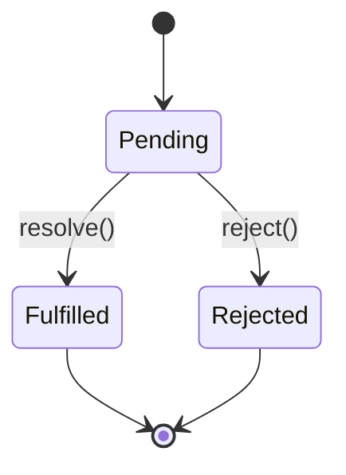
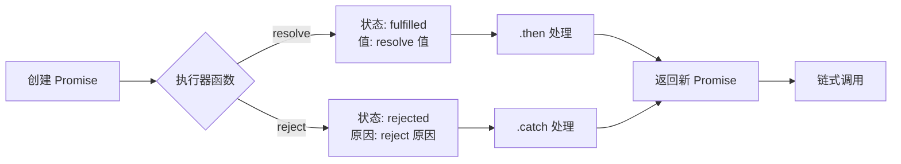

## 概念：Promise

> Promise 是 JavaScript 中用于处理异步操作的对象，代表一个异步操作的最终结果（成功值或失败原因）。

**解决的核心痛点**：解决回调地狱（Callback Hell）问题，提供更清晰的异步代码组织方式和统一错误处理机制。

---

### 核心命题

- [[Promise 通过 thenable 接口实现链式调用，解决回调地狱]]
	- **原理**：Promise 返回一个新的 Promise，支持 `.then()` 链式调用，将嵌套回调拍平成链式结构。
- [[Promise 状态一旦确定就不会再改变]]
	- **原理**：Promise 有三种状态：pending（进行中）、fulfilled（已成功）、rejected（已失败），状态只能从 pending 转向 fulfilled 或 rejected，且不可逆。
- [[Promise.all 失败时立即终止，Promise.allSettled 等待所有 Promise 完成]]
	- **原理**：Promise.all 采用 " 短路 " 逻辑，任一 Promise rejected 则整体 rejected；Promise.allSettled 等待所有 Promise settled，无论成功或失败。
- Promise 使用控制反转（IoC）模式：
	- 将异步结果的 " 通知权 " 交给调用者而非自己

---

### 运行机制

---

### 关键区别

| 维度 | **Promise** | **async/await** |
|:---|:---|:---|
| **语法** | 链式.then()/.catch() | 同步风格的 async/await |
| **错误处理** |.catch() 捕获 | try/catch 捕获 |
| **调试** | 堆栈较长 | 更清晰的堆栈 |
| **适用场景** | 并发控制、简单异步 | 复杂异步逻辑 |

---

### 应用场景

- ✅ **适用场景**
	- **并发请求**：使用 `Promise.all` 并行执行多个异步操作
	- **链式操作**：多个依赖的异步步骤按顺序执行
	- **统一错误处理**：在链末统一捕获错误
- ⛔ **误用**
	- **不必要的包装**：同步代码包装成 Promise（性能开销）
	- **忘记 return**：链式调用中忘记 return 导致逻辑错误

---

### 知识图谱

- **父级概念**：[[JavaScript]] — Promise 所在的语言环境
- **子集概念**：[[Promise.all]]、[[Promise.race]]、[[Promise.allSettled]]、[[Promise.any]] — Promise 的静态方法
- **并列概念**：async/await — Promise 的语法糖
- **相关概念**：
	- [[事件循环]] — Promise 的微任务执行机制
	- [[手写Promise]] — Promise 手写实践

---

### 参考延伸

- [MDN Promise](https://developer.mozilla.org/en-US/docs/Web/JavaScript/Reference/Global_Objects/Promise)
- [JavaScript Promise 详解](https://developer.mozilla.org/en-US/docs/Web/JavaScript/Guide/Using_promises)
