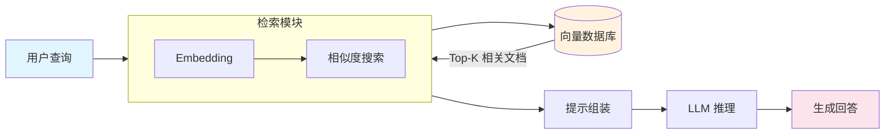

## 概念：RAG

> 检索增强生成（Retrieval-Augmented Generation）是一种将信息检索与文本生成相结合的技术架构，通过在生成前从外部知识库检索相关文档来增强 LLM 的响应质量。

**解决的核心痛点**：LLM 的知识截止于训练数据时间点，无法访问私有数据，且存在幻觉问题。RAG 通过在生成时注入实时/私域知识，在不重新训练模型的前提下扩展知识边界。

---

### 核心命题

> 核心命题引用 atomic 笔记（陈述句观点），每个命题是一句话洞见

- [[检索质量决定了 RAG 输出的上限]]
	- **原理**：检索到的文档质量直接决定了 LLM 能利用的信息质量，检索是 RAG 的瓶颈环节
- [[RAG 的本质是给 LLM 装上一个外部知识缓存]]
	- **原理**：RAG 不修改模型参数，而是在推理时从外部存储器中按需读取知识，类似 CPU 的缓存层级

---

### 运行机制

标准 RAG 流程：用户查询 → Embedding 向量化 → 向量库相似度搜索 → 检索 Top-K 文档 → 组装提示（查询 + 文档） → LLM 生成回答。

---

### 关键区别

| 维度 | RAG | 微调 (Fine-tuning) | 长上下文 |
|:--- |:--- |:--- |:--- |
| **核心逻辑** | 外部知识注入提示词 | 修改模型权重 | 依赖模型原生窗口 |
| **知识更新** | 实时，改数据库即可 | 需要重新训练 | 窗口内动态输入 |
| **幻觉控制** | 强（知识源于检索） | 弱（依赖记忆） | 中（长上下文精度下降） |
| **成本** | 低（无训练成本） | 高（训练 + 部署） | 中（Token 成本） |
| **适用场景** | 知识问答、私域数据 | 风格适配、特定任务 | 长文档分析 |

---

### 适用范围

- ✅ **适用场景**
	- **知识库问答**：基于私有文档的知识查询，如企业知识库、产品文档
	- **实时信息检索**：需要最新数据支撑的场景，如新闻、股价、天气
	- **开放域问答**：覆盖广泛领域的问答，需要从大规模知识库中检索
	- **减少幻觉**：对事实准确性要求高的场景，如医疗、法律
- ⛔ **误用**
	- **替代微调**：RAG 不能改变模型的输出风格或遵循特定格式指令，这需要微调
	- **零检索保证**：检索模块可能返回无关文档，RAG 不保证每次检索都有用
- **失效边界**
	- 检索库质量低时，RAG 输出劣于直接生成
	- 需要深度推理的任务（如数学证明），检索到的片段帮助有限
	- 非结构化知识（如对话历史、情感分析）不适合检索范式

---

### 批判

- **外部批判**
	- "检索-生成"耦合度问题：检索模块和生成模块各自优化，难以端到端协同
	- 检索内容局限：RAG 无法检索尚未存在的信息（预测性任务）
- **内在张力**
	- 检索数量与精度的权衡：检索越多噪音越大，检索越少可能遗漏关键信息
	- 上下文窗口占用：检索文档占据 LLM 上下文窗口，可能挤占推理空间

---

### 知识图谱

> 知识图谱链接 term（术语定义）和相关 concept，建立概念关系网络

- **父级概念**：[[LLM]] — RAG 是基于 LLM 的能力增强架构
- **子级概念**：
	- [[上下文窗口]] — 上下文窗口大小影响 RAG 检索到的文档数量上限
	- [[Token]] — Token 是 RAG 系统成本计算的基本单位
- **并列概念**：
	- [[提示词工程|Prompt Engineering]] — 提示词工程技术被 RAG 用于组装检索结果
	- [[Agent]] — Agent 可能使用 RAG 作为知识获取工具
	- [[LLM Wiki]] — RAG会在每次查询时重新检索，LLM Wiki维护一个结构化的Wiki索引
- **相关概念**：
	- [[MCP]] — MCP 提供了 RAG 检索的标准化协议
	- Embedding — 向量化技术是 RAG 检索模块的核心
	- Vector Database — 向量数据库是 RAG 的知识存储层
