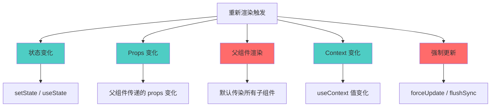

## 概念：React 重新渲染

> React 重新渲染是 React 更新 UI 的核心机制，当组件状态、props 或上下文发生变化时，React 会重新执行组件函数并对比虚拟 DOM。

**解决的核心痛点**：React 需要知道何时重新渲染组件以保持 UI 与状态同步，同时需要最小化不必要的渲染以保证性能。

---

### 核心命题

- [[React 重新渲染的本质是状态驱动的 UI 更新]]
	- **原理**：React 是响应式框架，数据驱动视图，状态变化触发重新渲染
- [[不必要的重新渲染是 React 性能问题的常见原因]]
	- **原理**：每次渲染都有 CPU 成本，过度渲染导致卡顿

---

### 运行机制

#### 触发条件

React 重新渲染由以下 5 种情况触发：



| 触发条件 | 说明 | 触发频率 |
|:---|:---|:---:|
| **状态变化** | setState / useState 的 setter，即使值相同也会触发 | 高 |
| **Props 变化** | 父组件传递的 props 值或引用变化 | 中 |
| **父组件渲染** | 父组件渲染时，默认传染所有子组件 | 高 |
| **Context 变化** | useContext 的 Provider 值变化 | 中 |
| **强制更新** | forceUpdate() 或 flushSync | 低 |

#### 渲染流程

```bash
状态/Props 变化
    ↓
触发重新渲染
    ↓
组件函数重新执行
    ↓
生成新的虚拟 DOM
    ↓
Diff 算法对比新旧虚拟 DOM
    ↓
只更新变化的部分到真实 DOM
```

**关键点**：
- 组件函数重新执行不等于真实 DOM 更新
- 只有 Diff 后发现变化，才会更新真实 DOM
- Props 没变化的子组件也会执行函数，但 Diff 可避免 DOM 更新

---

### 关键区别

| 维度 | 重新渲染 | 真实 DOM 更新 |
|:--- |:--- |:--- |
| **定义** | 组件函数重新执行 | 浏览器 DOM 操作 |
| **成本** | 低（JS 执行） | 高（ DOM 操作） |
| **必然性** | 触发条件满足就发生 | 需要 Diff 后确定变化才发生 |

---

### 应用场景

- ✅ **适用场景**
	- **状态管理**：合理设计状态位置，避免不必要的父组件渲染
	- **性能优化**：使用 React.memo、useMemo、useCallback 减少不必要的渲染
- ⛔ **误用**
	- **在 render 中调用 setState**：导致无限循环渲染
	- **Mutation 后期望自动渲染**：React 需要 immutable 状态更新

---

### 优化策略

**React.memo** — 包装组件，只有 props 变化才渲染：

```jsx
const MyComponent = React.memo(function MyComponent({ name }) {
    return <div>{name}</div>;
});
```

**useMemo / useCallback** — 缓存计算结果和函数引用：

```jsx
function Parent() {
    const [count, setCount] = useState(0);

    // 只有 count 变化时，memoizedCallback 才会重新创建
    const memoizedCallback = useCallback(() => {
        doSomething(count);
    }, [count]);

    return <Child onClick={memoizedCallback} />;
}
```

---

### FAQ

- 暂无相关 Question

---

### 知识图谱

- **父级概念**：[[React]] — React 核心机制
- **子级概念**：
	- [[React 虚拟 DOM]] — Diff 算法的基础
	- [[Fiber]] — React 16+ 的重新渲染架构
- **并列概念**：
	- [[React 状态管理]] — useState、useReducer、Zustand 等
- **相关概念**：
	- [[React.memo]] — 避免不必要的子组件渲染
	- [[Hooks(React)]] — useState、useEffect、useCallback 等
- **参考文章**
	- [React 官方文档 - Reconciliation](https://react.dev/learn/preserving-and-resetting-state)
	- [React 官方文档 - useCallback](https://react.dev/reference/react/useCallback)
