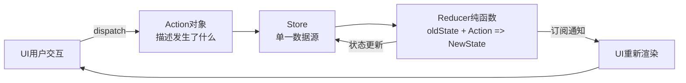

## 概念：Redux

> Redux 是 React 生态最广泛使用的可预测状态容器，通过单一数据源和纯函数更新保证状态可追溯

**解决的核心痛点**：前端状态分散在多个组件和模块中，状态变化难以追踪，调试困难

---

### 核心命题

> 核心命题引用 atomic 笔记（陈述句观点），每个命题是一句话洞见

- [[A-单一数据源]]
	- **原理**：所有状态存在一个 store，任何变化都通过固定流程（dispatch → reducer → new state），方便追踪
- [[A-状态可追溯]]
	- **原理**：Redux DevTools 支持 " 时间旅行 " 调试，可以回放任意状态快照

---

### 运行机制

Redux 的核心是**单向数据流 + 不可变更新**，通过固定流程保证状态可预测。

**关键角色**：

| 角色 | 职责 |
|:---|:---|
| Store | 单一状态容器，存储所有状态树 |
| Action | 普通对象，描述 " 发生了什么 " |
| Reducer | 纯函数，接收旧状态和 action，返回新状态 |
| Dispatch | 触发 action 的唯一方式 |
| Selector | 从 store 状态树中提取数据的函数 |
| Middleware | 扩展 dispatch 能力（如异步、日志） |

---

### 关键区别

| 维度 | Redux | Zustand |
|:--- |:--- |:--- |
| **样板代码** | 多（action、reducer、type、creator） | 少（create + set） |
| **数据流** | 强制单向（dispatch→reduce→notify） | 自由（set() 直接修改） |
| **不可变性** | 必须返回新对象（immutable） | 可变或不可变都行 |
| **DevTools** | 强大时间旅行调试 | 有限 |
| **学习曲线** | 陡峭 | 平缓 |
| **社区生态** | 庞大（Redux Toolkit、RTK Query、Redux Saga） | 较小但活跃 |

| 维度 | Redux | MobX |
|:--- |:--- |:--- |
| **范式** | 函数式，强调不可变和纯函数 | 面向对象，可观察对象 |
| **更新方式** | dispatch action | 直接修改 observable |
| **调试** | 时间旅行，action 日志 | 追踪不够精细 |
| **Boilerplate** | 多 | 少 |

---

### 应用场景

- ✅ **适用场景**
	- **中大型复杂应用**：需要多人协作、严格规范、可维护性优先
	- **需要时间旅行调试**：复杂状态逻辑、bug 复现、用户操作回放
	- **多团队大型项目**：约定俗成的状态管理模式，便于新人 onboarding
	- **需要强大中间件生态**：RTK Query、Redux Saga 处理复杂异步
- ⛔ **误用**
	- **简单本地状态**：用 useState 或 Context 即可
	- **快速原型开发**：Redux 模板代码拖慢开发速度
	- **小团队短期项目**：维护成本超过收益

---

### SOP

> 与本概念相关的标准操作流程，通过实践辅助理解

- [[SOP-Redux-基础配置]] — 创建 store、定义 reducer、连接组件
- [[SOP-Redux-RTK配置]] — 使用 Redux Toolkit 简化模板代码
- [[SOP-Redux-异步处理]] — 使用 createAsyncThunk 处理异步

---

### FAQ

> 与本概念相关的开放性问题，待进一步探索

- [[Q-Redux何时该用]]
- [[Q-RTK和传统Redux区别]]
- [[Q-Redux与Context的选择]]

---

### 知识图谱

> 知识图谱链接 term（术语定义）和相关 concept，建立概念关系网络

- **父级概念**：[[前端状态管理]] — Redux 所属的领域
- **子级概念**：
	- [[T-Action]] — 描述事件的普通对象
	- [[T-Reducer]] — 状态更新的纯函数
	- [[T-Store]] — 单一状态容器
	- [[T-RTK]] — Redux Toolkit，官方推荐的现代 Redux 方案
- **并列概念**：
	- [[Zustand]] — 轻量替代方案
	- [[MobX]] — 响应式状态管理
	- [[Jotai]] — 原子化状态管理
- **相关概念**：
	- [[React Hooks]] — 组件连接 Redux 的桥梁
	- [[单向数据流]] — Redux 的核心架构原则
	- [[函数式编程]] — Reducer 纯函数背后的编程范式
- **参考文章**
	- [Redux 官方文档](https://redux.js.org/)
	- [Redux Toolkit 官方文档](https://redux-toolkit.js.org/)
	- [Redux 架构解析](https://omingm.github.io/posts/redux-architecture/)
