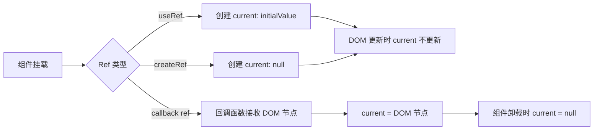

## 概念：React Refs

> React Refs 是一种允许组件访问 DOM 节点和 React 元素实例的机制

**解决的核心痛点**：在 React 的声明式编程模型中，数据流是单向的，当需要直接操作 DOM 节点、聚焦输入、触发动画或访问类组件实例时，Refs 提供了必要的「命令式」逃生舱。

---

### 核心命题

> 核心命题引用 atomic 笔记（陈述句观点），每个命题是一句话洞见

- [[Ref 的本质是命令式到声明式的桥梁]]
	- **原理**：Ref 让你绕过 React 的渲染机制直接访问 DOM，但同时也放弃了 React 的声明式优势
- [[Ref 的 current 属性是响应式与非响应式的分界线]]
	- **原理**：改变 ref.current 不会触发重新渲染，这使得 ref 成为状态和 UI 之间的「结界」

---

### 运行机制

React Ref 有三种创建方式：`useRef`、`createRef`、`useRef` 回调形式。

**生命周期要点**：
- Ref 对象在组件整个生命周期内保持不变
- `current` 属性的修改不会触发重渲染
- 回调 Ref 在 DOM 绑定/解绑时会被调用

---

### 关键区别

| 维度       | useRef        | createRef     |
|:------- |:------------ |:------------ |
| **适用场景** | 函数组件          | 类组件           |
| **生命周期** | 跨渲染持久化        | 每次渲染重新创建      |
| **性能**   | 更优（ref 对象不重建） | 较差（每次渲染创建新对象） |

---

### 应用场景

- ✅ **适用场景**
	- **DOM 操作**：聚焦、文本选择、触发动画、集成第三方库（如 D3、Leaflet）
	- **类组件实例**：访问类组件方法
	- **存储不需要触发重渲染的可变值**：如计时器 ID
- ⛔ **误用**
	- **用 Ref 存储会随 UI 变化的状态**：应使用 `useState`，否则 UI 与状态脱节
	- **用 Ref 代替 props 传递数据**：打破数据流原则

---

### SOP

> 与本概念相关的标准操作流程，通过实践辅助理解

- [[SOP-在React中正确使用Ref]] — useRef 的正确用法和注意事项
- [[SOP-React 类组件中的 Ref]] — createRef 的使用场景

---

### FAQ

> 与本概念相关的开放性问题，待进一步探索

- [[Q-Ref 和 state 的选择标准是什么]]
- [[Q-为什么不要滥用 Ref]]

---

### 知识图谱

> 知识图谱链接 term（术语定义）和相关 concept，建立概念关系网络

- **父级概念**：[[React 组件模型]] — React 的声明式编程基础
- **子级概念**：
	- [[useRef]] — 函数组件中使用 Ref 的 Hook
	- [[createRef]] — 类组件中创建 Ref 的方法
	- [[forwardRef]] — 转发 Ref 给子组件的 API
- **并列概念**：
	- [[React State]] — 触发 UI 更新的状态管理
	- [[React Props]] — 组件间数据传递
- **相关概念**：
	- [[虚拟DOM(React)]] — 理解 Ref 与真实 DOM 的关系
	- [[React 生命周期]] — 类组件中 Ref 与组件生命周期的关联

---

## 参考延伸

- [React 官方文档 - Refs and the DOM](https://react.dev/learn/referencing-values-with-refs)
- [React 官方文档 - Exposing DOM nodes with forwardRef](https://react.dev/learn/manipulating-the-dom-with-refs)
