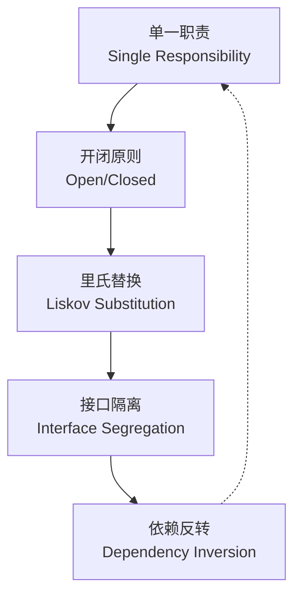

## 概念：SOLID 原则

> 面向对象设计的五个基本原则：单一职责、开闭原则、里氏替换、接口隔离、依赖反转。

**解决的核心痛点**：如何设计出易于维护、扩展和重构的面向对象系统？SOLID 原则提供了判断代码设计质量的五个维度。

---

### 核心命题

- **单一职责原则（SRP）**：一个类只应有一个引起变化的原因
- **开闭原则（OCP）**：对扩展开放，对修改关闭
- **里氏替换原则（LSP）**：子类必须能替换父类而不影响程序正确性
- **接口隔离原则（ISP）**：不应强迫客户端依赖它不使用的方法
- **依赖反转原则（DIP）**：依赖抽象而非具体实现

---

### 运行机制

---

### 知识图谱

- **父级概念**：[[软件工程]] — 设计原则是软件工程方法论的基石
- **相关概念**：
	- [[设计模式|MOC-设计模式]] — 设计模式是 SOLID 原则的具体实现方案
	- [[重构]] — 通过重构不断趋近 SOLID 设计
	- [[面向对象编程]] — SOLID 原则的应用前提
