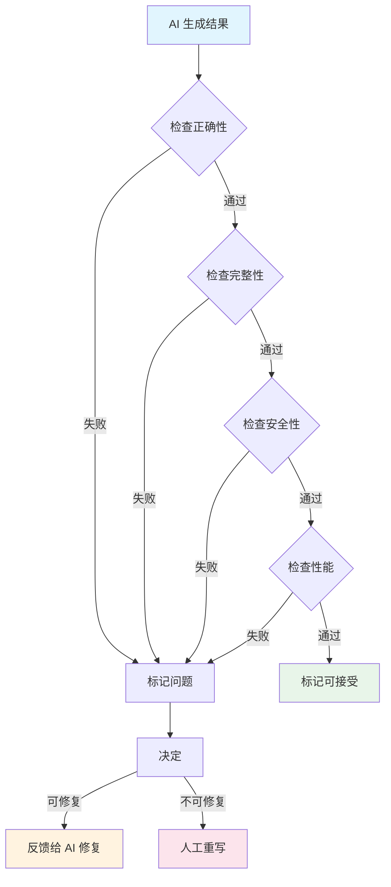

## SOP：AI 输出质量评估

> 评估 AI 生成结果可靠性的标准流程，适用于代码审查和结果验证，帮助前端工程师判断 AI 输出是否可接受。

**目标**：建立 AI 输出质量评估标准，减少因盲目信任 AI 导致的 bug
**实现**：通过分层检查（正确性 → 完整性 → 安全性 → 性能）系统化评估

---

### 适用场景

- ✅ **代码生成后**：评估 AI 生成的代码是否可接受
- ✅ **Bug 分析后**：验证 AI 给出的修复方案是否有效
- ✅ **Code Review 辅助**：AI 提出优化建议后人工复核
- ✅ **Prompt 迭代**：评估不同 Prompt 输出的质量差异
- ⛔ **简单机械任务**：变量重命名、格式化等无风险的简单操作（可跳过）

---

### 流程图解



---

### 核心步骤

#### 步骤 1：检查正确性

**正确性检查清单**：

| 检查项 | 期望 | 不合格标志 |
|:---|:---|:---|
| **类型正确** | TypeScript 类型无错误 | 存在 `any` 或类型错误 |
| **逻辑正确** | 组件行为符合预期 | 事件处理、状态更新逻辑错误 |
| **API 正确** | 调用的 API 存在且参数正确 | 调用了不存在的 API |
| **语法正确** | 无 ESLint 错误 | 语法错误、缺少分号 |

**操作方法**：

1. 复制代码到 IDE
2. 运行 TypeScript 检查：`npx tsc --noEmit`
3. 运行 Lint：`npm run lint`
4. 手动检查关键逻辑（如状态管理、副作用处理）

**不合格处理**：

```
如果正确性不合格：
→ 直接反馈给 AI：「第 X 行类型错误，请修复」
→ 附加上下文：「使用 React 18 + TypeScript 约束」
```

#### 步骤 2：检查完整性

**完整性检查清单**：

| 检查项 | 期望 | 不合格标志 |
|:---|:---|:---|
| **Props 完整** | 包含所有必要 Props | 缺少 onChange、disabled 等常见 Props |
| **边界处理** | 处理空数据、加载状态 | 无 loading 处理、无空状态 |
| **错误处理** | 有 try-catch 或错误边界 | 缺少错误处理 |
| **可访问性** | 有 aria-label、键盘支持 | 缺少无障碍支持 |

**示例检查**：

```typescript
// 缺少的常见 Props（不合格）
function Button({ label }: { label: string }) { ... }

// 完整的 Props（合格）
function Button({
  label,
  variant = 'primary',
  disabled = false,
  onClick,
}: {
  label: string;
  variant?: 'primary' | 'secondary';
  disabled?: boolean;
  onClick?: () => void;
}) { ... }
```

#### 步骤 3：检查安全性

**安全性检查清单**：

| 检查项 | 风险 | 修复方案 |
|:---|:---|:---|
| **XSS** | 用户输入未转义 | 使用 textContent 而非 innerHTML |
| **敏感信息** | 硬编码 API Key | 移到环境变量 |
| **依赖安全** | 使用已知漏洞的包 | 检查 package.json |
| **数据暴露** | 过度日志记录 | 移除 console.log |

**检查命令**：

```bash
# 检查依赖安全
npm audit

# 检查代码中的敏感信息模式
grep -r "apiKey\|password\|secret" src/
```

#### 步骤 4：检查性能

**性能检查清单**：

| 检查项 | 影响 | 检测方法 |
|:---|:---|:---|
| **不必要的重新渲染** | 性能下降 | React DevTools Profiler |
| **内存泄漏** | 长时间运行崩溃 | Chrome DevTools Memory |
| **大包体积** | 首屏加载慢 | webpack-bundle-analyzer |
| **过度请求** | API 限流、延迟 | Network 面板 |

**快速检查（前端）**：

```javascript
// 检查是否使用了不必要的 useEffect 依赖
// 检查是否在 render 中创建新对象/函数
// 检查是否缺少 useMemo/useCallback
```

---

### 评估决策

**综合评分**：

| 维度 | 权重 | 说明 |
|:---|:---|:---|
| 正确性 | 40% | 基础门槛，必须通过 |
| 完整性 | 25% | 影响可用性 |
| 安全性 | 20% | 底线要求 |
| 性能 | 15% | 长期影响 |

**决策规则**：

```
评分 ≥ 80% → 接受（可直接使用）
评分 60-80% → 修复（反馈给 AI 修复问题）
评分 < 60% → 重写（人工重写或换 Prompt）
```

---

### 实践/示例

**示例：评估 AI 生成的表单组件**

```typescript
// AI 生成的代码片段
function Form() {
  const [data, setData] = useState(null);

  return (
    <input
      value={data.name}
      onChange={(e) => setData({ name: e.target.value })}
    />
  );
}
```

**检查结果**：

| 维度 | 问题 | 评分影响 |
|:---|:---|:---|
| 正确性 | `data` 为 null 时 `data.name` 会报错 | -20 |
| 完整性 | 缺少表单验证、提交处理 | -15 |
| 安全性 | 用户输入直接使用，无转义 | -10 |
| 性能 | 无明显问题 | 0 |

**最终决策**：评分 55%，需要修复

**修复 Prompt**：

```
请修复这个表单组件：
1. 添加 data 的空值检查，初始状态用 {}
2. 添加 email 字段的格式验证
3. 添加表单提交处理
4. 类型使用 TypeScript，不要 any

约束：不使用 any，遵循 React Hooks 规范
```

---

### 常见坑点

- ⛔ **盲目信任 AI 输出**
  - **排查**：特别是类型、安全相关的代码，容易引入漏洞
  - **修复**：建立强制检查清单，特别是安全性维度

- ⛔ **只检查语法不检查逻辑**
  - **排查**：代码能运行但行为不符合预期
  - **修复**：手动跑一遍关键用户流程

- ⛔ **忽视性能问题**
  - **排查**：小数据集没问题，大数据集才暴露
  - **修复**：用真实规模的数据测试

- 🔧 **Prompt 导致的输出问题**
  - **排查**：同一问题反复出现
  - **修复**：迭代 Prompt，添加更明确的约束

---

### 知识图谱

- **父级概念**：[[人工智能]] — 本 SOP 是 AI 辅助开发的质量保障
- **关联概念**：
  - [[SOP-提示词工程最佳实践]] — 提升 Prompt 质量减少问题
  - [[Claude Code]] — Claude Code 内置了基础检查
  - [[Harness]] — 工程化约束是质量保障的基础
- **相关 SOP**：
  - [[SOP-使用Claude-Code开发React组件]] — 组件开发的完整 SOP