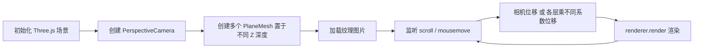

## SOP：使用 Three.js 实现 3D 视差滚动

> 本 SOP 定义使用 Three.js 实现 3D 视差滚动效果的标准流程，核心思路是**多层平面 + 相机位移 + 不同 Z 深度产生视差**，适用于 3D 官网、产品展示、沉浸式 Landing Page 等场景。

---

### 适用场景

- ✅ 场景 1：3D 沉浸式官网的滚动视差效果
- ✅ 场景 2：产品展示的多层次深度滚动
- ✅ 场景 3：创意作品集的 3D 卡片视差
- ✅ 场景 4：游戏风格的滚动背景（多层 parallax）

---

### 流程图解



---

### 核心原理

视差的本质是**不同深度的物体在视角移动时产生的相对位移差异**。

Three.js 的视差方案与 CSS / Canvas 的本质区别：

| 方案 | 原理 | 渲染方式 | 适用场景 |
|:---|:---|:---|:---|
| CSS | `translateX(-50%)` 复制内容无缝衔接 | CSS 动画 | 1D 文字/标语跑马灯 |
| Canvas | 边界传送 + 逐帧重绘 | `clearRect` + `drawImage` | 2D 图片墙拖拽 |
| **Three.js** | **相机视角位移 + perspective 投影** | WebGL 渲染管线 | **3D 多层深度视差** |

Three.js 利用 `PerspectiveCamera` 的透视投影，当相机沿 Z 轴移动或旋转时，近处物体位移大，远处物体位移小，自然产生视差。

---

### 核心步骤

#### 步骤 1：初始化 Three.js 场景

```javascript
import * as THREE from 'three'

const scene    = new THREE.Scene()
const camera   = new THREE.PerspectiveCamera(75, window.innerWidth / window.innerHeight, 0.1, 1000)
const renderer = new THREE.WebGLRenderer({ antialias: true })

renderer.setSize(window.innerWidth, window.innerHeight)
renderer.setPixelRatio(Math.min(window.devicePixelRatio, 2))
document.body.appendChild(renderer.domElement)

camera.position.z = 5
```

> `PerspectiveCamera` 的视锥体角度（75°）越大，透视感越强，视差效果越明显。

#### 步骤 2：创建多层平面置于不同 Z 深度

```javascript
const layers = []

const layerConfigs = [
  { z: 0,    speed: 1.0,  texture: 'bg-far.jpg',    scale: 20 },   // 远景：慢
  { z: -5,   speed: 0.6,  texture: 'bg-mid.jpg',    scale: 15 },   // 中景：中等
  { z: -10,  speed: 0.3,  texture: 'bg-near.jpg',   scale: 10 },   // 近景：快
]

layerConfigs.forEach(cfg => {
  const geometry = new THREE.PlaneGeometry(cfg.scale, cfg.scale)
  const texture  = new THREE.TextureLoader().load(cfg.texture)
  const material = new THREE.MeshBasicMaterial({ map: texture })
  const mesh     = new THREE.Mesh(geometry, material)

  mesh.position.z = cfg.z
  scene.add(mesh)

  layers.push({ mesh, speed: cfg.speed })
})
```

> 远景（Z 值小/相机近）位移慢，近景（Z 值大/相机远）位移快。

#### 步骤 3：监听滚动或鼠标移动

```javascript
let targetX = 0
let targetY = 0

window.addEventListener('scroll', () => {
  const scrollY = window.scrollY
  targetY = scrollY * 0.001  // 根据滚动量计算目标偏移
})

window.addEventListener('mousemove', (e) => {
  // 归一化鼠标位置 (-0.5 ~ 0.5)
  targetX = (e.clientX / window.innerWidth  - 0.5) * 2
  targetY = (e.clientY / window.innerHeight - 0.5) * 2
})
```

#### 步骤 4：每帧更新相机位置并渲染

```javascript
function animate() {
  requestAnimationFrame(animate)

  // 相机平滑跟随（lerp 插值）
  camera.position.x += (targetX * 3 - camera.position.x) * 0.05
  camera.position.y += (targetY * 2 - camera.position.y) * 0.05

  // 或者：直接按不同系数移动各层 mesh
  layers.forEach(({ mesh, speed }) => {
    mesh.position.x = targetX * speed * 2
    mesh.position.y = targetY * speed * 1.5
  })

  renderer.render(scene, camera)
}

animate()
```

**视差系数**：

| 层级 | Z 深度参考 | 速度系数 | 效果 |
|:---|:---|:---|:---|
| 最远背景 | z = -20 | 0.1 ~ 0.2 | 微动，几乎静止 |
| 中景层 | z = -5 ~ -10 | 0.4 ~ 0.7 | 适度视差 |
| 近景层 | z = 0 ~ -3 | 0.8 ~ 1.2 | 明显视差 |
| 前景 | z = 1 ~ 2 | 1.5 ~ 2.0 | 强烈冲击感 |

#### 步骤 5：响应式处理

```javascript
window.addEventListener('resize', () => {
  camera.aspect = window.innerWidth / window.innerHeight
  camera.updateProjectionMatrix()
  renderer.setSize(window.innerWidth, window.innerHeight)
})
```

---

### 完整骨架

```javascript
import * as THREE from 'three'

class ParallaxScene {
  constructor() {
    this.scene    = new THREE.Scene()
    this.camera   = new THREE.PerspectiveCamera(75, innerWidth / innerHeight, 0.1, 1000)
    this.renderer = new THREE.WebGLRenderer({ antialias: true })
    this.layers   = []
    this.targetX  = 0
    this.targetY  = 0

    this.init()
    this.createLayers()
    this.bindEvents()
    this.animate()
  }

  init() {
    this.renderer.setSize(innerWidth, innerHeight)
    this.renderer.setPixelRatio(Math.min(devicePixelRatio, 2))
    document.body.appendChild(this.renderer.domElement)
    this.camera.position.z = 5
  }

  createLayers() {
    const configs = [
      { z: -10, speed: 0.2, texture: 'far.jpg'   },
      { z: -5,  speed: 0.5, texture: 'mid.jpg'   },
      { z: -2,  speed: 0.8, texture: 'near.jpg'  },
    ]
    configs.forEach(cfg => {
      const geo = new THREE.PlaneGeometry(20, 20)
      const mat = new THREE.MeshBasicMaterial({ map: new THREE.TextureLoader().load(cfg.texture) })
      const mesh = new THREE.Mesh(geo, mat)
      mesh.position.z = cfg.z
      this.scene.add(mesh)
      this.layers.push({ mesh, speed: cfg.speed })
    })
  }

  bindEvents() {
    addEventListener('scroll', () => { this.targetY = scrollY * 0.001 })
    addEventListener('mousemove', (e) => {
      this.targetX = (e.clientX / innerWidth  - 0.5) * 2
      this.targetY = (e.clientY / innerHeight - 0.5) * 2
    })
    addEventListener('resize', () => {
      this.camera.aspect = innerWidth / innerHeight
      this.camera.updateProjectionMatrix()
      this.renderer.setSize(innerWidth, innerHeight)
    })
  }

  animate() {
    requestAnimationFrame(() => this.animate())
    this.layers.forEach(({ mesh, speed }) => {
      mesh.position.x += (this.targetX * speed - mesh.position.x) * 0.05
      mesh.position.y += (this.targetY * speed - mesh.position.y) * 0.05
    })
    this.renderer.render(this.scene, this.camera)
  }
}

new ParallaxScene()
```

---

### 常见坑点

- ⛔ **视差效果不明显**
	- **原因**：各层 Z 深度差异太小，或速度系数差异不够
	- **排查**：远景层 Z 用 -15 ~ -20，近景层 Z 用 0 ~ -3，速度系数差至少 3 倍以上
- ⛔ **3D 感不够强**
	- **原因**：`PerspectiveCamera` 的 FOV 角度太小（默认 50），透视感弱
	- **排查**：将 FOV 设为 60 ~ 90，角度越大透视变形越强
- ⛔ **图片被拉伸或比例失常**
	- **原因**：`PlaneGeometry` 的宽高比与纹理图片比例不匹配
	- **排查**：根据图片实际比例设置 `PlaneGeometry(width, height)`，或使用 `texture.repeat` 调整
- ⛔ **移动端性能差/帧率低**
	- **原因**：Three.js 在移动端 WebGL 性能有限，层数过多或纹理过大
	- **排查**：减少层数（3 层足够）、压缩纹理尺寸、使用 `PowerPreference: 'high-performance'`
- 🔧 **与 GSAP 结合**：Three.js 的动画可以用 GSAP 替代 `requestAnimationFrame`，获得更流畅的 easing 效果

---

### 知识图谱

- **父级概念**：[[ThreeJS]] — 本 SOP 是 Three.js 在视差场景的垂直应用
- **关联概念**：
	- [[SOP-CSS实现文字横向滚动效果]] — CSS 自动滚动方案（1D，无深度）
	- [[Canvas实现无限滑动效果]] — Canvas 拖拽方案（2D，无透视）
	- [[Canvas动画]] — Canvas 2D 动画基础
