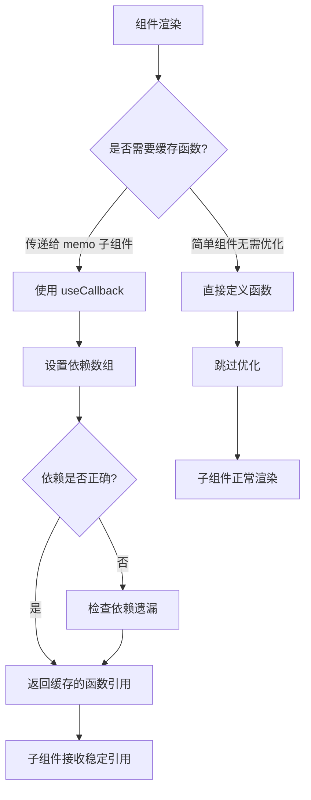

## SOP：useCallback 使用示例

> 展示 useCallback 在正确场景下的使用方式和效果

**目标**：通过具体示例理解 useCallback 的使用场景和使用方法

**前置条件**：React 16.8+，已了解 Hooks 基础用法

---

### 适用场景

- 场景 1：父组件频繁渲染，需要将回调函数传递给 `React.memo` 包装的子组件
- 场景 2：函数作为其他 Hook 的依赖项（如 useEffect 依赖某个函数）
- 场景 3：列表渲染中的回调函数，需要保持引用稳定

---

### 流程图解



---

### 核心步骤

#### 1. 基础使用模式

```jsx
import { useState, useCallback } from 'react';

function ParentComponent() {
  const [count, setCount] = useState(0);
  const [name, setName] = useState('');

  // ✅ 正确：useCallback 缓存函数，只有 count 变化时才创建新函数
  const handleIncrement = useCallback(() => {
    setCount(c => c + 1);
  }, []); // 空依赖：函数不依赖任何状态，永远返回同一引用

  // ❌ 错误：依赖遗漏
  // const handleClick = useCallback(() => {
  //   console.log(count); // 引用了 count 但没有放在依赖数组中
  // }, []); // count 变化时函数不会更新，产生 bug

  return (
    <div>
      <ChildComponent onIncrement={handleIncrement} />
      <input value={name} onChange={e => setName(e.target.value)} />
    </div>
  );
}

// ✅ 子组件用 React.memo 包装，接收稳定引用
const ChildComponent = React.memo(({ onIncrement }) => {
  console.log('ChildComponent rendered');
  return <button onClick={onIncrement}>+</button>;
});
```

#### 2. 配合 useEffect 使用

```jsx
function DataFetcher({ fetchId }) {
  const [data, setData] = useState(null);

  // ✅ 函数作为 useEffect 依赖时需要 useCallback
  const fetchData = useCallback(async () => {
    const response = await fetch(`/api/${fetchId}`);
    const result = await response.json();
    setData(result);
  }, [fetchId]);

  useEffect(() => {
    fetchData();
  }, [fetchData]); // fetchData 变化时才重新执行 effect

  return <div>{data ? data.name : 'Loading...'}</div>;
}
```

#### 3. 列表中的使用

```jsx
function ItemList({ items }) {
  const [selectedId, setSelectedId] = useState(null);

  // ✅ 每个 item 的点击处理器独立缓存
  const getItemHandler = useCallback((id) => {
    return () => {
      setSelectedId(id);
      console.log('Selected:', id);
    };
  }, []); // 空依赖，返回的内部函数始终创建新的，但 getItemHandler 引用稳定

  return (
    <ul>
      {items.map(item => (
        <MemoizedItem
          key={item.id}
          item={item}
          onClick={getItemHandler(item.id)}
        />
      ))}
    </ul>
  );
}
```

---

### 常见坑点

- ⛔ **空依赖导致闭包陷阱**

```jsx
  // ❌ 错误：handleClick 永远引用初始的 count 值（0）
  const handleClick = useCallback(() => {
    console.log(count);
  }, []); // count 变化时函数不更新

  // ✅ 正确：根据需要设置依赖
  const handleClick = useCallback(() => {
    console.log(count);
  }, [count]);
```

- ⛔ **过度使用**

```jsx
  // ❌ 错误：简单组件不需要 useCallback，反而增加复杂度
  const Button = ({ onClick }) => {
    const handleClick = useCallback(onClick, [onClick]);
    return <button onClick={handleClick}>Click</button>;
  };

  // ✅ 正确：简单组件直接使用
  const Button = ({ onClick }) => {
    return <button onClick={onClick}>Click</button>;
  };
```

- ⛔ **依赖数组遗漏**

```jsx
  // ❌ 错误：函数内部使用了 value 但依赖数组为空
  const handleSubmit = useCallback(() => {
    submitForm(value); // value 变化时函数不更新
  }, []); // 应该写成 [value]

```

- 🔧 **排查**：如果子组件仍然重新渲染，检查：
	1. 子组件是否真的用 `React.memo` 包装
	2. 其他 props 是否稳定（如对象、数组字面量）
	3. 依赖数组是否正确

---

### 知识图谱

- **父级概念**：[[useCallback]] — 本 SOP 对应的核心概念
- **关联概念**：
	- [[Hooks(React)]] — useCallback 所属的 Hooks 体系
	- [[React.memo]] — 需要配合使用的组件记忆化工具
	- [[useMemo]] — 值缓存 Hook，与 useCallback 机制类似
