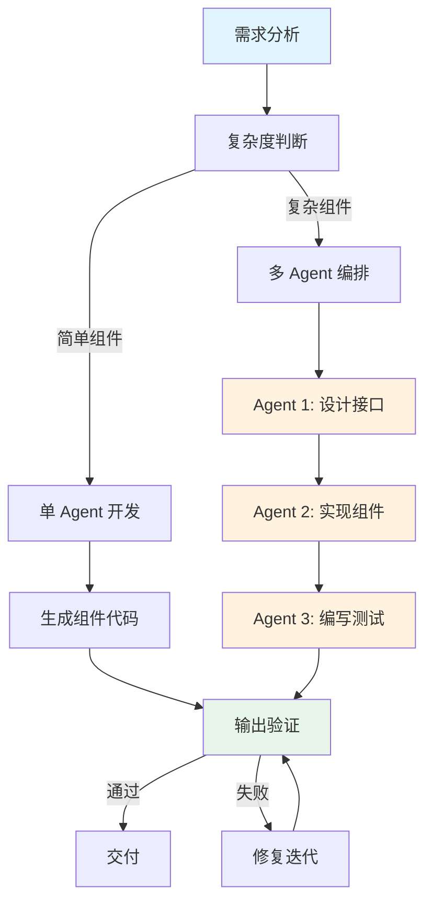

## SOP：使用 Claude Code 开发 React 组件

> 本 SOP 定义使用 Claude Code 开发 React 组件的标准流程，适用于前端开发者通过 AI 辅助提升组件开发效率和质量。

---

### 适用场景

- ✅ **简单组件**：Button、Icon、Badge 等单一职责组件
- ✅ **业务组件**：Form、Card、Modal 等业务逻辑组件
- ✅ **复杂组件**：DataTable、Tree、Editor 等需要架构设计的大型组件
- ⛔ **非组件任务**：页面布局、全栈功能请使用其他 SOP

---

### 流程图解



---

### 核心步骤

#### 阶段 1：需求分析

1. **明确组件职责**
	 - 一句话描述组件的核心功能
	 - 确认是否符合单一职责原则

2. **定义输入契约**
	 - 组件名称（PascalCase，语义化）
	 - Props 接口（TypeScript 类型）
	 - 设计约束（设计稿链接、UI 规范）
	 - 技术约束（React 版本、样式方案）

3. **判断复杂度**
	 - **简单组件**：直接跳到阶段 2
	 - **复杂组件**：进入多 Agent 编排模式

#### 阶段 2：单 Agent 开发（简单组件）

1. **发起请求**

 ```bash
作为 React 专家，帮我创建一个 {{组件名}} 组件：
- 支持 {{功能1}}、{{功能2}}
- 使用 TypeScript + {{样式方案}}
- 遵循 {{规范文档}} 的设计规范
- 包含 Props 类型导出
 ```

2. **Claude Code 执行**
	 - 生成组件代码
	 - 自动创建文件

3. **输出验证**
	 - 检查组件渲染是否正常
	 - 检查 Props 类型是否完整
	 - 检查样式是否符合规范

#### 阶段 3：多 Agent 编排（复杂组件）

1. **Agent 1 - 架构师：设计接口**

```bash
作为 React 架构师，设计 {{组件名}} 的 Props 接口：
- 支持 {{核心功能列表}}
- 需要考虑 {{扩展性要求}}
- 输出完整的 TypeScript 类型定义
```

2. **Agent 2 - 开发者：实现组件**

```bash
根据以下接口实现 {{组件名}} 组件：
<粘贴接口定义>

技术要求：
- React 18 + TypeScript
- 使用 {{样式方案}}
- 遵循 {{规范文档}}
```

3. **Agent 3 - 测试工程师：编写测试**

```bash
为 {{组件名}} 组件编写测试：
<粘贴组件代码>

测试覆盖：
- 渲染测试
- 交互测试（{{主要交互}})
- 边界情况测试
```

#### 阶段 4：交付检查

1. **代码审查**
	 - [ ] Props 命名是否符合规范
	 - [ ] 是否有必要的注释
	 - [ ] 是否有 Storybook 故事（可选）

2. **测试验证**
	 - [ ] 单元测试通过
	 - [ ] Storybook 渲染正常（如有）

---

### 常见坑点

- ⛔ **需求模糊**：没有明确的 Props 定义就开始实现，导致返工
	- **排查**：先在设计稿上标注 Props，再开始编码
- ⛔ **过度设计**：简单组件使用复杂架构
	- **排查**：遵循「简单组件简单做」原则
- ⛔ **Agent 幻觉**：Claude Code 生成了不存在的 API
	- **排查**：提供明确的 API 约束或文档链接
- ⛔ **上下文丢失**：长对话后组件逻辑前后不一致
	- **排查**：复杂组件分 Agent 阶段，每阶段保存上下文
- 🔧 **样式不一致**：组件样式与现有规范冲突
	- **排查**：在 Prompt 中提供样式规范链接

---

### 知识图谱

- **父级概念**：[[Claude Code]] — 本 SOP 是 Claude Code 在前端开发的具体应用
- **关联概念**：
	- [[Agent]] — Agent 能力是本 SOP 的技术基础
	- [[Harness]] — 输入/输出契约是组件质量的保障
	- [[智能体编排]] — 复杂组件使用多 Agent 编排模式
	- [[提示词工程]] — Prompt 优化提升组件生成质量
