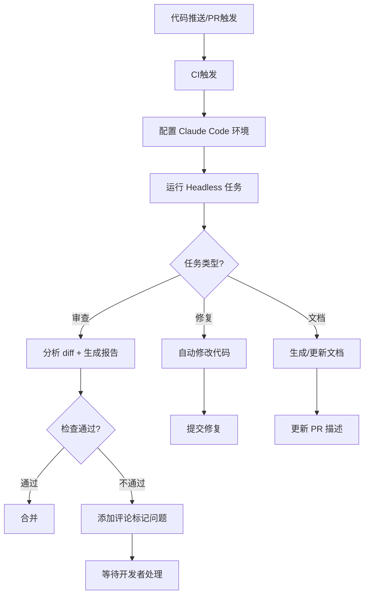

## SOP：使用 Claude Code 自动化 CI/CD 流水线

> 在 CI/CD 流水线中集成 Claude Code Headless 模式，将 AI 代码审查和自动修复融入现有构建部署流程。

目标：在 CI 环境中无交互运行 Claude Code，自动执行代码审查、质量门禁、批量修复等任务
实现：Claude Code Headless 模式 + CI 平台（GitHub Actions / GitLab CI 等）

---

### 适用场景

- **PR 代码审查**：提交 PR 时自动审查 diff，标记潜在问题
- **质量门禁**：在合并前运行 Claude Code 检查，不符合标准则阻断合并
- **批量修复**：对存量代码运行修复命令（lint 修复、类型补全、迁移重构）
- **自动化文档生成**：基于代码变更自动更新 API 文档或 changelog

---

### 流程图解



---

### 核心步骤

1. **安装 Claude Code**
	 - 在 CI 镜像或 runner 中安装：`npm install -g @anthropic-ai/claude-code`
	 - 或使用官方 Docker 镜像

2. **配置认证**
	 - 设置 `ANTHROPIC_API_KEY` 环境变量（在 CI 平台的 Secrets 中配置）
	 - 注意：不要在代码库中硬编码 API Key

3. **编写 Headless 命令脚本**

```bash
claude --headless --prompt "审查以下 diff，列出所有潜在问题" --diff
```

4. **处理输出**
	 - Claude Code 输出结构化结果（JSON/markdown）
	 - 根据 exit code 判断是否阻断流水线

5. **集成到 CI 平台**
	 - 在 `.github/workflows/` 或 `.gitlab-ci.yml` 中添加 job

---

### 实践/示例

**GitHub Actions 配置示例：**

```yaml
name: Claude Code Review
on: [pull_request]

jobs:
  review:
    runs-on: ubuntu-latest
    steps:
      - uses: actions/checkout@v4
      - uses: actions/setup-node@v4
        with:
          node-version: 22
      - run: npm install -g @anthropic-ai/claude-code
      - name: Run Claude Code review
        env:
          ANTHROPIC_API_KEY: ${{ secrets.ANTHROPIC_API_KEY }}
        run: |
          claude --headless \
            --prompt "审查此 PR 的代码变更，检查：1) 潜在 Bug 2) 安全漏洞 3) 性能问题 4) 与项目约定的代码风格一致性。输出 markdown 报告。" \
            --diff \
            --output review-report.md
      - name: Post review comment
        uses: actions/github-script@v7
        with:
          script: |
            const fs = require('fs');
            const report = fs.readFileSync('review-report.md', 'utf8');
            await github.rest.issues.createComment({
              ...context.repo,
              issue_number: context.issue.number,
              body: `## Claude Code Review\n\n${report}`
            });
```

### 常见坑点

- ⛔ **反模式**：在 PR 审查中直接让 Claude Code 自动提交修复（可能引入意外更改）
	- **正确做法**：审查模式只生成报告，修复模式单独控制
- ⛔ **反模式**：API Key 暴露在 CI 日志中
	- **正确做法**：使用 CI 平台的 Secret 管理，勿用 `echo` 打印环境变量
- 🔧 **排查**：如果 Headless 模式超时，检查 `--timeout` 参数是否合理，大项目需设置更高的超时值（如 `--timeout 300000`）
- 🔧 **排查**：如果 diff 上下文中代码量过大，使用 `--file-pattern` 限定文件范围

---

### 知识图谱

- **相关概念**：
	- [[Claude Code]] — Claude Code 核心概念和能力
	- [[CI-CD流程]] — 持续集成/持续部署通用流程
- **相关 SOP**：
	- [[SOP-使用Claude-Code开发React组件]] — 同类 Claude Code 实践 SOP
	- [[代码审查流程]] — 人工代码审查标准流程
- **相关术语**：
	- [[Headless模式]] — Claude Code 的无头运行模式
