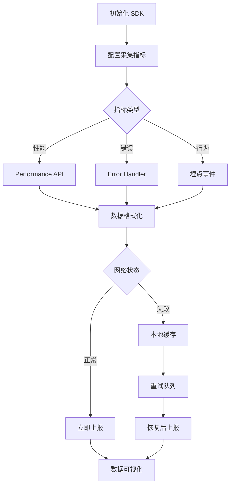

## SOP：前端监控指标采集

> 标准化采集前端性能、错误、行为数据的完整流程

目标：建立统一的前端监控指标采集体系，覆盖性能、错误、业务三个维度
实现：Vue/React + SDK + 数据上报服务

---

### 适用场景

- 场景 1：新产品接入监控，需标准化埋点流程
- 场景 2：排查线上问题，需快速定位性能瓶颈或错误来源
- 场景 3：数据驱动优化，需客观指标衡量改版效果

---

### 流程图解



---

### 核心步骤

1. **初始化 SDK**：在应用入口引入监控 SDK，配置 AppId 和上报地址
	 - 注意：SDK 需在 Vue/React 根组件之前初始化
2. **配置采集指标**：按需开启性能监控、错误监控、行为埋点
	 - 注意：指标过多影响性能，建议按场景选择性接入
3. **性能指标采集**：使用 Performance API 获取 FP、FCP、LCP、TTFB 等
	 - 注意：需在 `window.onload` 后获取，避免白屏干扰
4. **错误监控采集**：监听 `window.onerror`、`unhandledrejection`、资源加载错误
	 - 注意：React 项目需额外监听 `componentDidCatch`
5. **行为埋点采集**：在关键节点触发埋点，采集点击、曝光、自定义事件
	 - 注意：埋点需与业务逻辑解耦，避免污染主流程
6. **数据上报与缓存**：异步上报数据，网络失败时本地降级
	 - 注意：敏感信息需脱敏处理后再上报

---

### 实践/示例

**SDK 初始化（Vue 3）**

```javascript
// main.js
import { createApp } from 'vue'
import monitor from 'monitor-sdk'

// 初始化监控
monitor.init({
  appId: 'your-app-id',
  endpoint: 'https://analytics.example.com',
  enablePerformance: true,
  enableError: true,
  enableBehavior: true,
  sampleRate: 1 // 采样率 100%
})

const app = createApp(App)
app.mount('#app')
```

**性能指标采集**

```javascript
// 采集关键性能指标
const getPerformanceMetrics = () => {
  const entries = performance.getEntriesByType('navigation')[0]

  return {
    fp: measureFirstPaint(),        // First Paint
    fcp: measureFirstContentfulPaint(), // First Contentful Paint
    lcp: getLargestContentfulPaint(),   // Largest Contentful Paint
    ttfb: entries.responseStart,        // Time to First Byte
    fid: measureFID(),                  // First Input Delay
    cls: computeCLS()                   // Cumulative Layout Shift
  }
}

// LCP 采集
const getLargestContentfulPaint = () => {
  return new Promise((resolve) => {
    new PerformanceObserver((list) => {
      const entries = list.getEntries()
      const lastEntry = entries[entries.length - 1]
      resolve(lastEntry.renderTime || lastEntry.loadTime)
    }).observe({ type: 'largest-contentful-paint', buffered: true })
  })
}
```

**错误监控采集**

```javascript
// 全局错误监听
window.addEventListener('error', (event) => {
  monitor.report({
    type: 'error',
    message: event.message,
    filename: event.filename,
    lineno: event.lineno,
    colno: event.colno
  })
})

// 未处理 Promise 拒绝
window.addEventListener('unhandledrejection', (event) => {
  monitor.report({
    type: 'promise_error',
    message: event.reason?.message || String(event.reason)
  })
})

// React 错误边界
class ErrorBoundary extends React.Component {
  componentDidCatch(error, errorInfo) {
    monitor.report({
      type: 'react_error',
      message: error.message,
      stack: errorInfo.componentStack
    })
  }
  render() {
    return this.props.children
  }
}
```

**行为埋点采集**

```jsx
// 点击埋点（Vue 指令）
const vTrack = {
  mounted(el, binding) {
    el.addEventListener('click', () => {
      monitor.track(binding.value.event, {
        ...binding.value.props,
        timestamp: Date.now()
      })
    })
  }
}

// 使用
<button v-track="{ event: 'button_click', props: { name: '立即购买' } }">
  点击
</button>

// 曝光埋点
const observeExposure = (element, eventName, data) => {
  const observer = new IntersectionObserver((entries) => {
    entries.forEach(entry => {
      if (entry.isIntersecting) {
        monitor.track(eventName, { ...data, exposure: true })
        observer.unobserve(element)
      }
    })
  })
  observer.observe(element)
}
```

---

### 常见坑点

- ⛔ **全量采集**：接入全部指标导致性能开销过大，应按需选择
- ⛔ **敏感信息**：上报数据未脱敏，如用户密码、Token 泄露
- 🔧 **排查**：数据未上报 → 检查网络拦截、endpoint 配置、采样率
- 🔧 **排查**：性能数据为 0 → 确认是否在 `window.onload` 后采集
- 🔧 **排查**：错误漏报 → 检查是否被 try-catch 吞掉或 ErrorBoundary 拦截

---

### 知识图谱

- **相关概念**：
	- [[埋点]] — 前端行为数据采集的基础
	- [[前端监控]] — 包含性能、错误、行为三大模块
	- [[核心Web指标]] — 具体的性能度量标准（LCP、FID、CLS）
	- [[优惠券发放、领取、核销的前端实现逻辑|SOP-优惠券发放领取核销]] — 实际业务场景应用
