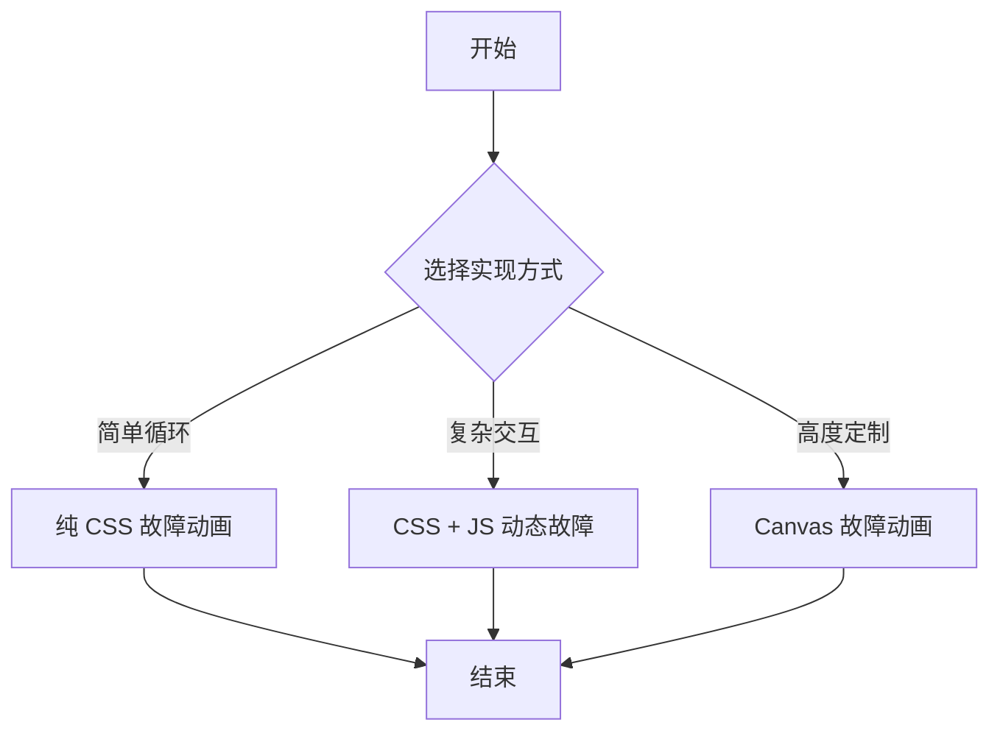

## SOP：在 React 中实现文字故障动画

> 本 SOP 定义在 React 中实现文字故障动画（RGB 颜色分离 + 位置抖动 + 切片错位）的标准流程，适用于赛博朋克、科技风格网站的标题动画。

---

### 适用场景

- ✅ **场景 1**：终端风格/赛博朋克网站的标题动画
- ✅ **场景 2**：技术产品首页的 Hero 文字特效
- ✅ **场景 3**：加载状态或错误状态的视觉反馈
- ✅ **场景 4**：游戏风格界面的装饰性动画

---

### 流程图解



---

### 核心步骤

#### 1. 纯 CSS 故障动画（适合简单循环动画）

基于伪元素和 `clip-path` 实现 RGB 通道分离效果：

```tsx
import './GlitchText.css'

function GlitchText({ children }: { children: React.ReactNode }) {
  return (
    <span className="glitch-wrapper">
      <span className="glitch" data-text={children}>
        {children}
      </span>
    </span>
  )
}
```

```css
/* GlitchText.css */
.glitch {
  position: relative;
  display: inline-block;
}

.glitch::before,
.glitch::after {
  content: attr(data-text);
  position: absolute;
  top: 0;
  left: 0;
  width: 100%;
  height: 100%;
  background: transparent;
}

.glitch::before {
  /* 红色通道向左偏移 */
  left: 2px;
  text-shadow: -2px 0 #ff0000;
  clip-path: inset(0 0 50% 0);
  animation: glitch-1 2s infinite linear alternate-reverse;
}

.glitch::after {
  /* 蓝色通道向右偏移 */
  left: -2px;
  text-shadow: 2px 0 #0000ff;
  clip-path: inset(50% 0 0 0);
  animation: glitch-2 3s infinite linear alternate-reverse;
}

@keyframes glitch-1 {
  0% { clip-path: inset(20% 0 60% 0); transform: translate(-3px); }
  20% { clip-path: inset(60% 0 10% 0); transform: translate(2px); }
  40% { clip-path: inset(30% 0 40% 0); transform: translate(-2px); }
  60% { clip-path: inset(70% 0 5% 0); transform: translate(3px); }
  80% { clip-path: inset(10% 0 80% 0); transform: translate(-1px); }
  100% { clip-path: inset(50% 0 30% 0); transform: translate(2px); }
}

@keyframes glitch-2 {
  0% { clip-path: inset(50% 0 30% 0); transform: translate(3px); }
  25% { clip-path: inset(10% 0 70% 0); transform: translate(-2px); }
  50% { clip-path: inset(70% 0 10% 0); transform: translate(1px); }
  75% { clip-path: inset(40% 0 40% 0); transform: translate(-3px); }
  100% { clip-path: inset(25% 0 55% 0); transform: translate(2px); }
}
```

**效果原理**：
- 原始文字在底层
- `::before` 伪元素作为红色通道，向左偏移 2px
- `::after` 伪元素作为蓝色通道，向右偏移 2px
- `clip-path: inset()` 控制显示区域，实现切片错位
- 两个动画的周期不同（2s vs 3s），避免规律性

#### 2. CSS + JS 动态故障（适合随机触发）

使用 React hooks 控制随机故障触发，产生随机的抖动和乱码：

```tsx
import { useState, useEffect, useRef } from 'react'

function DynamicGlitch({ children, triggerInterval = 3000 }: { children: string; triggerInterval?: number }) {
  const [isGlitching, setIsGlitching] = useState(false)
  const [displayText, setDisplayText] = useState(children)
  const timeoutRef = useRef<ReturnType<typeof setTimeout>>()

  useEffect(() => {
    const triggerGlitch = () => {
      setIsGlitching(true)

      // 快速切换乱码帧
      const glitchFrames = 5
      let frame = 0
      const glitchInterval = setInterval(() => {
        if (frame < glitchFrames) {
          setDisplayText(generateGlitchText(children))
          frame++
        } else {
          clearInterval(glitchInterval)
          setDisplayText(children)
          setIsGlitching(false)
        }
      }, 50)

      // 设置下次触发（随机间隔）
      timeoutRef.current = setTimeout(triggerGlitch, triggerInterval + Math.random() * 2000)
    }

    timeoutRef.current = setTimeout(triggerGlitch, triggerInterval)

    return () => {
      if (timeoutRef.current) clearTimeout(timeoutRef.current)
    }
  }, [children, triggerInterval])

  return (
    <span className={`dynamic-glitch ${isGlitching ? 'active' : ''}`}>
      {displayText}
    </span>
  )
}

function generateGlitchText(text: string): string {
  const glitchChars = '!@#$%^&*()_+-=[]{}|;:,.<>?/~`'
  return text
    .split('')
    .map(char => Math.random() > 0.7 ? glitchChars[Math.floor(Math.random() * glitchChars.length)] : char)
    .join('')
}
```

```css
.dynamic-glitch {
  position: relative;
  display: inline-block;
  transition: all 0.1s;
}

.dynamic-glitch.active {
  color: #ff3333;
  text-shadow:
    2px 0 #00ffff,
    -2px 0 #ff00ff;
  animation: shake 0.1s infinite;
}

@keyframes shake {
  0% { transform: translate(0); }
  25% { transform: translate(-2px, 1px); }
  50% { transform: translate(2px, -1px); }
  75% { transform: translate(-1px, -1px); }
  100% { transform: translate(1px, 1px); }
}
```

#### 3. 使用 Framer Motion 实现高级故障效果

```tsx
import { motion, useMotionValue, animate, useEffect } from 'framer-motion'

function MotionGlitch({ children }: { children: string }) {
  const glitchX = useMotionValue(0)
  const glitchY = useMotionValue(0)

  useEffect(() => {
    const triggerGlitch = () => {
      // X轴抖动序列
      animate(glitchX, [0, -3, 3, -2, 2, 0], {
        duration: 0.3,
        easing: [0.36, 0.07, 0.19, 0.97]
      })
      // Y轴抖动序列
      animate(glitchY, [0, 1, -1, 2, -1, 0], {
        duration: 0.25,
        easing: [0.36, 0.07, 0.19, 0.97]
      })

      setTimeout(triggerGlitch, 2000 + Math.random() * 3000)
    }

    const timeout = setTimeout(triggerGlitch, 2000)
    return () => clearTimeout(timeout)
  }, [glitchX, glitchY])

  return (
    <motion.span
      style={{
        x: glitchX,
        y: glitchY,
        textShadow: [
          '2px 0 #ff0000',
          '-2px 0 #00ffff',
          '0 0 10px #ff0000'
        ]
      }}
    >
      {children}
    </motion.span>
  )
}
```

#### 4. 组合效果层（推荐结构）

RGB 三层分离 + 扫描线效果：

```tsx
function GlitchEffect({ text }: { text: string }) {
  return (
    <div className="glitch-container">
      {/* 底层：原始文字 */}
      <span className="glitch-base">{text}</span>

      {/* 红色偏移层 */}
      <span className="glitch-layer glitch-red" aria-hidden="true">
        {text}
      </span>

      {/* 蓝色偏移层 */}
      <span className="glitch-layer glitch-blue" aria-hidden="true">
        {text}
      </span>

      {/* 扫描线效果 */}
      <span className="glitch-scanline" aria-hidden="true" />
    </div>
  )
}
```

```css
.glitch-container {
  position: relative;
  display: inline-block;
}

.glitch-base { position: relative; z-index: 1; }

.glitch-layer {
  position: absolute;
  top: 0;
  left: 0;
  opacity: 0.8;
}

.glitch-red {
  color: #ff0000;
  animation: glitch-red 2.5s infinite;
}

.glitch-blue {
  color: #0000ff;
  animation: glitch-blue 3s infinite;
}

.glitch-scanline {
  position: absolute;
  top: 0;
  left: 0;
  width: 100%;
  height: 100%;
  background: repeating-linear-gradient(
    0deg,
    transparent,
    transparent 2px,
    rgba(0, 0, 0, 0.1) 2px,
    rgba(0, 0, 0, 0.1) 4px
  );
  pointer-events: none;
  animation: scanline 0.1s infinite;
}
```

---

### 常见坑点

- ⛔ **无障碍问题**
	- **原因**：`aria-hidden="true"` 隐藏了辅助层，但原始文字层可能被屏幕阅读器忽略
	- **排查**：确保 `<span className="glitch-base">` 可被正常访问，考虑使用 `aria-label` 提供替代描述
- ⛔ **动画卡顿**
	- **原因**：`clip-path` 和 `text-shadow` 触发重排/重绘，性能较差
	- **排查**：将故障层放入独立的合成层（`will-change: transform`），或使用 `transform` 替代位置偏移
- ⛔ **中文字符故障效果不一致**
	- **原因**：中文字符宽度不固定，等宽字体覆盖不全
	- **排查**：使用 `font-variant-numeric: tabular-nums` 和等宽中文字体（如 Source Han Sans），或为中英文分别设置样式
- ⛔ **React Strict Mode 双重执行**
	- **原因**：`useEffect` 在开发模式下运行两次，导致定时器叠加
	- **排查**：使用 `useRef` 存储定时器 ID，并在 cleanup 中正确清理
- 🔧 **故障效果不触发**
	- **排查**：检查 `animation` 和 `setTimeout` 是否正确设置，DevTools 中观察元素类名变化
- 🔧 **性能优化检查点**
	- 使用 `transform` 和 `opacity` 实现动画（触发合成层）
	- 避免动画中改变 `width`、`height`、`margin`、`padding`
	- 对故障层添加 `will-change: transform`

---

### 知识图谱

- **父级概念**：[[Web动画]] — 本 SOP 属于 Web 动画的 CSS/JS 动画分支
- **关联概念**：
	- [[CSS Animation]] — 纯 CSS 实现动画的基础
	- [[SOP-在React中实现ASCII动画]] — 另一种 React 文本动画实现
	- [[Canvas动画]] — 更底层的动画实现方式
	- Framer Motion — React 动画库（本 SOP 的优化工具）
- **参考文章**：[【前端 | 教程】实现酷酷的文字故障效果_哔哩哔哩_bilibili](https://www.bilibili.com/video/BV1LN4y1D7aC/?spm_id_from=333.1387.homepage.video_card.click&vd_source=d909cd5773c434648664a934ea4a8dae)
