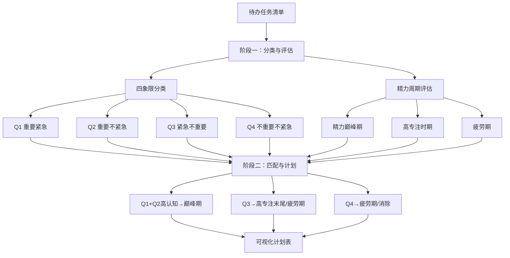

## SOP：如何在四象限法则中应用精力成本

### 目标与触发条件 (Goal & Trigger)

> [!summary]
> **触发场景**：当进行每日或每周任务规划，需要将 [[四象限法则]] 的任务优先级与 [[精力成本]] 的个人精力周期进行匹配时。
> **预期结果**：制定出一份高效的任务执行计划，确保高认知负荷的重要任务被安排在精力最旺盛的时段执行，从而提升工作质量和效率。

### 前置准备 (Mise-en-place)

- **工具**: [[四象限法则]]（用于任务分类）、[[精力成本]]（用于精力周期分析）、纸笔或数字工具（用于绘制矩阵和计划表）
- **素材**: 待处理的任务清单、个人精力周期观察记录（如无，需先进行 1-2 周的自我观察）
- **心态**: 接受精力是波动的，并愿意根据生理规律而非主观意愿来安排任务。

### 核心流程 (The Workflow)

#### 阶段一：任务分类与精力评估

1. **列出并分类任务**
	- 将所有待办事项列出。
	- 使用 [[四象限法则]]，根据 "重要性" 和 "紧急性" 将每个任务放入对应的象限（第一象限：重要且紧急；第二象限：重要不紧急；第三象限：紧急不重要；第四象限：不重要不紧急）。

2. **评估个人精力周期**
	- 回顾或记录自己一天中典型的精力波动情况。通常分为：
		- **精力巅峰期**（如早晨）：头脑最清醒，创造力、决策力最强。
		- **高专注时期**（如上/下午前半段）：注意力集中，适合处理常规复杂工作。
		- **疲劳期**（如午后、傍晚）：精力下降，易分心。

#### 阶段二：精力 - 任务匹配与计划制定

3. **进行双重优先级匹配**
	- **第一象限任务（重要且紧急）**：**必须优先处理**。将其中的**高认知负荷任务**（如复杂决策、关键报告）安排在**精力巅峰期**。如果任务量大，可将部分安排在**高专注时期**。
	- **第二象限任务（重要不紧急）**：这是**提升长期效能的关键**。将其中需要深度思考、创造性或战略规划的任务（如学习新技能、制定年度计划）坚决安排在**精力巅峰期**进行保护性投入。
	- **第三象限任务（紧急不重要）**：尽量**授权、简化或批量处理**。安排在**高专注时期**的末尾或**疲劳期**处理，避免其侵占高精力时段。
	- **第四象限任务（不重要不紧急）**：**尽量消除或最小化**。如果必须做，安排在**疲劳期**或作为休息间隙的填充。

4. **制定可视化计划表**
	- 制作一个时间表，将匹配好的任务填入对应的具体时间段。
	- 为**精力巅峰期**设置 "勿扰" 屏障，防止被会议或琐事打断。

### 常见坑点与排错 (Troubleshooting)

- **反模式**:
	- **凭感觉安排**：忽略精力周期，将重要任务随意安排在下午疲劳时段。
	- **救火模式**：让第三象限的 "紧急" 任务不断挤占第一、二象限的 "重要" 任务时间，并消耗掉宝贵的高精力时段。
	- **过度消耗**：在精力巅峰期连续工作数小时不休息，导致精力过早耗尽。
- **故障排查**:
	- **如果感到计划执行困难**：检查是否对自身精力周期的判断有误，重新进行一周的观察和记录。
	- **如果重要任务总被拖延**：检查是否将其安排在了错误的时段（如疲劳期），或是否被低估了认知负荷，需要调整至更高精力时段。
	- **如果高精力时段总被打断**：检查并强化 "勿扰" 措施，如关闭通知、告知同事、使用 [[番茄工作法]] 专注块。

### 原理与优化

- **底层逻辑**: 本流程基于 [[精力成本]] 中 "将高认知负荷任务与高精力时段对齐" 的核心原则，以及 [[四象限法则]] 中 "区分重要性以聚焦长期价值" 的决策框架。两者的结合实现了对 "注意力" 这一稀缺资源的双重优化管理 [^1][^2]。
- **优化日志**:
	- 2026-03-08: 初版 SOP 建立，整合了 [[精力成本]] 与 [[四象限法则]] 的核心思想。
