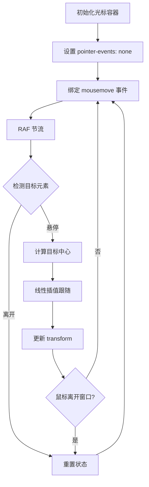

## SOP：磁力光标实现流程

> 实现具有磁力跟随效果的自定义光标，包含性能优化、状态管理、事件处理等标准流程。

---

### 适用场景

- 交互式光标效果（自定义鼠标指针、光标跟随）
- 拖拽功能（元素吸附、磁性吸附）
- 交互动画（平滑跟随、惯性效果）
- 游戏开发（角色移动、物体拖拽）

---

### 流程图解



---

### 核心步骤

1. **初始化光标容器**
	 - 创建光标 DOM 元素
	 - 设置 `position: fixed` 定位
	 - 设置 `pointer-events: none` 允许事件穿透

2. **性能优化设置**
	 - 设置 `will-change: transform` 提示浏览器创建合成层
	 - 使用 `transform` 而非 `left/top` 实现位移

3. **事件绑定**

 ```javascript
 // RAF 节流：避免高频事件导致性能问题
 let rafId = null;
 window.addEventListener("mousemove", (e) => {
	 if (rafId) cancelAnimationFrame(rafId);
	 rafId = requestAnimationFrame(() => {
		 updateCursorPosition(e);
	 });
 });
 ```

4. **目标检测与中心计算**

 ```javascript
 const rect = element.getBoundingClientRect();
 const centerX = rect.left + rect.width / 2;
 const centerY = rect.top + rect.height / 2;
 ```

5. **磁力跟随（线性插值）**

 ```javascript
 // 核心公式：新位置 = 当前位置 + (目标位置 - 当前位置) × 系数
 x = x + (targetX - x) * 0.3;
 y = y + (targetY - y) * 0.3;
 ```

6. **状态管理**

 ```javascript
 const cursor = {
	 container: null,
	 currentTarget: null,
	 isHovering: false,
	 magnetism: 0.25,  // 可配置参数
 };
 ```

7. **边界处理**

 ```javascript
 window.addEventListener("mouseleave", () => {
	 resetCursorSize();
	 isHovering = false;
 });
 ```

---

### CSS 关键配置

```css
.cursor {
position: fixed;
pointer-events: none;  /* 必须：允许事件穿透 */
will-change: transform;  /* 性能优化：创建合成层 */
transition: width 0.2s, height 0.2s;
/* 位置通过 JS transform 更新，不要用 left/top */
}

.cursor--active {
/* 悬停状态的样式变化 */
}
```

---

### 常见坑点

- ⛔ **事件穿透失败**：忘记设置 `pointer-events: none`，光标会拦截所有鼠标事件
- ⛔ **性能问题**：在 `mousemove` 中直接操作 DOM 或读取 layout 属性（如 `offsetLeft`）
- ⛔ **状态残留**：鼠标离开窗口时未重置状态，导致光标卡死
- 🔧 **样式闪烁**：检查 `mouseenter/mouseleave` 中的状态设置顺序
- 🔧 **跟随延迟**：调整 `magnetism` 系数（0.1~0.5），0.3 是平衡值

---

### 系数选择指南

| 系数 | 效果 | 适用场景 |
|:---:|:---|:---|
| 0.1 | 缓慢跟随，拖尾感强 | 磁性较弱效果 |
| **0.3** | **中等跟随，平衡感好** | **大多数场景** |
| 0.5 | 快速跟随，几乎直接吸附 | 即时响应需求 |
| 1.0 | 瞬间跳转 | 无动画效果 |

---

### 知识图谱

- **父级**：[[前端交互]] — 属于交互技术范畴
- **关联概念**：
	- [[requestAnimationFrame]] — 帧调度与节流
	- [[will-change]] — 合成层优化
	- [[回流和重绘|重绘与回流]] — 性能优化原理
	- [[pointer-events]] — 事件穿透控制
- **相关笔记**：
	- [[自定义光标开发记录]] — 完整开发记录

---

### 参考代码

详见 [[自定义光标开发记录]] 附录中的完整代码结构。
效果参见：[[磁力光标.html]]
