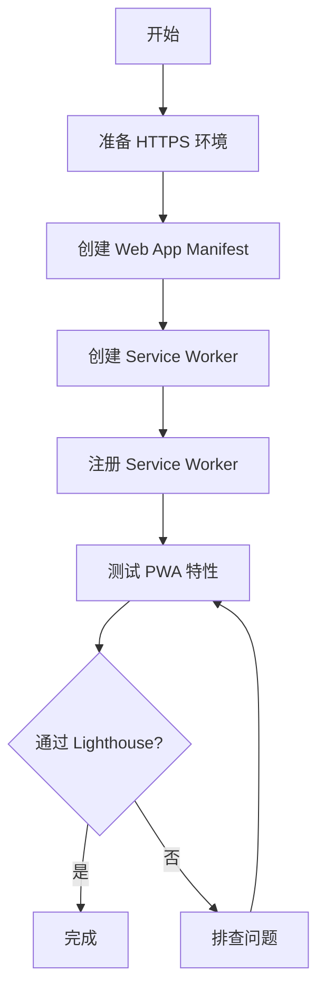

## SOP：开发一个最小 PWA 应用

> 快速搭建一个满足 PWA 最低要求的可安装 Web 应用

目标：开发一个最小可运行的 PWA 应用，通过 Lighthouse PWA 审核
实现：HTTPS + Web App Manifest + Service Worker + 离线资源

---

### 适用场景

- 场景 1：首次接触 PWA，需要快速验证概念
- 场景 2：学习 PWA 核心组件，理解最小要求
- 场景 3：快速原型开发，需要离线能力

---

### 流程图解



---

### 核心步骤

1. **准备 HTTPS 环境**：PWA 必须使用 HTTPS，localhost 除外
		- 注意：开发环境使用 `http://localhost`，生产环境必须 HTTPS
2. **创建 Web App Manifest**：定义应用元数据（名称、图标、主题色）
		- 注意：必须包含 `name`、`icons`、`start_url`、`display`
3. **创建 Service Worker**：实现基本的离线缓存
		- 注意：必须实现 `install` 和 `fetch` 事件
4. **注册 Service Worker**：在主页面引入并注册
		- 注意：必须在 HTTPS 或 localhost 下运行
5. **测试 PWA 特性**：使用 Chrome DevTools 或 Lighthouse 验证

---

### 实践/示例

**项目结构**

```bash
/
├── index.html
├── manifest.json
├── sw.js
└── icons/
    └── icon-192.png
```

**1. index.html**

```html
<!DOCTYPE html>
<html lang="zh">
<head>
  <meta charset="UTF-8">
  <meta name="viewport" content="width=device-width, initial-scale=1.0">
  <title>我的 PWA 应用</title>
  <link rel="manifest" href="/manifest.json">
  <link rel="apple-touch-icon" href="/icons/icon-192.png">
</head>
<body>
  <h1>最小 PWA</h1>
  <p>这个应用可以离线访问</p>
  <script>
    // 注册 Service Worker
    if ('serviceWorker' in navigator) {
      navigator.serviceWorker.register('/sw.js')
        .then(reg => console.log('SW 注册成功', reg))
        .catch(err => console.error('SW 注册失败', err))
    }
  </script>
</body>
</html>
```

**2. manifest.json**

```json
{
  "name": "我的 PWA 应用",
  "short_name": "PWA",
  "start_url": "/",
  "display": "standalone",
  "background_color": "#ffffff",
  "theme_color": "#4CAF50",
  "icons": [
    {
      "src": "/icons/icon-192.png",
      "sizes": "192x192",
      "type": "image/png"
    },
    {
      "src": "/icons/icon-512.png",
      "sizes": "512x512",
      "type": "image/png"
    }
  ]
}
```

**3. sw.js**

```javascript
const CACHE_NAME = 'pwa-cache-v1'
const urlsToCache = [
  '/',
  '/index.html'
]

// install 事件：缓存资源
self.addEventListener('install', event => {
  event.waitUntil(
    caches.open(CACHE_NAME)
      .then(cache => cache.addAll(urlsToCache))
  )
  self.skipWaiting()
})

// activate 事件：清理旧缓存
self.addEventListener('activate', event => {
  event.waitUntil(
    caches.keys().then(names =>
      Promise.all(names.filter(name => name !== CACHE_NAME).map(name => caches.delete(name)))
    )
  )
  self.clients.claim()
})

// fetch 事件：缓存优先策略
self.addEventListener('fetch', event => {
  event.respondWith(
    caches.match(event.request)
      .then(response => response || fetch(event.request))
  )
})
```

---

### 常见坑点

- ⛔ **反模式**：manifest.json 或 sw.js 路径错误导致 404
- ⛔ **反模式**：图标尺寸不符合要求（至少 192x192 和 512x512）
- ⛔ **反模式**：Service Worker 注册在 HTTP 页面（非 localhost）
- 🔧 **排查**：PWA 不可安装 → 检查 manifest.json 是否可访问、字段是否完整
- 🔧 **排查**：离线不工作 → 检查 sw.js 是否正确注册、缓存是否成功
- 🔧 **排查**：Lighthouse 提示 "Service Worker 不响应 fetch" → 检查 fetch 事件处理逻辑

---

### 知识图谱

- **相关概念**：
		- [[PWA]] — PWA 的完整概念
		- [[Service Worker]] — 实现离线缓存的核心技术
		- [[Web App Manifest]] — 定义 PWA 元数据
- **相关 SOP**：
		- [[SOP-开发一个最小PWA应用]] — 本笔记
		- [[SOP-调试JavaScript内存泄漏]] — Service Worker 缓存可能导致的内存问题
