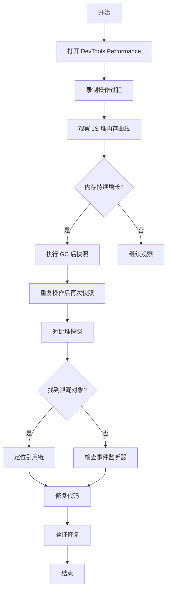

## SOP：调试 JavaScript 内存泄漏

> 使用 Chrome DevTools 定位和解决 JavaScript 内存泄漏的标准流程

目标：通过性能分析和==堆快照对比==，定位内存泄漏的根源并修复
实现：Chrome DevTools + Performance API + 内存分析

---

### 适用场景

- 场景 1：页面长时间运行后变卡或变慢
- 场景 2：用户反馈页面内存占用持续增长
- 场景 3：代码变更后需要验证内存使用是否正常

---

### 流程图解



---

### 核心步骤

1. **准备环境**：打开 Chrome DevTools，确保在无痕模式下排除扩展干扰
		- 注意：使用 `Ctrl+Shift+N` 打开无痕窗口
2. **录制基线**：打开 Performance 面板，记录正常操作作为基线
		- 注意：录制时长 30-60 秒，覆盖典型用户操作
3. ==**观察内存曲线**：查看 JS Heap 曲线是否呈上升趋势==
		- 注意：正常的垃圾回收应呈现锯齿状，持续上升才是泄漏
4. **堆快照对比**：在操作前后各执行一次 GC，记录堆快照
		- 注意：点击垃圾桶图标强制 GC
5. **定位泄漏对象**：使用 Comparison 视图对比两次快照差异
		- 注意：关注 Detached DOM 节点和闭包引用
6. **检查引用链**：通过 Memory 面板的 Allocation 视图定位持有引用的代码
7. **修复验证**：修改代码后重新录制，确认内存曲线恢复正常

---

### 实践/示例

**堆快照对比分析**

```javascript
// 泄漏场景：事件监听器未清理
class MemoryLeakDemo {
  constructor() {
    this.data = new Array(10000).fill('leak')
    // 每次创建实例都添加监听器，但从不移除
    window.addEventListener('resize', this.handleResize)
  }

  handleResize() {
    console.log('resize', this.data.length)
  }

  // 修复：添加销毁方法
  destroy() {
    window.removeEventListener('resize', this.handleResize)
    this.data = null
  }
}
```

**Performance API 监控**

```javascript
// 使用 performance API 检测内存
const monitorMemory = () => {
  if (performance.memory) {
    const used = (performance.memory.usedJSHeapSize / 1024 / 1024).toFixed(2)
    const total = (performance.memory.totalJSHeapSize / 1024 / 1024).toFixed(2)
    console.log(`内存使用: ${used} MB / 总计: ${total} MB`)
    return { used, total }
  }
  console.warn('performance.memory 不可用')
}

// 定期监控
setInterval(monitorMemory, 5000)
```

---

### 常见坑点

- ⛔ **反模式**：闭包持有大型对象引用后未释放，导致内存无法回收
- ⛔ **反模式**：DOM 节点已从文档移除，但仍有 JS 引用（detached DOM）
- ⛔ **反模式**：定时器（setInterval/setTimeout）未在组件销毁时清理
- 🔧 **排查**：内存持续增长 → 检查是否有未清理的事件监听器、定时器、全局缓存
- 🔧 **排查**：堆快照中大量相同类型对象 → 检查是否有缓存未正确清理
- 🔧 **排查**：Detached DOM 节点 → 检查 detach 后的清理逻辑

---

### 知识图谱

- **相关概念**：
		- [[JavaScript]] — 内存泄漏发生的语言环境
		- [[闭包]] — 常见的泄漏源（闭包持有大对象）
		- [[事件循环]] — 理解内存管理的异步环境
- **相关 SOP**：
		- [[SOP-使用Promise处理异步操作]] — 异步代码的规范处理
