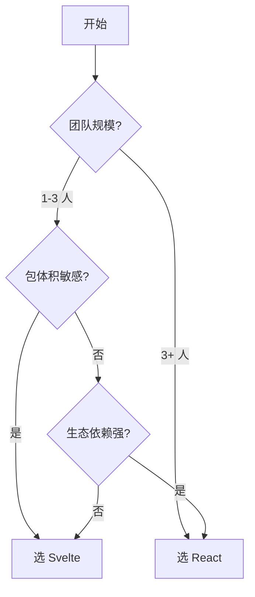

## Svelte vs React

### 一句话对比

Svelte 是编译时框架，在构建阶段将组件转换为原生 DOM 操作，运行时近乎零开销；React 是运行时框架，依赖虚拟 DOM 和协调机制来更新 UI。

---

### 核心对比

| 维度 | **Svelte** | **React** |
|:---|:---|:---|
| **一句话定义** | 编译时优化的前端框架，无运行时库 | 基于虚拟 DOM 的运行时 UI 库 |
| **核心本质** | 编译器将组件转换为命令式原生 JS | 运行时通过虚拟 DOM Diff 协调更新 |
| **适用场景** | 注重包体积和初始性能的项目 | 大型团队、复杂应用、生态依赖的场景 |

### 差异点

- **架构哲学**：
	- Svelte：编译时框架，将框架代码转化为原生 JS，运行时≈0KB
	- React：运行时框架，浏览器中加载 React 运行时（~40KB），执行虚拟 DOM Diff
- **响应式机制**：
	- Svelte：编译器重写赋值语句，编译时确定依赖关系，`let count` + `count++` 自动触发更新
	- React：基于 `useState` / `useReducer` 触发重新渲染，生成新虚拟 DOM 树并与旧树 Diff
- **DOM 更新方式**：
	- Svelte：编译生成精确的 DOM 操作指令，直接更新变化的节点
	- React：运行时生成虚拟 DOM 树，通过 Diff 算法（Fiber）找出差异，批量提交真实 DOM
- **组件模型**：
	- Svelte：单文件组件（`.svelte`），模板 + 脚本 + 样式天然隔离，`export let` 声明 props
	- React：函数组件 + JSX，组件即函数，props 为函数参数，样式需额外方案
- **状态管理**：
	- Svelte：内置 store（`writable`/`derived`/`readable`），响应式 `$:` 声明，`$store` 自动订阅
	- React：内置 `useState`/`useReducer` + Context，社区方案有 Redux/Zustand/Jotai 等
- **生命周期**：
	- Svelte：`onMount`/`onDestroy`/`beforeUpdate`/`afterUpdate` 等显式钩子
	- React：`useEffect`/`useLayoutEffect` 等 hooks，依赖数组控制执行时机
- **TypeScript 支持**：
	- Svelte：支持但不如 React 成熟，`<script lang="ts">`，部分需要额外配置
	- React：原生 TypeScript 支持，泛型组件、类型推断成熟，生态工具链完善
- **生态与社区**：
	- Svelte：生态较小但精炼，SvelteKit 全栈框架，适配器体系灵活
	- React：最大前端生态，Next.js/Gatsby/Remix 等丰富选择，第三方库覆盖所有场景

---

### 相似之处

- 都是组件化前端框架/库
- 都支持响应式数据驱动视图
- 都有对应的全栈框架（SvelteKit / Next.js）
- 都支持 SPA、SSR、SSG 模式
- 都有一流的开发者工具支持

---

### 场景选择

- **选 Svelte 当**：
	- 追求极致包体积和首屏性能，如移动端 H5、轻量页面
	- 项目小而精，团队规模小，无需大量第三方库
	- 偏好简洁语法和更少的样板代码
	- 用 SvelteKit 做全栈应用
- **选 React 当**：
	- 大型团队协作，需要丰富的生态和现成解决方案
	- 需要大量第三方库支持（图表、拖拽、富文本等）
	- 团队已有 React 技术积累
	- 需要成熟的 SSR/SSG 框架（Next.js）

---

### 决策树



---

### 示例对比

**Svelte 组件**：

```svelte
<script>
  let count = 0;
</script>

<button on:click={() => count++}>
  点击了 {count} 次
</button>

<style>
  button { color: red; }
</style>
```

**React 组件**：

```jsx
import { useState } from 'react';
import './Button.css';

export default function Button() {
  const [count, setCount] = useState(0);
  return <button onClick={() => setCount(c => c + 1)}>
    点击了 {count} 次
  </button>;
}
```

---

### 知识图谱

- **父级话题**：[[前端框架]]
- **相关对比**：
	- [[Angular vs React]] — 全面框架 vs UI 库的对比
	- [[Vue vs React]] — 渐进式框架 vs UI 库
- **前置知识**：
	- [[Svelte 无需虚拟 DOM，编译时直接生成 DOM 操作代码]]
	- React 虚拟 DOM 和 Fiber 架构
