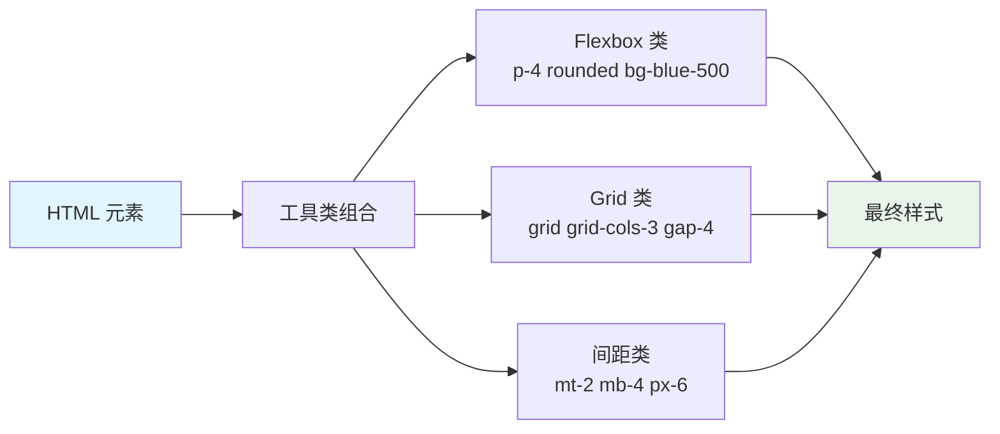

## 概念：TailwindCSS

> TailwindCSS 是一个以**原子化（Utility-First）** 为核心的 CSS 框架，通过组合大量预定义的工具类（Utility Classes）来构建用户界面，而非编写自定义 CSS 样式。

**解决的核心痛点**：解决传统 CSS 命名困难、样式冲突、代码复用性差的问题，让开发者可以直接在 HTML 中通过组合工具类完成样式开发。

---

### 核心命题

- TailwindCSS 的本质是「组合优于继承」——不再依赖 CSS 的层叠继承，而是通过工具类组合实现样式复用
- TailwindCSS 的价值在于「一致性」——预定义的设计系统（颜色、间距、字体）确保团队协作时样式统一
- TailwindCSS 的代价是「HTML 污染」——大量的工具类会让 HTML 标签变得臃肿

---

### 运行机制

#### 工具类组合模型

#### 核心概念

| 概念 | 说明 |
|:---|:---|
| **工具类（Utility）** | 单一职责的原子类，如 `p-4` 表示 padding: 1rem |
| **设计系统（Design System）** | 预定义的色板、间距、字体等，如 `blue-500`、`text-lg` |
| **响应式前缀** | `sm:`、`md:`、`lg:`、`xl:` 对应不同断点 |
| **变体（Variants）** | `hover:`、`focus:`、`dark:` 等状态变体 |

---

### 关键区别

| 维度 | TailwindCSS | 传统 CSS | CSS-in-JS |
|:---|:---|:---|:---|
| **样式位置** | HTML | 独立 CSS 文件 | JavaScript 对象 |
| **复用方式** | 工具类组合 | 类名复用/继承 | 组件封装 |
| **学习曲线** | 记忆工具类 | 熟悉选择器 | 熟悉框架 API |
| **HTML 污染** | 高 | 低 | 低 |
| **运行时性能** | 无 | 无 | 有（JS 执行） |

---

### 应用场景

- ✅ **适用场景**
	- **快速原型开发**：直接组合工具类，无需切换文件
	- **团队协作项目**：设计系统确保视觉一致性
	- **中小型项目**：组件化程度低的项目更合适
	- **Tailwind 生态项目**：如 shadcn/ui、Headless UI
- ⛔ **误用**
	- **超大型项目**：大量重复的工具类导致 HTML 难以维护
	- **设计一致性要求低**：自定义 CSS 更灵活
	- **需要深度定制**：复杂动画和特殊效果需要额外的自定义 CSS

---

### 知识图谱

- **父级概念**：[[CSS]] — TailwindCSS 是 CSS 的原子化实现
- **子级概念**：
	- 工具类 — 原子化样式单元
	- 设计系统配置 — Tailwind 的预设值定制
- **并列概念**：
	- [[CSS]] — 传统 CSS 写法
	- SCSS/Sass — CSS 预处理器
	- CSS-in-JS — 样式绑定 JavaScript 的方案
- **相关概念**：
	- [[前端开发]] — TailwindCSS 的应用领域
	- [[前端交互]] — 交互样式实现

---

### FAQ

- [[Q-TailwindCSS 与传统 CSS 相比的优缺点是什么]]
- [[Q-何时应该选择 TailwindCSS 而不是其他 CSS 方案]]

---

### 参考延伸

- 官网：[tailwindcss.com](https://tailwindcss.com/)
- 组件库：[Headless UI](https://headlessui.com/)、[shadcn/ui](https://ui.shadcn.com/)
