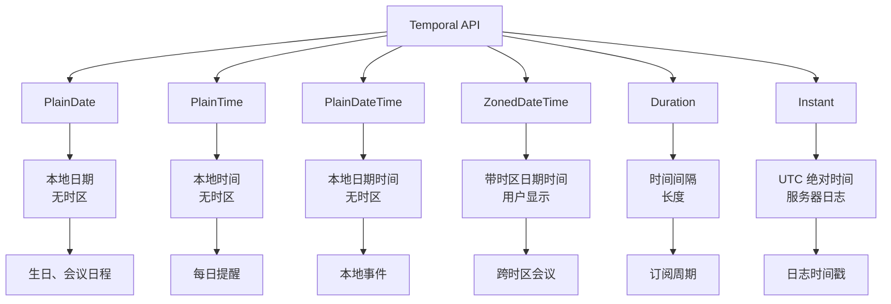
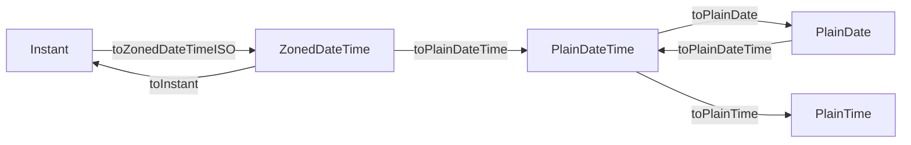

## 概念：Temporal API

> ES2026 引入的现代化日期时间 API，提供一组不可变的日期时间对象，填补了 `Date` 的所有设计缺陷

**解决的核心痛点**：JavaScript 传统 `Date` 对象是可变的、时区处理混乱、API 不一致，开发者长期依赖第三方库（如 date-fns、moment.js）处理日期时间

---

### 核心命题

- Temporal API 是 JavaScript 日期时间的范式转换 — 从有设计缺陷的 `Date` 走向现代不可变日期时间对象
	- **原理**：`Date` 是可变的，而 Temporal 所有对象都是不可变的；`Date` 的时区处理依赖运行环境，而 Temporal 有明确的时区概念
- Temporal API 终结了 JavaScript 日期时间必须依赖第三方库的历史
	- **原理**：ES2026 之前，处理时区、非公历日历、精确时间运算都需要 moment.js 或 date-fns，现在原生支持
- 选择正确的 Temporal 对象类型是正确处理日期时间的关键
	- **原理**：PlainDate 用于无时区日期，ZonedDateTime 用于需要时区显示的场景，Instant 用于服务器时间戳

---

### 运行机制

**六大核心对象的职责分工**：



**对象间转换关系**：



---

### 关键区别

| 维度 | `Temporal` | `Date` |
|:---|:---|:---|
| **可变性** | 不可变 | 可变（`setDate` 等直接修改） |
| **时区处理** | 明确、一致 | 混乱、依赖运行环境 |
| **API 一致性** | 统一方法命名 | 各对象方法不统一 |
| **第三方库依赖** | 无需 | 需要 date-fns 等处理复杂场景 |
| **非公历支持** | 支持 | 不支持 |

**代码对比**：

```javascript
// ❌ Date：可变性陷阱
const deadline = new Date('2026-04-18');
deadline.setDate(deadline.getDate() + 7); // 直接修改原对象！
console.log(deadline); // 原对象被改变

// ✅ Temporal：不可变安全
const deadline = Temporal.PlainDate.from('2026-04-18');
const newDeadline = deadline.add({ days: 7 }); // 返回新对象
console.log(deadline);    // 原对象不变
console.log(newDeadline); // 新对象
```

| 对象选择 | 场景 | 示例 |
|:---|:---|:---|
| `PlainDate` | 用户生日、本地日程 | `2026-04-18` |
| `PlainTime` | 每日闹钟、重复提醒 | `14:30:00` |
| `PlainDateTime` | 本地事件（无需时区） | `2026-04-18T14:30:00` |
| `ZonedDateTime` | 跨时区会议、用户可见时间 | `2026-04-18T14:30:00+08:00[Asia/Shanghai]` |
| `Duration` | 订阅周期、过期时长 | `P30D`（30 天） |
| `Instant` | 服务器日志、API 时间戳 | `2026-04-18T06:30:00Z` |

---

### 应用场景

- ✅ **适用场景**
	- **用户生日/纪念日**：用 `PlainDate`，不需要时区
	- **跨时区会议**：用 `ZonedDateTime`，正确转换用户本地时间
	- **服务器日志**：用 `Instant`，UTC 统一时间戳
	- **订阅/会员过期**：用 `Duration` + `PlainDate` 计算
	- **日期计算**：不可变运算，避免 `Date` 的陷阱
- ⛔ **误用**
	- **用 PlainDateTime 显示给用户**：应该用 `ZonedDateTime` 转换到用户时区
	- **用 Instant 做本地显示**：应该用 `ZonedDateTime` 转换到用户时区
	- **修改 Temporal 对象**：所有 Temporal 对象不可变，应该用 `.with()` 或 `.add()` 返回新对象

---

### FAQ

> 关于 Temporal API 的常见问题

- [[Q-Temporal API和date-fns的区别]]
- [[Q-Temporal API如何处理夏令时]]
- [[Q-为什么Temporal比Date好]]

---

### 知识图谱

- **父级概念**：
	- [[ES2026]] — Temporal API 是 ES2026 的核心特性
	- [[Javascript版本演进]] — ES2026 是最新版本
- **相关概念**：
	- [[Date]] — 被替代的传统 API
	- [[ECMAScript]] — JavaScript 遵循的标准
- **参考文章**
	- [MDN - Temporal](https://developer.mozilla.org/zh-CN/docs/Web/JavaScript/Reference/Global_Objects/Temporal)
