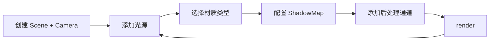

## SOP：Three.js 实现光影滤镜

> 本 SOP 定义使用 Three.js 实现光照系统、阴影投射与后处理滤镜效果的标准流程，覆盖 `Light` → `Material` → `Shadow` → `Post-processing` 全链路。

---

### 适用场景

- ✅ 场景 1：3D 产品展示的光影氛围营造
- ✅ 场景 2：游戏场景的动态光照与阴影
- ✅ 场景 3：数据可视化的滤镜效果（泛光、色调调整）
- ✅ 场景 4：沉浸式官网的后处理特效（Bokeh、Glow）

---

### 流程图解



---

### 核心概念关系

```bash
Scene
 ├── Lights（光源）
 │    ├── AmbientLight      环境光（全局照亮）
 │    ├── DirectionalLight 方向光（太阳光/平行光）
 │    ├── PointLight       点光源（灯泡/蜡烛）
 │    └── SpotLight        聚光灯（舞台灯）
 │
 ├── Meshes（网格）
 │    └── Materials（材质）
 │         ├── MeshBasicMaterial  不受光照影响
 │         ├── MeshLambertMaterial  漫反射（简单计算）
 │         └── MeshStandardMaterial 物理渲染（PBR）
 │
 └── Post-processing（后处理）
      ├── EffectComposer
      ├── RenderPass
      └── UnrealBloomPass / ShaderPass
```

---

### 核心步骤

#### 步骤 1：创建场景与基础光照

```javascript
import * as THREE from 'three'

const scene  = new THREE.Scene()
const camera = new THREE.PerspectiveCamera(75, innerWidth / innerHeight, 0.1, 1000)
const renderer = new THREE.WebGLRenderer({ antialias: true })
renderer.setSize(innerWidth, innerHeight)
renderer.setPixelRatio(Math.min(devicePixelRatio, 2))
renderer.shadowMap.enabled = true              // 开启阴影
renderer.shadowMap.type = THREE.PCFSoftShadowMap // 柔和阴影
document.body.appendChild(renderer.domElement)

// 环境光：均匀照亮所有物体，不产生阴影
const ambient = new THREE.AmbientLight(0x404040, 0.5) // 颜色，强度
scene.add(ambient)

// 方向光：模拟太阳光，可投射阴影
const sun = new THREE.DirectionalLight(0xffffff, 1.0)
sun.position.set(10, 10, 10)
sun.castShadow = true
sun.shadow.mapSize.width  = 2048
sun.shadow.mapSize.height = 2048
sun.shadow.camera.near = 0.1
sun.shadow.camera.far  = 50
sun.shadow.camera.left = -10
sun.shadow.camera.right = 10
sun.shadow.camera.top = 10
sun.shadow.camera.bottom = -10
scene.add(sun)
```

#### 步骤 2：选择材质类型

| 材质 | 受光类型 | 适用场景 | 性能 |
|:---|:---|:---|:---|
| `MeshBasicMaterial` | 不受光 | 纯色、调试 | 最快 |
| `MeshLambertMaterial` | 漫反射 | 简约风格 | 较快 |
| `MeshStandardMaterial` | 漫反射 + 镜面反射 | PBR 真实渲染 | 中等 |
| `MeshPhongMaterial` | 漫反射 + 高光 | 光滑表面 | 中等 |
| `ShaderMaterial` | 自定义 | 特殊效果 | 取决于 shader |

```javascript
// PBR 材质（推荐，用于真实感渲染）
const material = new THREE.MeshStandardMaterial({
  color: 0x4488ff,
  roughness: 0.3,    // 粗糙度：0 = 光滑镜面，1 = 完全漫反射
  metalness: 0.8,    // 金属度：0 = 非金属，1 = 全金属
  emissive: 0x000000, // 自发光颜色
})
```

#### 步骤 3：投射阴影的网格设置

阴影的产生需要**两个条件**：光源开启 `castShadow`，物体开启 `castShadow` 和/或 `receiveShadow`。

```javascript
// 创建地面：接收阴影
const groundGeo = new THREE.PlaneGeometry(20, 20)
const groundMat = new THREE.MeshStandardMaterial({ color: 0x333333 })
const ground = new THREE.Mesh(groundGeo, groundMat)
ground.rotation.x = -Math.PI / 2
ground.receiveShadow = true   // 接收阴影
scene.add(ground)

// 创建立方体：投射阴影
const boxGeo = new THREE.BoxGeometry(2, 2, 2)
const box    = new THREE.Mesh(boxGeo, material)
box.position.y = 1
box.castShadow    = true  // 投射阴影
box.receiveShadow = true  // 同时也接收阴影
scene.add(box)
```

> `castShadow` 和 `receiveShadow` 可以同时开启，不会冲突。

#### 步骤 4：点光源与聚光灯

```javascript
// 点光源：从一点向所有方向发射
const point = new THREE.PointLight(0xff6600, 1.0, 50) // 颜色，强度，衰减距离
point.position.set(0, 5, 0)
point.castShadow = true
scene.add(point)

// 聚光灯：锥形光束，可用于舞台/手电筒效果
const spot = new THREE.SpotLight(0xffffff, 2.0)
spot.position.set(5, 10, 5)
spot.target.position.set(0, 0, 0)
spot.angle       = Math.PI / 6    // 锥角
spot.penumbra    = 0.5            // 半影（0=硬边缘，1=软边缘）
spot.decay       = 2              // 衰减系数
spot.distance    = 50
spot.castShadow  = true
spot.shadow.mapSize.set(1024, 1024)
scene.add(spot)
scene.add(spot.target)
```

#### 步骤 5：后处理滤镜（EffectComposer）

后处理通过 `EffectComposer` 在场景渲染后应用各种滤镜效果：

```javascript
import { EffectComposer } from 'three/addons/postprocessing/EffectComposer.js'
import { RenderPass }     from 'three/addons/postprocessing/RenderPass.js'
import { UnrealBloomPass } from 'three/addons/postprocessing/UnrealBloomPass.js'
import { ShaderPass }     from 'three/addons/postprocessing/ShaderPass.js'

const composer = new EffectComposer(renderer)

// 1. 基础渲染通道
const renderPass = new RenderPass(scene, camera)
composer.addPass(renderPass)

// 2. 泛光效果（发光/Bloom）
const bloomPass = new UnrealBloomPass(
  new THREE.Vector2(innerWidth, innerHeight),
  1.5,   // 强度
  0.4,   // 半径
  0.85   // 阈值（低于此亮度的像素不受影响）
)
composer.addPass(bloomPass)

// 3. 自定义 ShaderPass（色调调整、模糊等）
const colorShader = {
  uniforms: {
    tDiffuse: { value: null },
    uAmount:  { value: 0.1 },
  },
  vertexShader: `
    varying vec2 vUv;
    void main() {
      vUv = uv;
      gl_Position = projectionMatrix * modelViewMatrix * vec4(position, 1.0);
    }
  `,
  fragmentShader: `
    uniform sampler2D tDiffuse;
    uniform float uAmount;
    varying vec2 vUv;
    void main() {
      vec4 color = texture2D(tDiffuse, vUv);
      // 饱和度调整
      float gray = dot(color.rgb, vec3(0.299, 0.587, 0.114));
      color.rgb = mix(vec3(gray), color.rgb, 1.0 + uAmount);
      gl_FragColor = color;
    }
  `,
}
const colorPass = new ShaderPass(colorShader)
composer.addPass(colorPass)

// 替换原来的 render 为 composer
function animate() {
  requestAnimationFrame(animate)
  composer.render()  // 使用 composer.render() 而非 renderer.render()
}
```

---

### 常见坑点

- ⛔ **阴影呈块状/锯齿**
	- **原因**：`ShadowMap` 分辨率不足，或 `PCFSoftShadowMap` 未开启
	- **排查 `：提高 `mapSize`（2048x2048 以上），确认 `renderer.shadowMap.type = THREE.PCFSoftShadowMap`
- ⛔ **物体不受光/完全黑暗**
	- **原因**：使用了 `MeshBasicMaterial`（不受任何光源影响），或场景中没有添加任何光源
	- **排查**：换用 `MeshStandardMaterial`，确认场景中有 `AmbientLight`
- ⛔ **Bloom 效果使整个画面泛白**
	- **原因**：`UnrealBloomPass` 的阈值太低（0.85 默认），几乎所有像素都被提亮
	- **排查**：提高阈值到 0.9 ~ 0.95，或降低强度到 0.5 ~ 1.0
- ⛔ **SpotLight 照不到物体**
	- **原因**：`spot.target` 未添加到场景中
	- **排查**：`scene.add(spot.target)` 让 target 成为场景子节点
- ⛔ **后处理后画面变黑**
	- **原因**：`EffectComposer` 使用后必须用 `composer.render()` 替代 `renderer.render()`
	- **排查**：确认动画循环中调用的是 `composer.render()`
- 🔧 **性能优化**：后处理是多通道串联，通道越多性能越差；移动端建议只用 `RenderPass + 一个 ShaderPass`

---

### 知识图谱

- **父级概念**：[[ThreeJS]] — 本 SOP 是 Three.js 光照与后处理系统的应用
- **关联 SOP**：
	- [[ThreeJS实现3D视差滚动]] — Three.js 的动态场景应用
	- [[Canvas实现无限滑动效果]] — Canvas 2D 渲染方案对比
	- [[CSS实现文字横向滚动效果]] — CSS 动画方案对比
