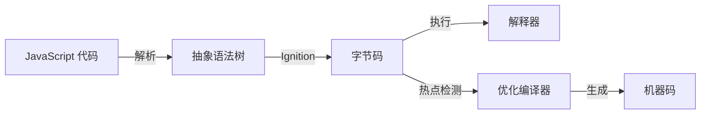

## 术语：V8 引擎

### 定义

V8 是 Google 开发的开源 JavaScript 引擎，使用 C++ 编写，用于 Chrome 浏览器和 Node.js。它将 JavaScript 代码直接编译为机器码执行，而非使用解释器，这使得 V8 具有极高的执行性能。

### 核心特性

| 特性 | 说明 |
|------|------|
| **JIT 编译** | 即时编译，将热点代码编译为机器码 |
| **TurboFan** | 优化编译器，针对热点函数进行深度优化 |
| **Ignition** | 解释器，快速启动并收集类型信息 |
| **Orinoco** | 垃圾回收器，负责内存管理 |

### 工作原理

### 内存管理

V8 使用分代垃圾回收：

- **新生代**：存放短生命周期对象，使用 Scavenge 算法
- **老生代**：存放长期存活对象，使用 Mark-Sweep 和 Mark-Compact 算法

### 锚点连接

- **属于**：[[JavaScript 引擎]]
- **用于**：[[Chrome]] [[Node.js]]
- **相关概念**：[[垃圾回收]] [[JIT 编译]] [[字节码]]
