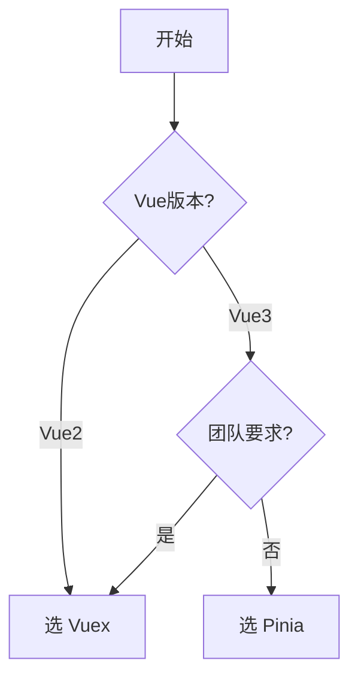

## VS-Vuex vs Pinia

### 🔰 一句话对比

Pinia 是 Vue3 官方推荐的状态管理库，相比 Vuex 更轻量、更 TypeScript 友好，是 Vue3 项目的事实标准。

---

### 🧠 对比全景图

#### 各自定义

| 维度 | **Vuex** | **Pinia** |
|------|----------|-----------|
| **一句话定义** | Vue2 时代的官方状态管理库 | Vue3 时代的官方状态管理库 |
| **核心本质** | 基于 mutations/actions/getters 的集中式状态管理 | 基于 store/ state/ actions/ getters 的响应式状态管理 |
| **解决什么问题** | 多组件共享状态问题 | 同上，但更现代化 |

#### 核心对比维度

| 对比维度 | **Vuex** | **Pinia** | 我的理解 |
|----------|----------|-----------|----------|
| **API 设计** | mutations + actions 分离 | actions 可异步，直观 | Pinia 更简洁 |
| **TypeScript** | 支持有限 | 原生 TypeScript 支持 | Pinia 开发体验更好 |
| **模块化** | 需要手动 namespaced | 自动商店拆分 | Pinia 更灵活 |
| **体积** | 约 21KB | 约 6KB | Pinia 更轻量 |
| **Vue3 支持** | 需配合 mapState 等 | 原生组合式 API | Pinia 无缝集成 |
| **调试** | devtools 支持 | devtools 支持 | 两者相当 |
| **Mutations** | 必须同步 | 可异步 | Pinia 更灵活 |
| **语法糖** | 较少 | setup 语法糖 | Pinia 更现代 |

#### 相似之处

- 都是 Vue 官方推荐的状态管理方案
- 都支持集中式状态管理
- 都支持调试工具
- 核心概念相似（state、getters、actions）

#### 核心区别（一句话总结

Pinia 是 Vue3 时代的轻量级状态管理方案，去掉了 mutations（不再强制要求），提供更好的 TypeScript 支持和更简洁的 API，是 Vue3 的默认选择。

---

### 💻 代码/实例对比

#### Vuex 示例

```javascript
const store = new Vuex.Store({
  state: {
    count: 0
  },
  mutations: {
    increment(state) {
      state.count++
    }
  },
  actions: {
    increment({ commit }) {
      commit('increment')
    }
  },
  getters: {
    doubleCount: state => state.count * 2
  }
})
```

#### Pinia 示例

```javascript
import { defineStore } from 'pinia'

export const useCounterStore = defineStore('counter', {
  state: () => ({
    count: 0
  }),
  getters: {
    doubleCount: (state) => state.count * 2
  },
  actions: {
    increment() {
      this.count++
    }
  }
})
```

### 场景选择指南

- **选 Vuex 当**：
	- 维护现有的 Vue2 + Vuex 项目
	- 项目必须使用 Vuex（团队技术栈要求）
- **选 Pinia 当**：
	- 新项目使用 Vue3
	- 需要更好的 TypeScript 支持
	- 追求更轻量的体积
	- 喜欢更简洁的 API

---

## 🗺️ 决策树



---

## 🔗 关联网络

- **父级话题**：[[前端开发]]
- **相关对比**：[[VS-Vue2 vs Vue3]]
- **前置知识**：
	- Vue3 响应式系统
	- 组件通信

---

## 📝 元数据与思考

- **对比类型**：替代关系（Pinia 是 Vuex 的升级替代）
- **信息来源**：官方文档 + 个人实践
- **可信度**：高
- **验证状态**：理论理解

### 💭 我的思考

- **最初困惑**：Vuex 和 Pinia 功能类似，为什么要换？
- **现在理解**：Pinia 更轻量、API 更简洁，Vue3 项目首选
- **实际应用体验**：Pinia 的 setup 风格 store 很舒服

### ✅ 下一步行动

- 在 Vue3 项目中实践 Pinia
- 了解 Pinia 持久化插件
- 迁移现有 Vuex 项目到 Pinia
