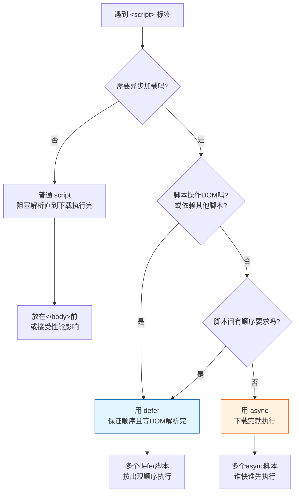

## `= this.title`

### 🔰 一句话对比

<!-- 用一句话概括这两个概念的核心区别，像告诉朋友为什么需要区分它们 -->

> **`defer` 是 " 等 HTML 解析完再执行 "**，适合需要操作 DOM 的脚本；**`async` 是 " 下载完就执行 "**，适合不依赖其他脚本的独立工具，两者都让 HTML 解析不用等脚本下载。

### 🧠 对比全景图

#### 各自定义

<!-- 先分别说明每个概念是什么 -->

| 维度 | **`async`** | **`defer`** |
|------|-------------|-------------|
| **一句话定义** | 异步加载脚本，下载完成后立即执行，执行时会阻塞 HTML 解析 | 异步加载脚本，等待 HTML 解析完成后再按顺序执行 |
| **核心本质** | 加载与执行都独立于 HTML 解析，但执行会阻塞 | 加载独立于 HTML 解析，执行推迟到解析完成后 |
| **解决什么问题** | 让不依赖 DOM 和其他脚本的工具脚本可以尽早运行 | 让依赖完整 DOM 的脚本既能异步加载，又能保证执行时机正确 |

#### 核心对比维度

<!-- 从多个维度深入对比，按重要性排序 -->

| 对比维度 | **`async`** | **`defer`** | 我的理解 |
|----------|-------------|-------------|----------|
| **维度 1：加载时机** | 异步加载，不阻塞 HTML 解析 | 异步加载，不阻塞 HTML 解析 | ✅ **共同点**：两者都不会阻塞 HTML 的解析过程 |
| **维度 2：执行时机** | 下载完成后**立即执行**，此时会暂停 HTML 解析 | 等待 HTML**全部解析完成后**执行 | `async` 像 " 插队 "，`defer` 像 " 排队到队尾 " |
| **维度 3：执行顺序** | **不保证顺序**，谁先下载完谁先执行 | **保证顺序**，按在 HTML 中的出现顺序执行 | `defer` 适合有依赖关系的多个脚本 |
| **维度 4：对 DOM 的依赖** | 不能假设执行时 DOM 已完整 | 执行时可以确保 DOM 已完整 | `async` 里用 `document.querySelector` 可能会找不到元素 |
| **维度 5：脚本间依赖** | 脚本间互相独立，不能依赖其他脚本 | 脚本可以有依赖关系 | Google Analytics 用 `async`，jQuery 依赖的脚本用 `defer` |
| **维度 6：执行时是否阻塞** | ✅ 执行时会阻塞 HTML 解析 | ❌ 执行时 HTML 已解析完，无阻塞 | `async` 执行时其实还是会卡一下渲染 |

#### 相似之处

- 都是为了让 HTML 解析不阻塞脚本下载
- 都在 `<script>` 标签上以属性形式使用
- 都是为了解决 " 脚本放头部阻塞渲染，放底部功能延迟 " 的两难问题
- 都支持跨域脚本

#### 核心区别（一句话总结）

> **`async` 是 " 下载完就执行，不管 HTML"，适合独立工具；`defer` 是 " 等 HTML 搞完再执行，还要按顺序 "，适合操作 DOM 的脚本。**

---

### 💻 代码/实例对比

<!-- 如果有代码或实际操作，在这里对比展示 -->

#### HTML 结构示例

```html
<!-- 假设有三个脚本：依赖jQuery的main.js，独立的analytics.js，以及jQuery本身 -->
<!DOCTYPE html>
<html>
<head>
  <!-- defer 示例：保证执行顺序，且等DOM解析完 -->
  <script defer src="jquery.js"></script>
  <script defer src="main.js"></script>  <!-- 依赖jQuery，放后面 -->
  
  <!-- async 示例：谁下载完谁先执行，互不干扰 -->
  <script async src="analytics.js"></script>
  <script async src="tracking.js"></script>
  
  <title>页面标题</title>
</head>
<body>
  <h1>Hello World</h1>
  <p>这段文字会在脚本下载时立刻显示</p>
</body>
</html>
```

#### 执行时序对比

```javascript
// 假设时间线：
// 0ms: 开始解析HTML
// 10ms: analytics.js 下载完成
// 15ms: jquery.js 下载完成  
// 20ms: tracking.js 下载完成
// 25ms: main.js 下载完成
// 30ms: HTML解析完成

// async 行为：
// 10ms: analytics.js 执行（暂停HTML解析）
// 15ms: jquery.js 下载完但不执行（因为是defer）
// 20ms: tracking.js 执行（再次暂停HTML解析）
// 25ms: main.js 下载完但不执行（defer）

// defer 行为：
// 30ms: HTML解析完成，按顺序执行 jquery.js → main.js
```

#### 场景选择指南

<!-- 什么场景该用哪个 -->
- **选 `async` 当**：
	- 脚本完全独立，不操作 DOM
	- 不依赖其他脚本，也不被其他脚本依赖
	- 希望尽早执行（如分析工具、广告脚本）
	- 第三方嵌入代码
- **选 `defer` 当**：
	- 脚本需要操作 DOM（如 `document.getElementById`）
	- 多个脚本有依赖关系（如 A 依赖 B）
	- 需要确保执行顺序
	- 希望在 DOM 准备就绪后运行（类似 `DOMContentLoaded`）

---

### 🗺️ 决策树/流程图

<!-- 可视化决策路径，帮助快速选择 -->



#### 执行时机可视化

```bash
普通脚本 (无属性) :
HTML解析 ────┬──── 下载脚本 ────┬──── 执行脚本 ────┬──── 继续解析
             (阻塞)            (阻塞)           

async:
HTML解析 ────┬──── 下载脚本 ────┬──── 执行脚本 ────┬──── 继续解析
             (不阻塞)           (阻塞)

defer:
HTML解析 ────────────────────────────────────────┬──── 执行脚本
             │                                    (解析完成后)
             下载脚本 ────────────────────────────
             (完全并行，不阻塞)
```

---

### 🔗 关联网络

<!-- 链接到相关笔记 -->

- **父级话题**：[[HTML脚本加载]] [[浏览器渲染原理]]
- **相关对比**：[[script标签位置对比]] [[DOMContentLoaded vs load事件]]
- **使用场景**：[[前端性能优化]] [[第三方脚本集成]]
- **前置知识**：[[浏览器解析HTML流程]] [[事件循环]]

---

### 📝 元数据与思考

- **对比类型**：`同类竞争`（同一属性的两种模式）
- **信息来源**：`文章整理 + 个人实践`
- **可信度**：`高`（已在项目中实际使用过）
- **验证状态**：`已实践`

#### 💭 我的思考

- **最初困惑**：以前只知道 "async 和 defer 都能异步加载 "，但分不清具体区别，经常随便用一个。
- **现在理解**：关键是**执行时机和顺序保证**。`defer` 像是 " 等所有人都到齐再按顺序发言 "，`async` 像是 " 谁先到谁先说，不管会场准备好没 "。
- **实际应用体验**：
	- 之前部署 OpenClaw 时没遇到这个问题，但理解了这个机制后，以后优化页面性能就知道怎么选了
	- 在 WSL 环境配置中，其实也是类似逻辑——有些服务要等系统准备好（defer），有些可以提前跑（async）
- **还有疑问**：
	- `async` 和 `defer` 对 `document.write()` 的影响？
	- 动态创建的 `<script>` 标签默认是什么行为？
	- 模块脚本 (`type="module"`) 默认是 defer 行为吗？

#### ✅ 下一步行动

- [x] 整理这个对比笔记，理清核心区别
- [x] 补充 mermaid 决策树可视化
- [ ] 在项目中实际测试两种属性的网络请求时序
- [ ] 研究模块脚本的加载行为
- [ ] 对比 [[HTTP/2 服务器推送 vs script加载]]

---
*笔记类型：对比笔记 | 状态：已成熟 | 最后更新：2026-03-08*

```bash
