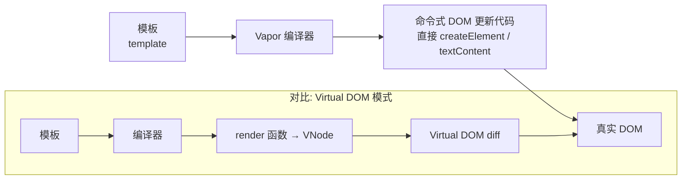

## 概念：Vapor Mode（蒸气式）

> Vapor Mode 是 Vue 的一种可选编译策略，跳过 Virtual DOM 与 diffing，将模板直接编译为命令式 DOM 操作，追求运行时性能数量级提升。

**解决的核心痛点**：VNode 创建与 diffing 带来的运行时代价，在组件密集场景下成为性能与内存瓶颈

---

### 核心命题

- **Vapor 组件绕过 Virtual DOM，直接操作真实 DOM**
	- **原理**：模板在编译期被转换为细粒度的命令式 DOM 更新代码（类似 SolidJS/Svelte），运行时不再生成 VNode 树、不执行 diff
- **Vapor 按组件粒度启用，与 Virtual DOM 模式共存**
	- **原理**：通过 `<script setup vapor>` 或 `createVaporApp()` API 逐组件选择，现有项目可渐进迁移而非重写
- **Vapor 是编译时优化思路在 Vue 的落地**
	- **原理**：把运行时可以静态推断的工作前移到编译期，用编译产物换取运行时收益，与 [[Vue编译器优化]] 的演进方向一脉相承

---

### 运行机制

**启用方式**：
- 单组件：`<script setup vapor>` 标签
- 全局：`createVaporApp(App)` API

**关键限制**：
- 仅支持 Composition API / `<script setup>`，不支持 Options API
- `<Suspense>` 尚不支持
- `app.config.globalProperties` / `getCurrentInstance()` 不可用
- 3.6 阶段仍非生产推荐

---

### 关键区别

| 维度 | Vapor Mode | [[模板编译(Vue3)]]（Virtual DOM） |
|:--- |:--- |:--- |
| **运行时** | 直接操作 DOM，无 VNode | 生成 VNode 树 + diff |
| **内存占用** | 更低（无 VNode 中间对象） | 较高 |
| **性能** | 组件密集场景快约 97% | 基准 |
| **灵活度** | 受限（无 Suspense、Options API） | 完整 |
| **生态兼容** | 需生态逐步适配 | 成熟 |

| 维度 | Vapor Mode | [[组合式API]] |
|:--- |:--- |:--- |
| **核心逻辑** | 编译期渲染策略 | 逻辑复用 API 形态 |
| **适用场景** | 追求极致性能的组件 | 组织组件逻辑 |

---

### 适用范围

- ✅ **适用场景**
	- **组件密集的列表/表格**：VNode diff 开销占比高，Vapor 收益明显
	- **新项目性能敏感模块**：按组件 opt-in，不改动既有代码
- ⛔ **误用**
	- **全项目强制启用**：Vapor 有 API 限制，生态库未适配前强行迁移会破坏功能
- **失效边界**
	- 依赖 `<Suspense>`、Options API、`globalProperties` 的组件无法使用 Vapor
	- 尚未生产稳定，3.6 RC 阶段不适合核心业务直接上线

---

### 批判

- **外部批判**
	- SolidJS/Svelte 社区：Vue 的 Vapor 理念与编译时框架殊途同归，但 Vue 双轨制（Vapor + Virtual DOM）增加认知负担和双份产物维护成本
- **内在张力**
	- 双模式并存：编译器需要同时维护 Vapor 和 Virtual DOM 两套代码生成路径，复杂度和维护成本翻倍
	- 生态适配滞后：第三方库若未按 Vapor 编译，混合使用时的边界行为需要额外约定

---

### FAQ

- [[Vapor Mode是什么]] — Vue 新编译策略的问题与探索路径

---

### SOP

> 暂无已验证的标准流程，属于前沿探索领域

- [[SOP-使用Vapor Mode]]

---

### 知识图谱

- **父级概念**：[[Vue]] — Vue 的核心框架
- **并列概念**：
	- [[组合式API]] — 与 Vapor 搭配的组合式开发范式
- **相关概念**：
	- [[Vue编译器优化]] — 编译器优化方向的延续
	- [[模板编译(Vue3)]] — Virtual DOM 模式下的模板编译
	- [[Diff算法(Vue3)]] — Vapor 试图绕开的运行时 diff
- **参考文章**
	- [Vue Vapor Mode 官方 RFC](https://github.com/vuejs/core-vapor)
	- [Vue.js 3.6 What's New](https://versionlog.com/vuejs/3.6/)
