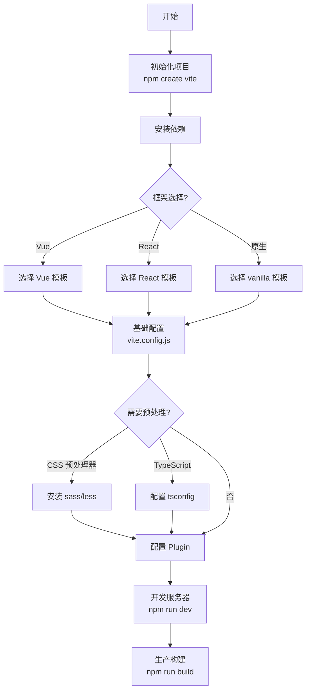

## SOP：Vite 配置流程

> 标准化 Vite 配置流程，适用于新项目初始化和现有项目优化。

**目标**：快速搭建 Vite 构建配置，覆盖开发/生产环境

**实现**：通过阶段化配置，从基础到进阶，逐步完善构建流程

---

### 适用场景

- 场景 1：新建项目需要引入 Vite 构建（Vue/React/Svelte/原生 JS）
- 场景 2：现有项目配置不规范，需要优化
- 场景 3：从 Webpack 迁移到 Vite

---

### 流程图解



---

### 核心步骤

1. **初始化项目**：使用 `npm create vite@latest` 脚手架
	 - 注意：选择对应框架模板（Vue/React/vanilla）
2. **基础配置**：创建 `vite.config.js`
	 - 注意：配置 `server.port`、`base` 路径等
3. **预处理配置**：根据需要安装 sass/less/postcss
	 - 注意：Vite 原生支持，无须额外 loader 配置
4. **Plugin 配置**：按需添加 @vitejs/plugin-vue / react / svelte
	 - 注意：框架 plugin 是必需的
5. **环境变量**：配置 `.env` 文件
	 - 注意：`VITE_` 前缀的环境变量会被暴露到客户端

---

### 实践/示例

```javascript
// vite.config.js
import { defineConfig } from 'vite';
import vue from '@vitejs/plugin-vue';
import path from 'path';

export default defineConfig({
  // 1. 基础配置
  plugins: [vue()],
  base: './',  // 相对路径，支持部署到任意路径

  // 2. 服务器配置
  server: {
    port: 3000,
    open: true,  // 自动打开浏览器
    proxy: {     // API 代理
      '/api': {
        target: 'http://localhost:8080',
        changeOrigin: true,
      },
    },
  },

  // 3. 构建配置
  build: {
    outDir: 'dist',
    sourcemap: false,
    rollupOptions: {
      output: {
        manualChunks: {  // 代码分割
          vendor: ['vue', 'vue-router'],
        },
      },
    },
  },

  // 4. 解析配置
  resolve: {
    alias: {
      '@': path.resolve(__dirname, 'src'),
    },
  },
});
```

```bash
# 环境变量文件
# .env
VITE_API_BASE_URL=/api
VITE_APP_TITLE=My App
```

---

### 常见坑点

- ⛔ **反模式**：`base: '/'` 部署到子路径时失效，应使用 `base: './'`
- ⛔ **反模式**：使用 `process.env` 而非 `import.meta.env`，Vite 不支持 Node.js 全局变量
- 🔧 **排查**：如果 `404` 资源找不到，检查 `base` 配置和打包输出路径
- 🔧 **排查**：如果热更新失效，检查是否修改了 `root` 目录导致路径问题

---

### 知识图谱

- **相关概念**：
	- [[Vite]] — 现代化构建工具的核心概念
	- [[Webpack]] — 传统构建工具对比
- **对比学习**：
	- [[Webpack vs Vite]] — 配置复杂度对比
