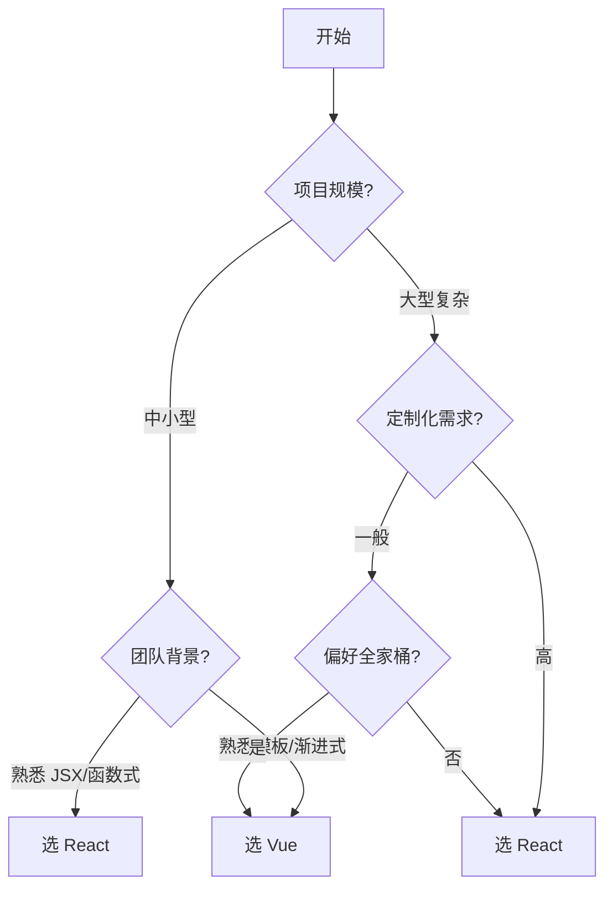

## Vue vs React

### 一句话对比

Vue 是一个 [^1] 渐进式响应式框架，通过响应式依赖追踪实现自动更新；React 是一个声明式组件化库，通过虚拟 DOM 和状态驱动 UI 更新。

> Vue 和 React 的核心本质区别是什么？ #card
> Vue：响应式依赖追踪 + 模板语法编译，修改即自动更新；React：状态驱动 + 虚拟 DOM，setState/useState 后触发重渲染。

---

### 核心对比

| 维度        | **[[Vue]]**          | **[[React]]**            |
|:-------- |:------------------- |:----------------------- |
| **定位**    | 渐进式框架                | UI 组件库                   |
| **核心本质**  | 响应式依赖追踪 + 模板语法       | 状态驱动 + 虚拟 DOM            |
| **学习曲线**  | 平缓（渐进式，文档友好）         | 较陡（概念多，灵活度高）             |
| **状态管理**  | reactive/ref + Pinia | useState + Redux/Context |
| **渲染机制**  | 响应式劫持 + 模板编译         | 虚拟 DOM diff              |
| **类型支持**  | 优秀（TypeScript 优先）    | 良好（需额外配置）                |
| **生态完整度** | 开箱即用（路由、状态、SSR 全家桶）  | 社区分散（需自行组合）              |
| **适用场景**  | 中小型项目、快速开发           | 大型应用、复杂交互                |

---

### 差异点

**响应式系统**：
- Vue：自动追踪依赖，修改即更新，无需手动处理
- React：状态驱动，需在 setState 或 useState 后触发重渲染

**模板 vs JSX**：
- Vue：模板语法，HTML 风格，学习成本低
- React：JSX，JavaScript 扩展，灵活性高但学习曲线陡

**组件写法**：
- Vue：Options API / Composition API（双模式）
- React：函数式组件 + Hooks（统一）

**生态策略**：
- Vue：官方维护完整生态（Vue Router、Pinia、Vue SSR）
- React：核心库精简，社区方案多样（需自行选型）

**性能优化**：
- Vue：自动分析依赖，精确更新
- React：需手动优化（useMemo、useCallback、React.memo）

---

### 场景选择

- **选 [[Vue]] 当**：
	- 中小型项目，追求开发效率
	- 团队对 HTML 模板更熟悉
	- 需要快速上手、文档友好
	- 使用 TypeScript 且希望类型支持开箱即用
- **选 [[React]] 当**：
	- 大型企业级应用，需高度定制
	- 团队对函数式编程熟悉
	- 需要丰富的社区生态和第三方库
	- 追求更灵活的技术选型空间

---

### 决策树

---

### 关键区别速记

| 记忆点 | Vue | React |
|:---|:---|:---|
| **响应式** | 自动追踪 | 手动状态 |
| **模板** | HTML 风格 | JSX 风格 |
| **更新粒度** | 组件级（自动） | 组件级（需优化） |
| **官方生态** | 完整全家桶 | 核心 + 社区组合 |
| **上手难度** | 低 | 中 |

---

### 知识图谱

- **父级概念**：[[前端开发]] — 同属前端框架领域
- **相关对比**：
	- [[Vue2 vs Vue3]] — Vue 内部版本对比
	- [[React 函数组件 vs 类组件]] — React 组件形式对比
- **相关工具**：
	- [[前端面试知识清单]] — 面试知识点汇总

[^1]: 渐进式意味着可以分层次使用，从核心功能开始逐步引入更多能力
