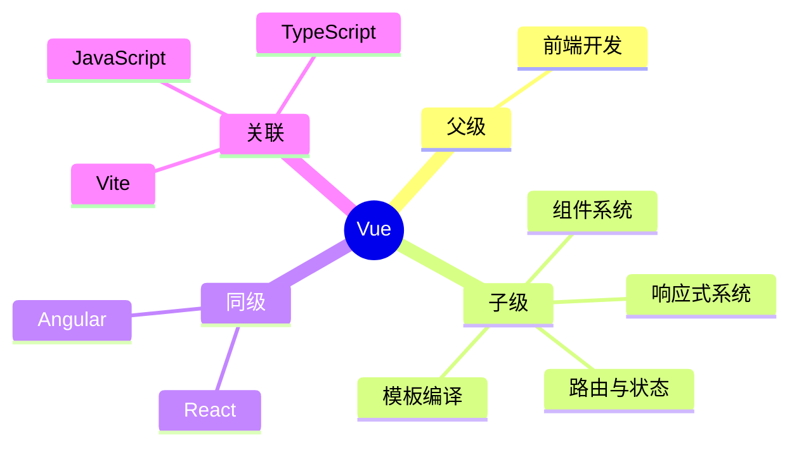

## 概念： Vue

> Vue 是一套用于构建用户界面的渐进式框架，采用数据驱动和组件化思想。

---

### 知识图谱

---

### 定义

- **核心范畴**：Vue 响应式系统、组合式 API、单文件组件、路由与状态管理
- **不包括**：服务端渲染（Nuxt 属于独立领域）、Node.js 后端开发
- **与相关领域的区别**：
	- vs React：Vue 更倾向约定优于配置，单文件组件更直观，响应式系统更自动
	- vs Angular：Vue 更轻量，学习曲线更平缓，无依赖注入等重型概念

---

### 长期目标

- **愿景**：掌握 Vue 3 生态，能够独立构建中大型 Vue 应用
- **里程碑**：
	- [x] 掌握 Vue 3 基础 + 组合式 API
	- [ ] 完成 Vue 3 + Vite + Pinia 项目实战
	- [ ] 深入响应式原理源码（Proxy / effect / reactive）
	- [ ] 掌握 Vue 编译器优化原理
	- [ ] 了解 Vue 未来方向（Vapor Mode）

---

### 关键领域

> 该领域的核心知识主题。链接指向尚未创建的 concept，表明尚未掌握。

- **响应式系统**
	- [[响应式原理(Vue3)]] — Vue 3 的 Proxy 响应式原理
	- [[Vue3 ref 和 reactive 的区别]] — 两种响应式引用的区别与适用场景
	- [[effect与reactive]] — 响应式系统分为 effect 和 reactive 两部分
	- [[reactive(Vue)]] — Vue 3 的 reactive 响应式 API
- **模板编译**
	- [[模板编译(Vue3)]] — 模板到渲染函数的转换过程
	- [[Vue编译器优化]] — 编译器的静态分析与优化
- **组件系统**
	- [[生命周期(Vue3)]] — 组件生命周期钩子
	- [[组合式API]] — Composition API 的使用模式
	- [[Diff算法]] — Virtual DOM 的 Diff 算法
- **路由与状态**
	- [[Vue Router]] — 路由管理（独立领域）
	- [[Pinia]] — 状态管理（独立领域）
- **未来方向**
	- [[Vue版本演进]] — Vue 各版本核心差异与演进路线
	- [[Vapor Mode]] — Vue 新的编译策略
- **生态系统**
	- [[生态系统（Vue）]] — Vue 生态全景

---

### SOP

> 该领域的标准化操作流程

- [[SOP-Vue3项目搭建]] — 待创建：Vue 3 + Vite + Pinia 标准项目结构
- [[SOP-Vue3-混合文件夹结构]] — 根按职责、内按领域的混合文件夹组织流程

---

### FAQ

> 该领域的常见问题

- [[Vue 面试题]] — Vue 常见面试问题汇总
- [[v-if 和 v-show 区别？v-model 原理是什么？]] — 指令条件渲染与双向绑定原理
- [[在 Vue 组件中，模板是否必须有一个根节点包裹？Vue 2 和 Vue 3 在这方面有什么区别？]] — 模板根节点要求与 Vue 2/3 差异
- [[Vue编译器如何优化]] — Vue 编译器的优化原理
- [[Vapor Mode是什么]] — Vue 新的编译策略

---

### 人物

- [[尤雨溪]] — Vue.js 与 Vite 的创建者，渐进式框架理念的提出者
