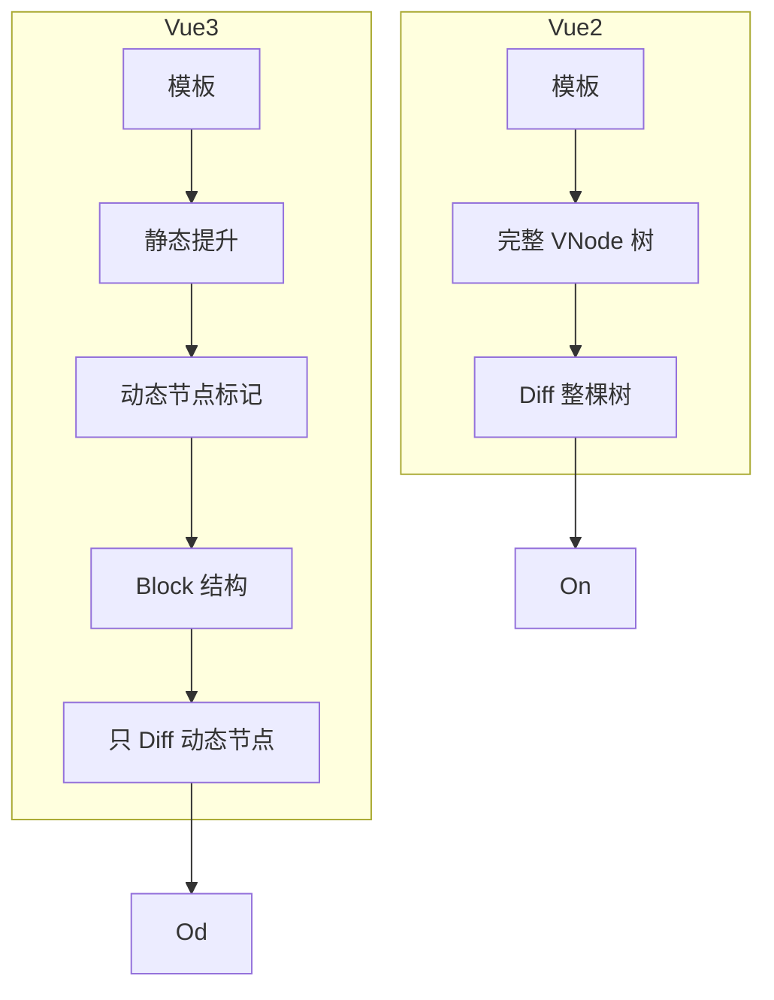

## 对比：Vue2 vs Vue3 Diff 算法

> Vue3 在 Diff 算法上做了重大优化，通过 Block、静态提升、PatchFlag 等技术大幅提升了更新性能。

---

### 核心区别

| 维度 | Vue2 | Vue3 |
|:---|:---|:---|
| **数据结构** | 完整 VNode 树 | Block + 动态节点数组 |
| **Diff 范围** | 遍历整棵 VNode 树 | 只 diff 动态节点 |
| **静态节点** | 每次参与 diff | 静态提升，不参与 diff |
| **时间复杂度** | O(n) | O(d)，d=动态节点数 |

---

### 详细对比

#### 1. 虚拟 DOM 结构

**Vue2：树形结构**

```javascript
// 每次更新都需要遍历整棵树
vnode = {
  type: 'div',
  children: [
    { type: 'span', children: '静态' },   // 每次都 diff
    { type: 'span', children: this.msg }   // 动态
  ]
}
```

**Vue3：Block + 动态集合**

```javascript
// 静态节点已提升，动态节点单独管理
block = {
  type: 'div',
  children: [...],
  dynamicChildren: [  // 只 diff 这部分
    dynamicNode1,
    dynamicNode2
  ]
}
```

#### 2. Diff 性能

**Vue2：遍历整棵树**

```javascript
function update(oldVNode, newVNode) {
  // 无论是否需要更新，都遍历所有节点
  traverseAndPatch(oldVNode.children, newVNode.children)
}
```

**Vue3：只 diff 动态节点**

```javascript
function blockPatch(block, newBlock) {
  // 只 diff 动态节点集合
  block.dynamicChildren.forEach((child, i) => {
    patch(child, newBlock.dynamicChildren[i])
  })
}
```

#### 3. 静态提升

**Vue2：无静态提升**

```javascript
render() {
  return h('div', [
    h('span', '静态内容'),  // 每次都创建新 VNode
    h('span', this.msg)
  ])
}
```

**Vue3：静态提升**

```javascript
// 静态内容提取到 render 函数外
const _hoisted_1 = h('span', '静态内容')

render() {
  return h('div', [
    _hoisted_1,  // 复用
    h('span', this.msg)
  ])
}
```

---

### 性能提升原因



---

### 实际场景性能对比

| 场景 | Vue2 | Vue3 | 提升 |
|:---|:---:|:---:|:---:|
| 纯静态页面更新 | 慢 | 极快 | 静态节点不参与 |
| 大列表更新 | 中等 | 快 | 只 diff 变化的行 |
| 频繁状态变化 | 较慢 | 快 | 精准 diff |
| 首次渲染 | 慢 | 中等 | Block 有开销 |

---

### 为什么 Vue3 更快

1. **减少 diff 范围**：只 diff 动态节点
2. **静态提升**：不变的部分不参与 diff
3. **PatchFlag**：标记动态内容位置，快速定位
4. **更激进的优化**：Vue2 时代无法实现的优化

---

### 知识图谱

- **父级概念**：[[Diff算法(Vue3)]]
- **关联概念**：
	- [[静态提升]] — Vue3 静态优化
	- [[预标记]] — 动态节点标记
	- [[Block管理]] — Block 数据结构

---

### 参考延伸

- Vue3 源码：`packages/runtime-core/src/renderer.ts`
- Vue RFC: Block-based VNode
