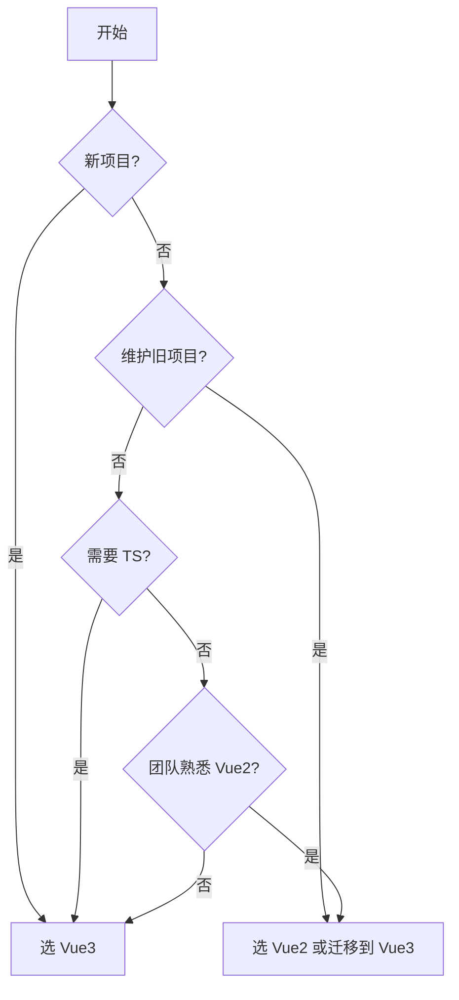

## Vue2 vs Vue3

### 🔰 一句话对比

Vue3 是 Vue2 的全面升级，在响应式系统、TypeScript 支持、性能、API 设计等方面都有显著改进，是 Vue 生态的未来方向。

---

### 🧠 对比全景图

#### 各自定义

| 维度 | **Vue2** | **Vue3** |
|------|----------|----------|
| **一句话定义** | 2016 年发布的渐进式 JavaScript 框架 | 2020 年发布的 Vue 下一代核心版本 |
| **核心本质** | 基于 Object.defineProperty 实现响应式 | 基于 Proxy 实现响应式 |
| **解决什么问题** | 构建用户界面的渐进式框架 | 更强性能、更好 TypeScript 支持、更好的逻辑复用 |

#### 核心对比维度

| 对比维度 | **Vue2** | **Vue3** | 我的理解 |
|----------|----------|----------|----------|
| **响应式系统** | Object.defineProperty | Proxy | Vue3 自动监听新增/删除属性 |
| **API 风格** | Options API | Composition API | Composition API 更灵活 |
| **TypeScript** | 支持但有限 | 原生 TypeScript | Vue3 开发体验更好 |
| **生命周期** | created 等 | setup + lifecycle hooks | 更加直观 |
| **性能** | 较好 | 显著提升 | 减少不必要的重渲染 |
| **体积** | 约 20KB | 约 10KB (tree-shaking) | 按需引入 |
| **虚拟 DOM** | VNode | 优化后的 VNode | 减少不必要的 Diff |
| **多根节点** | 不支持 | 支持 | fragment 支持 |

#### 相似之处

- 都是渐进式 JavaScript 框架
- 都采用组件化开发模式
- 都支持响应式数据绑定
- 都使用虚拟 DOM 进行高效渲染

#### 核心区别（一句话总结

Vue3 全面升级了响应式系统（Proxy 替代 Object.defineProperty）、引入了 Composition API、提供了更好的 TypeScript 支持和性能优化。

---

### 💻 代码/实例对比

#### Vue2 示例

```javascript
export default {
  data() {
    return {
      count: 0
    }
  },
  methods: {
    increment() {
      this.count++
    }
  }
}
```

#### Vue3 示例

```javascript
import { ref } from 'vue'

export default {
  setup() {
    const count = ref(0)
    const increment = () => count.value++
    return { count, increment }
  }
}
```

### 场景选择指南

- **选 Vue2 当**：
	- 维护现有 Vue2 项目
	- 项目团队不熟悉 Vue3
	- 需要使用 Vue2 特有生态（如 Vuex 3）
- **选 Vue3 当**：
	- 新项目启动
	- 需要更好的 TypeScript 支持
	- 需要更好的性能
	- 需要更好的代码组织和逻辑复用

---

## 🗺️ 决策树



---

## 🔗 关联网络

- **父级话题**：[[前端开发]]
- **相关对比**：
	- Vue2 Options API vs Vue3 Composition API
	- [[Vuex vs Pinia]]
- **前置知识**：
	- [[Vue3 响应式原理]]
	- JavaScript ES6

---

## 📝 元数据与思考

- **对比类型**：替代关系（Vue3 是 Vue2 的升级）
- **信息来源**：官方文档 + 个人实践
- **可信度**：高
- **验证状态**：理论理解

### 💭 我的思考

- **最初困惑**：Vue3 改动太大，学习成本高
- **现在理解**：Composition API 是大势所趋，Vue3 整体更优秀
- **实际应用体验**：Vue3 的 setup 语法糖让代码更组织化

### ✅ 下一步行动

- 在项目中实践 Vue3
- 深入学习 Composition API
- 了解 Vue3 性能优化技巧
