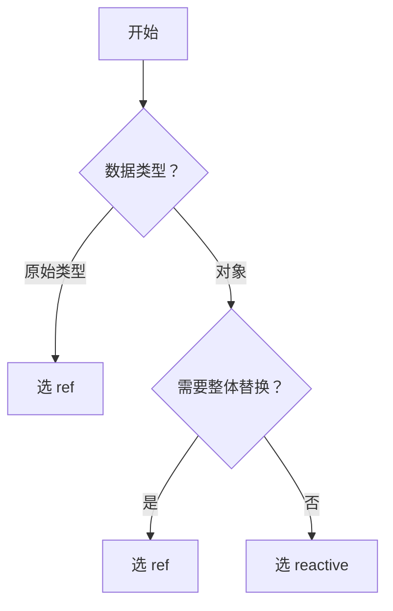

> ref 和 reactive 是 Vue3 的两种响应式 API，ref 适合原始值，reactive 适合对象。

---

## 一句话对比

**ref 通过 `.value` 访问值，适合原始类型；reactive 直接访问，适合对象类型。**

---

## 对比全景

| 维度 | **[[ref]]** | **[[reactive]]** |
|:---|:---|:---|
| **一句话定义** | 包装原始值为响应式对象 | 将对象深度转为响应式 |
| **核心本质** | 包装器，通过.value 访问 | 代理器，直接访问属性 |
| **解决什么问题** | 原始类型无法实现响应式 | 对象需要深度响应式 |

---

## 核心区别

| 对比维度       | **ref**   | **reactive** | 我的理解                   |
|:--------- |:-------- |:----------- |:--------------------- |
| **支持类型**   | 任意类型      | 仅对象          | ref 包装一切，reactive 专注对象 |
| **访问方式**   |.value 访问 | 直接访问         | ref 需要脱帽，reactive 不需要  |
| **重新赋值**   | 可以（替换整个值） | 不能（替换整个对象）   | ref 更灵活                |
| **解构**     | 丢失响应式     | 丢失响应式        | 需使用 toRef/toRefs       |
| **数组/Map** | 支持        | 支持           | 两者都可以                  |

### 代码示例

**ref**：

```javascript
import { ref } from 'vue'

const count = ref(0)
count.value++  // 访问需 .value
console.log(count.value)
```

**reactive**：

```javascript
import { reactive } from 'vue'

const state = reactive({
  count: 0,
  name: 'Alice'
})
state.count++  // 直接访问
console.log(state.count)
```

---

## 相似之处

- 两者都是 Vue3 响应式系统的一部分
- 变化都会触发组件重新渲染
- 都可以在 setup 中返回给模板使用
- 内部都使用 Proxy 实现

---

## 场景选择

- **选 ref 当**：
	- 原始类型（string、number、boolean）
	- 需要重新赋值整个值
	- 不确定类型时（ref 更通用）
- **选 reactive 当**：
	- 复杂对象/数组
	- 不想写.value
	- 状态结构清晰，不需要替换整个对象

---

## 决策树



---

## 关联

- **父级话题**：[[Vue3]] — 两者都是 Vue3 响应式 API
- **相关概念**：[[响应式原理]] — 两者的底层实现
