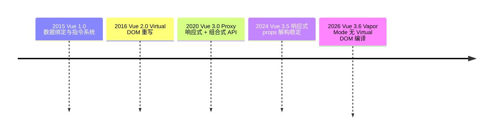

## Vue 版本演进

> Vue 通过版本迭代逐步解决前端开发的核心痛点：从模板字符串到 Virtual DOM，再到 Proxy 响应式与组合式 API，最终走向编译时优化的 Vapor Mode。

**时间跨度**：Vue 1.0 (2015) → Vue 2.0 (2016) → Vue 3.0 (2020) → Vue 3.6 (2026, RC)
**演进动力**：响应式性能瓶颈、类型安全与组合逻辑复用的需求、对编译时优化的探索

---

### 演进概览

---

### 阶段详情

#### Vue 1.0 "Evangelion"

- **时间**：2015 年 10 月
- **核心变化**：响应式数据绑定 + 指令系统 + 组件系统
- **解决的关键问题**：让开发者从手动 DOM 操作中解放，用声明式模板描述界面
- **相关概念**：[[Vue]]

#### Vue 2.0 "Ghost of the Future"

- **时间**：2016 年 9 月
- **核心变化**：引入 Virtual DOM 与模板编译器重写，支持服务端渲染与 Fragment
- **解决的关键问题**：1.x 模板字符串的渲染灵活性与性能局限，跨端渲染能力（Weex）
- **相关概念**：[[Diff算法(Vue3)]]

#### Vue 2.6 / 2.7（过渡期）

- **时间**：2019 年 2 月 / 2022 年 7 月
- **核心变化**：2.6 引入新 `v-slot` 语法；2.7 将 Composition API 向后移植到 Vue 2
- **解决的关键问题**：为 Vue 2 存量项目提供渐进升级到组合式 API 的桥梁
- **相关概念**：[[组合式API]]

#### Vue 3.0 "One Piece"

- **时间**：2020 年 9 月
- **核心变化**：基于 Proxy 重写响应式系统、组合式 API、全面 TypeScript 支持、性能大幅提升
- **解决的关键问题**：defineProperty 的响应式局限（新增属性、数组索引）、逻辑复用困难、类型推导薄弱
- **相关概念**：[[响应式原理(Vue3)]] [[组合式API]]

#### Vue 3.2（script setup 稳定）

- **时间**：2021 年 8 月
- **核心变化**：`<script setup>` 编译宏正式稳定、响应式性能优化
- **解决的关键问题**：组合式 API 的样板代码冗余，简化单文件组件的编写体验
- **相关概念**：[[组合式API]]

#### Vue 3.3 / 3.4 / 3.5（DX 与类型增强）

- **时间**：2023 年 5 月 / 2023 年 12 月 / 2024 年 9 月
- **核心变化**：`defineOptions`、`defineModel`、泛型组件、解析器重写、响应式 props 解构稳定
- **解决的关键问题**：类型系统支持不足、宏与编译器体验粗糙、内存与性能持续优化
- **相关概念**：[[模板编译(Vue3)]] [[Vue编译器优化]]

#### Vue 3.6（Vapor Mode，RC）

- **时间**：2026 年 7 月（3.6.0-rc.1）
- **核心变化**：Vapor Mode 无 Virtual DOM 编译策略、alien-signals 响应式引擎重写、无破坏性变更
- **解决的关键问题**：VNode diffing 的性能与内存开销，向编译时生成命令式 DOM 操作（类 SolidJS/Svelte）演进
- **相关概念**：[[Vapor Mode]] [[响应式原理(Vue3)]]

---

### 关键转折点

> 演进中的重要里程碑或范式转换

| 时间点 | 转折内容 | 影响 |
|:---|:---|:---|
| Vue 2.0 (2016) | 引入 Virtual DOM | 提升渲染灵活性与跨端能力，确立模板编译 + diff 范式 |
| Vue 3.0 (2020) | Proxy 响应式 + 组合式 API | 解决响应式局限与逻辑复用痛点，全面转向 TypeScript |
| Vue 3.6 (2026) | Vapor Mode 无 Virtual DOM | 从运行时 diff 走向编译时直接 DOM 操作，性能数量级提升 |

---

### 未来展望

- **趋势**：Vapor Mode 走向生产可用，混合模式（Vapor + Virtual DOM 组件共存）成为升级路径
- **待解决**：Vapor 对 Suspense、Options API 等特性的兼容，alien-signals 与生态库的适配
- **值得关注**：Vue 3.6 正式版发布、Vite 生态协同、编译时优化进一步深入

---

### 关联概念

- **父级领域**：[[Vue]]
- **相关概念**：
	- [[响应式原理(Vue3)]] — Proxy 响应式原理
	- [[组合式API]] — Composition API 使用模式
	- [[模板编译(Vue3)]] — 模板到渲染函数的转换
	- [[Vue编译器优化]] — 编译器的静态分析与优化
	- [[Vapor Mode]] — 无 Virtual DOM 的编译策略
	- [[Diff算法(Vue3)]] — Virtual DOM 的 Diff 算法
