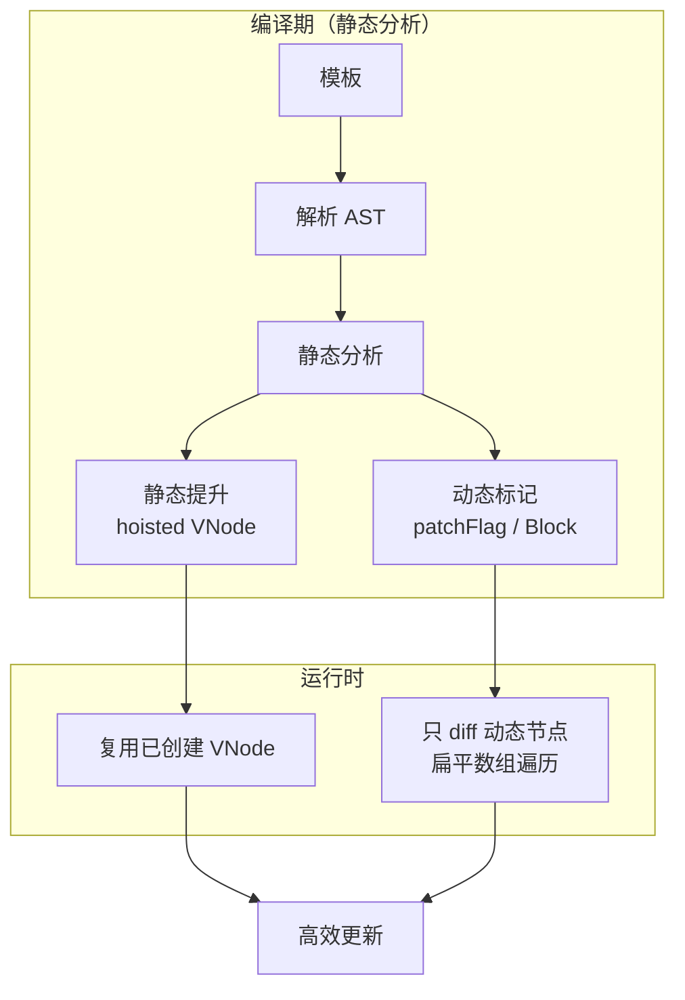

## 概念：Vue编译器优化

> Vue 编译器优化指在编译期对模板进行静态分析，将可预判的工作从运行时前移到编译期，从而减小产物、降低渲染与更新开销的技术集合。

**解决的核心痛点**：Virtual DOM 的运行时要为每个渲染重建 VNode 并进行 diff，编译器优化让静态部分在运行时被完全跳过

---

### 核心命题

- **静态提升把不变的 VNode 移出渲染函数**
	- **原理**：编译期识别完全静态的子树，将其提升到渲染函数外部只创建一次，后续渲染直接复用同一引用
- **Block + patchFlag 让 diff 只检查动态节点**
	- **原理**：模板编译成嵌套的 Block 结构，只有带 patchFlag 的动态节点才参与 diff，静态节点在编译期就被排除
- **树形扁平化把 diff 从 O(n) 递归降为线性数组遍历**
	- **原理**：Block 内部通过虚拟数组（vnode array）收集动态节点，更新时直接遍历扁平列表，跳过深层递归
- **缓存与预编译把模板解析成本移出运行时**
	- **原理**：v-once / v-memo 指令标记不变片段，Vite 等构建工具在构建阶段预编译模板，运行时不再解析模板字符串

---

### 运行机制

**四大优化手段**：
- **静态提升（Hoisting）**：不变节点提到渲染函数外
- **patchFlag**：标记节点动态类型（TEXT / PROPS / CLASS 等），更新只走对应路径
- **Block Tree**：以 Block 为单位收集动态节点，diff 扁平化
- **v-once / v-memo**：指令级标记，整段或按依赖缓存

---

### 关键区别

| 维度 | Vue 2 编译器 | Vue 3 编译器 |
|:--- |:--- |:--- |
| **静态提升** | 不支持 | 支持 |
| **Block Tree** | 不支持 | 支持 |
| **patchFlag** | 不支持（全量 diff） | 支持（细粒度更新） |
| **diff 策略** | 树形递归 | Block 扁平化 |
| **性能** | 基准 | 显著提升 |

| 维度 | [[Vue编译器优化]] | [[模板编译(Vue3)]] |
|:--- |:--- |:--- |
| **核心逻辑** | 优化策略（怎么更快） | 编译过程（怎么转换） |
| **关注点** | 静态分析 + 产物优化 | 解析/转换/生成三阶段 |

| 维度 | [[Vue编译器优化]] | [[Vapor Mode]] |
|:--- |:--- |:--- |
| **运行时** | 仍走 Virtual DOM | 完全绕过 Virtual DOM |
| **优化边界** | 优化现有 diff 模式 | 替换渲染范式 |

---

### 适用范围

- ✅ **适用场景**
	- **大型模板的静态内容多**：静态提升收益明显
	- **高频更新的动态组件**：patchFlag 缩小 diff 范围，更新更快
- ⛔ **误用**
	- **把优化当正确性依赖**：编译优化只影响性能，不应作为功能正确性的依据
- **失效边界**
	- 全部动态的模板优化空间有限——优化依赖静态分析，模板全动态时无从优化
	- 过度使用 v-memo/v-once 可能因缓存条件不匹配导致视图不更新

---

### 批判

- **外部批判**
	- Svelte 社区：Vue 仍在 Virtual DOM 框架内做增量优化，与编译时直接生成命令式代码的彻底方案相比收益有限
- **内在张力**
	- 编译优化与运行时复杂度：patchFlag 体系增加编译器与运行时的复杂度，对模板作者透明、对框架维护者沉重
	- 优化红利递减：静态分析能榨取的空间终会收敛，长远看需要范式级突破（如 [[Vapor Mode]]）

---

### FAQ

- [[Q-Vue编译器如何优化]] — 编译器优化原理的问题与探索路径

---

### SOP

> 暂无独立 SOP，优化已在框架层自动完成

- 模板编写习惯：优先使用 `v-if` 而非 `v-show`（按需渲染更利于静态分析）

---

### 知识图谱

- **父级概念**：[[Vue]] — Vue 的核心框架
- **子级概念**：
	- [[模板编译(Vue3)]] — 编译器优化发生在模板编译的转换/生成阶段
- **并列概念**：
	- [[Vapor Mode]] — 范式级替代方案
- **相关概念**：
	- [[响应式原理(Vue3)]] — 优化后的更新路径依赖响应式依赖收集
	- [[Diff算法(Vue3)]] — patchFlag 优化的是 diff 的检查范围
- **参考文章**
	- Vue 官方文档：Template Compilation
	- Vue3 源码：`packages/compiler-core` / `packages/compiler-dom`
