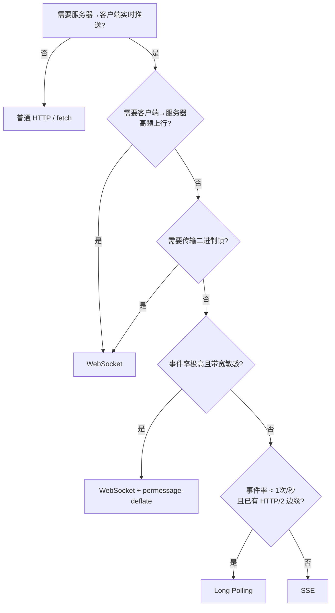

## WebSocket vs SSE vs Long Polling

### 一句话对比

三者都能做「服务器 → 客户端实时推送」，差别不在负载而在于**成帧开销**：[[SSE比WebSocket只贵10%字节却换来免费的断线重连与续传]]；长轮询在 HTTP/1.1 下贵 7.4 倍（罪魁是重复发送的请求头），但换到 HTTP/2 就塌缩到 1.56 倍——[[长轮询的坏名声来自请求头的重复而非轮询模式本身]]。

---

### 核心对比

| 维度 | **[[WebSocket]]** | **[[SSE]]** | **Long Polling** |
|:---|:---|:---|:---|
| **通信方向** | 全双工 | 单向（服务器→客户端） | 单向（客户端主动拉取） |
| **传输格式** | 二进制帧 | UTF-8 文本 | 普通 HTTP 响应 |
| **单事件开销** | 2.1 字节/消息 | 14.2 字节/事件 | ~768 字节/事件 |
| **断线重连** | 自己写重连/回退/去重 | 浏览器自动重连 + `Last-Event-ID` 续传 | 客户端循环自带 |
| **连接数上限** | 不受 6 连接限制 | HTTP/1.1 每源 6 条（跨标签页共享） | 同 SSE |
| **服务器内存（Node）** | ~13 KB/连接 | ~23 KB/连接 | ~21 KB/连接 |

---

### 核心数据（实测字节表）

同一 1,000 个事件（每个 ~117 字节 JSON）走三种传输，TCP 代理逐字节计数：

| 传输方案 | 线上总字节 | 每事件字节 | × 负载 |
|:---|:---|:---|:---|
| WebSocket（HTTP/1.1） | 119,692 | 119.7 | 1.02 |
| SSE（HTTP/1.1） | 131,596 | 131.6 | 1.13 |
| SSE（HTTP/2） | 134,534 | 134.5 | 1.15 |
| Long Polling（HTTP/2） | 182,475 | 182.5 | 1.56 |
| Long Polling（HTTP/1.1 keep-alive） | 884,698 | 884.7 | 7.57 |
| Long Polling（HTTP/1.1 无 keep-alive） | 851,691 | 851.7 | 7.29 |
| WebSocket + permessage-deflate | 30,434 | 30.4 | 0.26 |

---

### 差异点

- **字节开销的结构**：
	- WebSocket：符合 [RFC 6455](https://www.rfc-editor.org/rfc/rfc6455#section-5.2) 的 2 字节帧头（≤125 字节负载），无状态行、无 Header、无 Cookie。
	- SSE：14.2 字节 = 8 字节线格式（`data: ` + 空行终止符）+ 6 字节 HTTP/1.1 chunked 编码。代价就是「用普通 HTTP 响应代替二进制帧」。
	- Long Polling：每个事件付 570 字节请求头 + 198 字节响应头，其中会话 Cookie 占比超过事件本身。
- **HTTP/2 的影响**：
	- Long Polling 的请求头从 570 字节降到 36 字节（[[HPACK]] 把重复头集压缩成引用），总量 884,698 → 182,475，从「荒谬」变成「平庸」。
	- SSE 在 HTTP/2 下反而略贵（134,534 vs 131,596）：每个 DATA 帧带 9 字节头，chunked 只要约 6 字节。用 HTTP/2 跑 SSE 的理由是**连接上限**，不是带宽。
- **延迟几乎无差别**：
	- 每 100ms 一个事件、模拟 50ms RTT 下，三者均值都在 ~26.5ms，差 <0.3ms。
	- 长轮询只在**事件比一个 RTT 还快**时才落后：客户端只在请求停在服务器期间「听」，服务器一应答，客户端就「聋」一个 RTT，期间的事件排队下一轮再发。这个「间隙」机制让长轮询靠批处理不崩塌——但游标位置、交易 tick 这类不能容忍突发积压的场景，长轮询是结构性错误，调参无解。
- **服务器内存（Node 结果，非普适规律）**：WebSocket 最省，因为 `ws` 接管 socket 后 Node 的 HTTP 机制就退场了；SSE 要一直养着 `IncomingMessage` + `ServerResponse` + HTTP parser。Go/Rust 比例会不同，但「三者都一个客户端一条连接」的形态不变——长轮询省不下连接数。
- **生产环境的三个坑**（SSE 与 WebSocket 通病）：
	1. **空闲超时**：AWS ALB 默认 60s 无数据即断开，Cloudflare 对 WebSocket 同理。解法是心跳——SSE 发 `:heartbeat\n\n` 注释行，WebSocket 用 ping/pong。
	2. **缓冲**：nginx 默认 `proxy_buffering on`，SSE 流会被攒到结尾一次性到达。解法是响应头 `X-Accel-Buffering: no`。
	3. **扇出**：三者都把客户端钉在单个服务器进程，跨实例广播需要 Redis pub/sub 或消息总线——选长轮询躲不掉这个坑，因为挂起的请求同样被钉住。

---

### 场景选择

| 需求 | 选型 | 原因 |
|:---|:---|:---|
| 服务器→客户端、文本、任意速率 | **SSE** | 1.13× 负载，重连续传免费 |
| 高频上行（光标、协同编辑、游戏） | **WebSocket** | SSE 不能上行，逐键 fetch 比长轮询还糟 |
| 二进制帧（音视频、protobuf、CBOR） | **WebSocket** | SSE 仅 UTF-8，base64 先亏 33% |
| 带宽敏感 + 高消息率 | **WebSocket + permessage-deflate** | 实测 0.26× 负载 |
| <1 事件/秒 + 已有 HTTP/2 边缘 | **Long Polling** | 1.56× 负载，零新运维面 |
| 中介剥离 `Upgrade` 头 | **SSE 或 Long Polling** | 两者都是普通 HTTP 响应 |
| 多标签页 + 仅 HTTP/1.1 | **WebSocket** | SSE 会撞 6 连接上限 |
| 需要 per-request 认证头 | **WebSocket 或 fetch polyfill** | `EventSource` 设不了自定义头 |

**诚实默认值**：服务器→客户端推送，先写 SSE。那 10% 的字节溢价买来的是自动重连、续传、可 `curl` 调试、栈里不引入第二个协议。只有当你真正需要上行通道或二进制帧时再上 WebSocket——如果你为一个单向 feed 手写「重连 + 续传」循环，那等于把 SSE 糟糕地重写了一遍。

---

### 决策树

---

### 知识图谱

- **父级概念**：[[Web通信]] — 三者的选型归属实时通信分类
- **相关概念**：
	- [[WebSocket]] — 全双工二进制帧方案
	- [[SSE]] — 单向文本推送方案
	- [[HTTP]] — 三者的底层协议，HTTP/2 的 [[HPACK]] 与 [[持久连接]] 是长轮询成本塌缩的关键
- **原子洞见**：
	- [[长轮询的坏名声来自请求头的重复而非轮询模式本身]] — 长轮询 7.4× 成本的真正来源
	- [[SSE比WebSocket只贵10%字节却换来免费的断线重连与续传]] — SSE 作为默认选择的依据
- **参考来源**
	- [WebSocket vs SSE vs Long Polling: The Real Cost of 1,000 Events](https://theinfinity.dev/articles/websocket-vs-sse-vs-polling)
