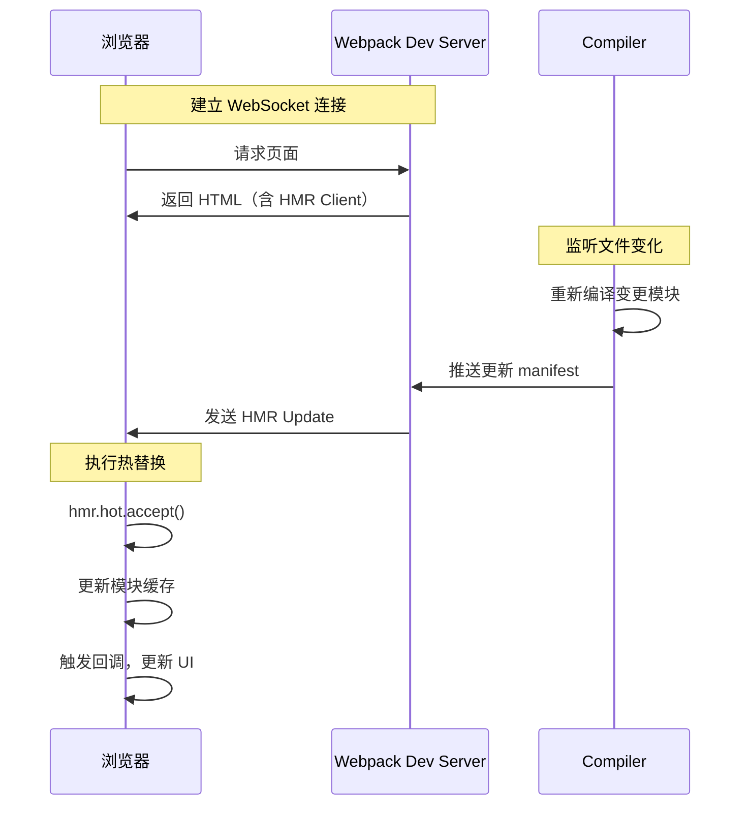

## 问题：Webpack HMR 热模块替换是如何实现的？

### 核心答案

> Webpack HMR（Hot Module Replacement）通过**客户端 - 服务端通信机制**实现：Webpack Dev Server 监听文件变化，编译后通过 WebSocket 推送更新模块，客户端执行模块替换并触发 `hmr.hot.accept()` 回调。

---

### 工作流程



---

### 核心组件

| 组件 | 作用 |
|:---|:---|
| **HMR Server** | Webpack Dev Server 内置，广播更新 |
| **HMR Runtime** | 客户端 JS，嵌入页面，处理更新 |
| **Module Federation** | 跨应用代码共享（可选） |

---

### 实现步骤

1. **建立连接**：浏览器加载时，HMR Runtime 与 Dev Server 建立 WebSocket 长连接
2. **监听文件**：Webpack Compiler 监听源文件变化
3. **重新编译**：检测到变化后，重新编译**变更的模块**（不是全部）
4. **推送更新**：通过 WebSocket 将 `manifest.json`（含更新模块 ID）推送给客户端
5. **执行替换**：HMR Runtime 根据 manifest 拉取新模块，替换缓存中的旧模块
6. **触发回调**：调用 `module.hot.accept()` 注册的回调函数，更新 UI

---

### 与 Vite HMR 对比

| 维度 | Webpack HMR | Vite HMR |
|:---|:---|:---|
| **触发方式** | WebSocket 推送 | 浏览器原生 ESM（import.meta.hot） |
| **更新范围** | 重新编译变更模块的依赖图 | 按需请求变更模块 |
| **延迟** | 依赖图越大，HMR 越慢 | 模块级更新，无依赖图重建 |
| **实现复杂度** | 高（需 WebSocket + HMR Runtime） | 低（利用浏览器原生 ESM） |

---

### 代码示例

```javascript
// 注册 HMR 回调
if (module.hot) {
  module.hot.accept('./print.js', function() {
    // 模块更新后的处理逻辑
    print(); // 重新调用更新后的函数
  });
}
```

---

### 关联

- [[Webpack]] — 上位概念
- [[Vite]] — 对比学习
- [[Webpack vs Vite]] — 核心差异对比
- [[MOC-Vite相关问题]] — Vite 相关面试题
