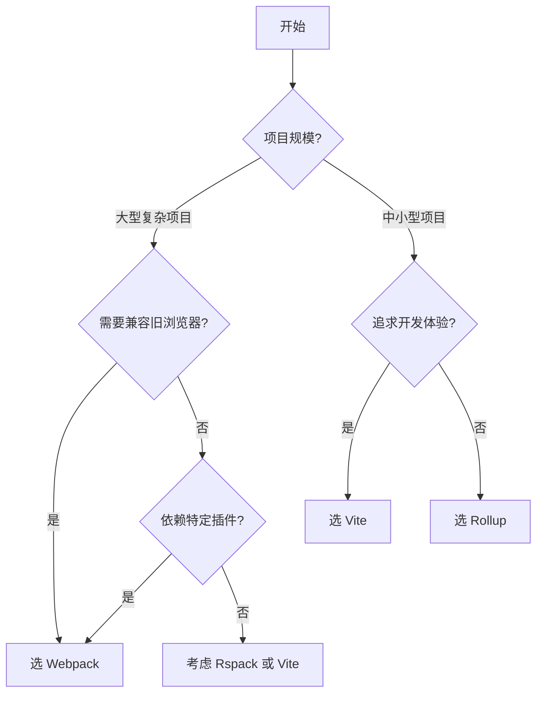

## Webpack vs Vite

### 一句话对比

Webpack 通过将所有模块打包成 bundle 实现构建；Vite 利用浏览器原生 ESM 实现即时热更新，只在部署时进行打包。

---

### 核心对比

| 维度        | **[[Webpack]]**         | **[[Vite]]**                |
|:-------- |:---------------------- |:-------------------------- |
| **定义**    | 模块打包器，将所有资源打包成静态 bundle | 基于 ESM 的开发服务器 + Rollup 生产构建 |
| **核心本质**  | Bundle-based，构建时打包所有模块  | ESM-first，开发时按需编译           |
| **适用场景**  | 大型复杂项目、深度定制化需求          | 中小型项目、快速开发体验                |
| **首次启动**  | 慢（需构建完整 bundle）         | 快（原生 ESM，即时响应）              |
| **热更新**   | 较慢（重打包相关模块）             | 极快（原生 ESM 模块热替换）            |
| **配置复杂度** | 高（大量配置项）                | 低（开箱即用）                     |
| **生态**    | 成熟、插件丰富                 | 快速成长、插件生态正在完善               |
| **生产构建**  | 优化成熟（tree-shaking、代码分割） | 基于 Rollup，优化成熟              |

---

### 差异点

- **构建速度**：
	- Webpack：开发时需构建完整 bundle，首次启动慢
	- Vite：利用浏览器原生 ESM，无需完整打包，启动极快
- **热更新效率**：
	- Webpack：模块变更需重新编译相关依赖链
	- Vite：仅更新变更模块，毫秒级 HMR
- **配置方式**：
	- Webpack：声明式配置，功能强大但配置复杂
	- Vite：约定优于配置，零配置即可运行
- **依赖处理**：
	- Webpack：通过 loaders 处理各种资源
	- Vite：使用 esbuild/SWC 预处理依赖，速度更快
- **浏览器兼容性**：
	- Webpack：可编译为 ES5，兼容旧浏览器
	- Vite：默认 ESM，部分版本支持 ES2017+

---

### 场景选择

- **选 [[Webpack]] 当**：
	- 大型企业级应用，需要深度定制
	- 项目依赖大量 webpack-specific 插件
	- 需要兼容旧版浏览器（ES5）
	- 已有成熟的 webpack 配置体系不想迁移
- **选 [[Vite]] 当**：
	- 新项目，追求开发体验
	- 中小型项目，构建速度是关键诉求
	- 使用 Vue、React、Svelte 等现代框架
	- 需要快速启动和即时热更新

---

### 决策树

---

### 选择建议

| 项目类型 | 推荐 | 理由 |
|:---|:---|:---|
| **新项目（推荐）** | ⭐ Vite | 开发体验好，社区活跃 |
| **Vue/React 项目** | ⭐ Vite | 官方推荐，集成完善 |
| **大型企业项目** | Webpack / Rspack | 生态成熟，插件丰富 |
| **需要兼容 IE** | Webpack | ES5 支持 |
| **库/组件开发** | Rollup | 专注文档输出格式 |

---

### 知识图谱

- **父级概念**：[[前端工程]] — 同属构建工具领域
- **相关对比**：
	- [[T-Rspack]] — Vite 的高性能替代方案
	- [[T-Rollup]] — 适合库打包
- **相关工具**：
	- [[MOC-前端工程化工具]]

---

### 参考延伸

- [Vite 官方文档](https://vitejs.dev/)
- [Webpack 官方文档](https://webpack.js.org/)
- [从 Webpack 到 Vite：迁移实践](https://cn.vitejs.dev/guide/migration.html)
