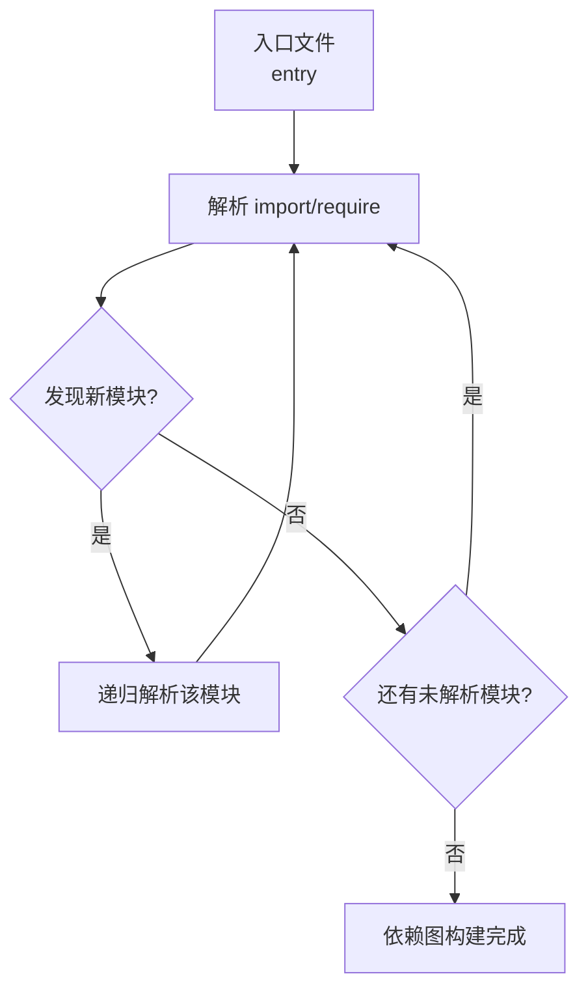

## 问题：Webpack 模块打包的本质是什么？依赖图是如何构建的？

### 问题 1：Webpack 模块打包的本质

> Webpack 模块打包的本质是递归解析入口文件的 `import`/`require` 依赖，构建完整**依赖图（Dependency Graph）**，再通过 Loader 转换各种资源、Plugin 优化，最终输出打包产物。

**关键点**：
- 依赖图是核心：Webpack 将项目中所有资源（JS/CSS/图片等）视为模块
- Loader 转换：非 JS 资源通过 Loader 转换为可打包的模块
- Plugin 优化：在打包过程中注入额外处理（压缩、混淆、Tree Shaking 等）

---

### 问题 2：依赖图是如何构建的？

> 依赖图是通过**递归解析**构建的：从入口文件开始，解析所有 `import`/`require` 语句，将被引用的模块加入依赖图，循环直到解析完毕。

**构建流程**：

**具体步骤**：
1. 从 `entry` 入口文件开始
2. 解析 `import`/`require` 语句，识别依赖
3. 递归处理每个被引用的模块
4. 重复直到所有模块解析完毕
5. 生成完整依赖图，用于后续打包

**与 Tree Shaking 的区别**：

|        阶段        | 作用              | 说明             |
|:--------------: |:-------------- |:------------- |
|    **依赖图构建**     | 确定 " 用了哪些模块 "      | 从入口递归，按引用关系收集  |
| **Tree Shaking** | 移除 " 未使用的 export" | 在依赖图基础上标记未使用代码 |

---

### 关联

- [[Webpack]] — 上位概念
- [[Webpack模块打包的本质是建立依赖图并生成优化后的资源集合]] — atomic 洞见
- [[Tree Shaking]] — 依赖图构建后的优化阶段
- [[Webpack配置流程]] — 标准配置流程
