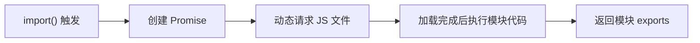

## 问题：Webpack 的 Code Splitting 和懒加载是如何实现的？

### 核心答案

> Webpack Code Splitting 通过**动态导入（Dynamic Import）** 和 **splitChunks 配置**实现，将代码分割为多个 chunk。懒加载则通过 `import()` 动态导入在需要时才请求对应 JS 文件。

---

### 两种实现方式

| 方式 | 语法 | 说明 |
|:---|:---|:---|
| **ES6 动态导入** | `import('./module.js')` | 返回 Promise，推荐方式 |
| **CommonJS 风格** | `require.ensure([], callback)` | Webpack 特有语法 |

---

### 代码示例

**动态导入（懒加载）**：

```javascript
// 点击按钮时才加载模块
button.addEventListener('click', async () => {
  const { formatDate } = await import('./utils.js');
  console.log(formatDate(new Date()));
});
```

**打包后产物**：

```bash
dist/
├── main.js           // 主包（首屏加载）
├── src_utils_js.xxx.js  // 懒加载包（触发时才请求）
```

**预获取（prefetch）**：

```javascript
// 预测用户行为，提前加载
button.addEventListener('click', () => {
  import(/* webpackPrefetch: true */ './utils.js');
});
```

---

### splitChunks 配置

```javascript
// webpack.config.js
module.exports = {
  optimization: {
    splitChunks: {
      chunks: 'all',        // 分割所有类型 chunk
      cacheGroups: {
        vendor: {           // 第三方库单独打包
          test: /[\\/]node_modules[\\/]/,
          name: 'vendors',
          priority: 10,
        },
        common: {           // 公共模块提取
          minChunks: 2,
          name: 'common',
        },
      },
    },
  },
};
```

**关键参数**：

| 参数 | 作用 |
|:---|:---|
| `chunks: 'all'/'async'/'initial'` | 分割哪些 chunk |
| `minChunks` | 模块被引用多少次才提取 |
| `cacheGroups` | 分组规则，自定义提取策略 |
| `priority` | 优先级，数字越大优先匹配 |

---

### 懒加载原理



1. `import()` 调用时创建 Promise
2. 浏览器动态请求分割后的 chunk 文件
3. Webpack 对请求做拦截，响应拼接后的模块代码
4. 模块代码执行后，Promise resolve
5. 回调函数执行，UI 更新

---

### 关联

- [[Webpack]] — 上位概念
- [[Tree Shaking]] — 代码优化手段，协同使用
- [[Code Splitting]] — 术语词条，深入了解
- [[Webpack配置流程]] — 配置示例
