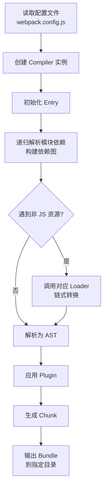

## 概念：Webpack

Webpack 本质上是一个现代Javascript应用程序的静态模块打包器（Static Module Bundler）。整个构建体系围绕三个核心角色展开：
1. Compiler（编译器）：包含Webpack环境的所有配置信息（options、loaders、plugins），在Webpack启动时实例化并且唯一，负责控制构建的生命周期和调度。
2. Compilation（单次编译实例）：代表每一次独立的编译过程。包含当前模块资源、编译生成资产（assets）、变化的文件以及被跟踪依赖的状态。在开发环境每次触发热更新或文件变更时，都会创建一个新的实例。
3. Tapable（微内核事件流引擎）：Webpack的骨架与灵魂。Compiler和Compilation都继承自Tapable。通过在不同生命周期节点广播Hook事件，插件（Plugin）只需监听（`tap`/`tapAsync`/`tapPromise`）对应Hook即可介入事件流。

**解决的核心痛点**：现代前端项目依赖众多模块文件，浏览器需要分别请求导致性能问题；不同资源类型（ESM、CommonJS、CSS、图片）需要统一模块化方案。

---

### 核心命题

> 核心命题引用 atomic 笔记（陈述句观点），每个命题是一句话洞见

- [[Webpack模块打包的本质是建立依赖图并生成优化后的资源集合]]
	- **原理**：Webpack 通过入口文件递归分析 `import`/`require` 依赖，构建完整依赖图（Dependency Graph），再根据图关系打包
- [[Tree Shaking 的本质是 ESM 静态分析]]
	- **原理**：Webpack 4+ 利用 ES Module 的静态结构，在打包阶段移除未使用的导出（unused exports），需要开启 `sideEffects: false`

---

### 运行机制

Webpack 的构建流程分为初始化、编译、输出三个阶段：

**关键阶段说明**：

| 阶段 | 核心操作 | 可扩展点 |
|:---:|:---|:---|
| **初始化** | 读取配置，创建 Compiler | entry、output 配置 |
| **编译** | 解析模块，构建依赖图 | Loader（转换）、Plugin（干预） |
| **输出** | 生成 chunk，写入文件 | optimization、splitChunks |

---

### 关键区别

| 维度 | Webpack | [[Vite]] | [[Rollup]] |
|:--- |:--- |:--- |:--- |
| **构建策略** | 先打包再服务 | 先服务再按需编译 | 专注于库/ESM 打包 |
| **开发体验** | 冷启动慢（全量打包） | 冷启动快（ESM dev server） | 不适合应用开发 |
| **生态** | 插件丰富，配置灵活 | 原生 ESM，插件兼容 Rollup | 输出格式纯净（ES/CommonJS/UMD） |
| **Tree Shaking** | 需要配置 `sideEffects` | 天然支持 | 效果最好 |
| **适用场景** | 大型复杂项目 | 快速开发体验 | 库/框架打包 |

详细对比：[[Webpack vs Vite]]

---

### 应用场景

- ✅ **大型复杂项目**：完善的插件生态，細粒度打包控制
- ✅ **需要 Tree Shaking**：ESM 项目配合 `sideEffects: false` 效果显著
- ✅ **多页面应用**：`splitChunks` 优化公共依赖
- ⛔ **中小型项目**：配置复杂，启动慢，使用 [[Vite]] 或 [[Rollup]] 更合适
- ⛔ **纯库开发**：推荐使用 [[Rollup]]，输出更干净

---

### SOP

- [[Webpack配置流程]]
- [[Webpack性能优化]]
---

### FAQ

> 与本概念相关的开放性问题，待进一步探索

- [[Webpack vs Vite]]
- [[Webpack相关问题]]

---

### 知识图谱

> 知识图谱链接 term（术语定义）和相关 concept，建立概念关系网络

- **父级概念**：[[前端工程]] — 构建工具的上游领域
- **并列概念**：
	- [[Vite]] — 新一代构建工具，对比学习
	- [[Rollup]] — 专注于库打包
- **相关工具**：
	- esbuild — 极速打包器
	- Parcel — 零配置打包工具
- **深入主题**：
	- [[Webpack vs Vite]] — 核心差异对比
	- Tree-Shaking — 死代码消除
	- Code-Splitting — 代码分割策略
