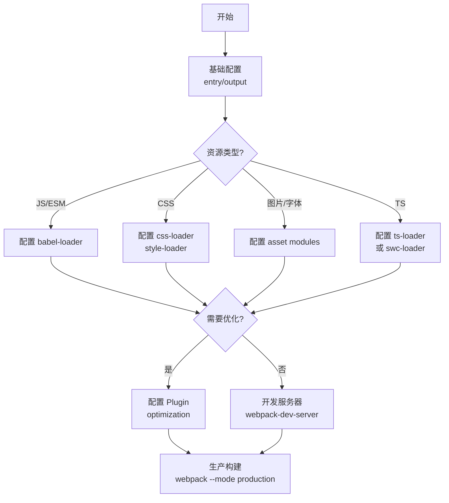

## SOP：Webpack 配置流程

> 标准化 Webpack 配置流程，适用于新项目初始化和现有项目优化。

**目标**：快速搭建 Webpack 构建配置，覆盖开发/生产环境

**实现**：通过阶段化配置，从 entry/output 到 Loader/Plugin，逐步完善构建流程

---

### 适用场景

- 场景 1：新建项目需要引入 Webpack 构建
- 场景 2：现有项目 Webpack 配置凌乱，需要规范化
- 场景 3：项目从其他构建工具迁移到 Webpack

---

### 流程图解



---

### 核心步骤

1. **基础配置**：设置 entry、output、mode
	 - 注意：`output.filename` 使用 `[name].[contenthash].js` 支持缓存
2. **Loader 配置**：按资源类型配置对应 loader
	 - 注意：loader 执行顺序从后往前，链式调用
3. **Plugin 配置**：根据需求添加插件
	 - 注意：Plugin 实例化时传入配置对象
4. **开发服务器**：配置 `webpack-dev-server` 支持热更新
	 - 注意：`hot: true` 开启 HMR
5. **生产优化**：配置 Tree Shaking、Code Splitting、压缩
	 - 注意：`sideEffects: false` 配合 `usedExports: true`

---

### 实践/示例

```javascript
// webpack.config.js
const path = require('path');
const HtmlWebpackPlugin = require('html-webpack-plugin');
const TerserPlugin = require('terser-webpack-plugin');

module.exports = (env, argv) => {
  const isProduction = argv.mode === 'production';

  return {
    // 1. 基础配置
    entry: './src/index.js',
    output: {
      path: path.resolve(__dirname, 'dist'),
      filename: isProduction ? '[name].[contenthash].js' : '[name].js',
      clean: true, // 自动清理 dist
    },
    mode: argv.mode || 'development',

    // 2. Loader 配置
    module: {
      rules: [
        {
          test: /\.css$/,
          use: ['style-loader', 'css-loader'],
        },
        {
          test: /\.(png|jpg|gif)$/,
          type: 'asset/resource',
        },
      ],
    },

    // 3. Plugin 配置
    plugins: [
      new HtmlWebpackPlugin({
        template: './public/index.html',
      }),
    ],

    // 4. 优化配置
    optimization: {
      minimize: isProduction,
      minimizer: [new TerserPlugin()],
      splitChunks: {
        chunks: 'all',
      },
    },

    // 5. 开发服务器
    devServer: {
      static: './dist',
      hot: true,
      port: 3000,
    },
  };
};
```

---

### 常见坑点

- ⛔ **反模式**：`development` 模式使用 `[contenthash]`，导致热更新失效
- ⛔ **反模式**：`loader` 从左到右执行，写反顺序导致解析失败
- 🔧 **排查**：如果 `Module not found`，检查 `resolve.extensions` 是否包含目标扩展名
- 🔧 **排查**：如果 `Cannot import from non ecmascript`，检查 `output.library.type`

---

### 知识图谱

- **相关概念**：
	- [[Webpack]] — 模块打包器的核心概念
	- [[Vite]] — 新一代构建工具对比
- **对比学习**：
	- [[Webpack vs Vite]] — 配置复杂度对比
