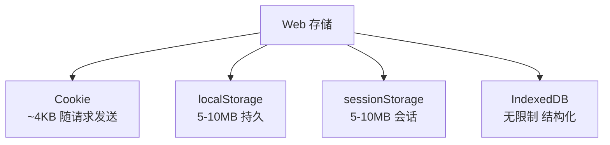

## MOC：Web存储

> Web 存储专题入口：聚合在浏览器客户端存储数据的技术，包括 Cookie（与服务端通信）、Web Storage API（localStorage/sessionStorage）和 IndexedDB。中观层专题，研究边界为「客户端数据持久化」，攻关粒度 5~20 篇高价值资料。

**解决的核心痛点**：如何在客户端存储数据以提高性能、减少服务器请求、支持离线应用？

---

### 存储方案

- [[Cookie 用于服务端通信和会话状态管理]]
	- **原理**：Cookie 随每次 HTTP 请求自动发送，用于服务端识别用户会话
- [[localStorage 用于长期存储简单键值对数据]]
	- **原理**：数据持久存储，除非手动删除永不过期，同源窗口均可访问
	- **注意**：同步 API，读取大体积数据可能阻塞主线程
- [[sessionStorage 用于会话级临时存储]]
	- **原理**：数据仅在当前会话（标签页）有效，关闭页面自动清除，仅创建它的窗口可访问
- [[IndexedDB 用于存储大量结构化数据]]
	- **原理**：支持事务、索引、异步操作，适合离线应用和大数据存储

---

### 运行机制

---

### 关键区别

| 特性 | Cookie | localStorage | sessionStorage | IndexedDB |
|:--- |:--- |:--- |:--- |:--- |
| **容量** | ~4KB | ~5-10MB | ~5-10MB | 无限制 |
| **随请求发送** | ✅ 自动 | ❌ | ❌ | ❌ |
| **有效期** | 可设置 | 永久 | 会话级 | 永久 |
| **数据类型** | 字符串 | 字符串 | 字符串 | 结构化对象 |
| **API** | 简单 | 同步 | 同步 | 异步 |
| **事务** | 不支持 | 不支持 | 不支持 | 支持 |
| **用途** | 会话通信 | 客户端存储 | 客户端存储 | 大数据存储 |

---

### 应用场景

- ✅ **适用场景**
	- **会话管理**：用户登录状态（Cookie，或 localStorage/sessionStorage 存 Token）
	- **用户偏好**：主题、语言设置（localStorage）
	- **临时状态**：表单草稿、会话数据（sessionStorage）
	- **未登录购物车**：缓存购物车商品信息（localStorage/sessionStorage）
	- **API 响应缓存**：减少对服务器请求、提升页面加载速度
	- **离线应用**：缓存大量数据（IndexedDB）
- ⛔ **误用**
	- **客户端存储用 Cookie**：容量小、性能差
	- **存储敏感信息**：客户端存储可被查看和篡改

---

### 注意事项

- 存储的数据为字符串类型，需自行序列化和反序列化
- 不支持过期时间，需手动管理数据过期
- localStorage 为同步 API，读取大体积数据可能阻塞主线程
- 存在跨域访问风险，需注意安全问题

---

### 知识网络

- **父级**：[[浏览器]] — Web 存储是浏览器的客户端存储能力
- **子级**：[[Cookie 用于服务端通信和会话状态管理]] · [[localStorage 用于长期存储简单键值对数据]] · [[sessionStorage 用于会话级临时存储]] · [[IndexedDB 用于存储大量结构化数据]]
- **相关**：[[Cache API]] — 资源缓存（Service Worker）；[[MOC-前端性能优化]] — 缓存与性能

---

### 待探索

- [ ] 补齐 Service Worker 与 Cache API 的离线存储专题
- [ ] 沉淀「前端存储选型」决策 SOP（按容量/会话/离线需求）
- [ ] 收集 5~20 篇高价值客户端存储资料，对接 NotebookLM 专题研究
