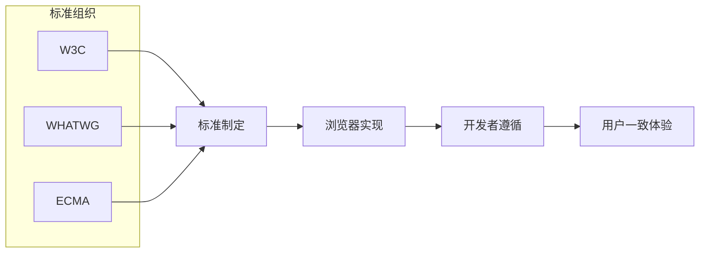

> Web 标准是由 W3C、WHATWG、ECMA 等标准化组织制定的一系列技术规范，旨在提高 Web 内容的可访问性、互操作性和可维护性。

**解决的核心痛点**：不同浏览器厂商可能实现不同的专有特性，导致相同代码在不同浏览器表现不一致；Web 标准提供了统一的规范，确保 Web 内容在各浏览器有一致的行为。

---

## 核心命题

- [[Web标准是浏览器实现一致性的基础]]
	- **原理**：W3C、WHATWG、ECMA 等组织制定的技术规范被主流浏览器厂商共同遵守，使得开发者可以用相同代码在不同浏览器获得一致体验
- [[遵循Web标准提升可维护性和可访问性]]
	- **原理**：标准化的语义化标签、CSS 布局、JS API 等让代码结构清晰，便于维护；同时标准也包含了无障碍访问（Accessibility）规范

---

## 运行机制

1. **标准制定**：W3C/WHATWG/ECMA 等组织制定规范
2. **浏览器实现**：各浏览器厂商根据规范实现特性
3. **开发者遵循**：开发者按标准编写代码
4. **用户受益**：获得一致的浏览体验

---

## 关键区别

| 维度 | W3C 标准 | WHATWG 标准 | ECMA 标准 |
|:--- |:--- |:--- |:--- |
| **关注点** | HTML、CSS、SVG | HTML Living Standard | JavaScript |
| **更新频率** | 版本发布 | 持续更新 | 年度版本 |
| **权威性** | 传统标准 | 现代 HTML 事实标准 | JS 语言标准 |

---

## 核心组成

| 技术 | 标准组织 | 作用 |
|:--- |:--- |:--- |
| [[HTML]] | W3C/WHATWG | 网页结构 |
| [[CSS]] | W3C | 网页样式 |
| [[JavaScript]] | ECMA | 网页交互 |
| [[DOM]] | W3C/WHATWG | 文档对象模型 |
| [[WCAG]] | W3C | 无障碍访问指南 |

---

## 应用场景

- ✅ **适用场景**
	- **跨浏览器开发**：确保代码在各浏览器一致运行
	- **SEO 优化**：语义化标签有助于搜索引擎理解内容
	- **可访问性**：遵循 WCAG 让残障用户也能访问
	- **长期维护**：标准代码更易于维护和升级
- ⛔ **误用**
	- **过度依赖厂商特性**：非标准特性可能导致兼容性问题
	- **忽视标准更新**：新标准可能带来更好的解决方案

---

## 知识图谱

- **父级概念**：[[前端开发]] — Web 标准是前端开发的基础
- **子级概念**：
	- [[HTML]] — 网页结构标准
	- [[CSS]] — 网页样式标准
	- [[JavaScript]] — 脚本语言标准
- **并列概念**：
	- [[浏览器兼容性]] — 与标准密切相关
- **相关概念**：
	- [[C-语义化 HTML|HTML语义化]]
	- [[可访问性]]

---

## 参考延伸

- [W3C Standards](https://www.w3.org/standards/)
- [WHATWG - HTML Living Standard](https://html.spec.whatwg.org/)
- [ECMAScript Language Specification](https://tc39.es/ecma262/)
