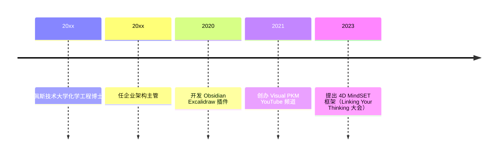

> Obsidian 最热门插件 Excalidraw 的作者、Visual PKM 频道创始人，把视觉思维系统化引入个人知识管理的匈牙利大叔。

## 人物卡片

| 项目 | 信息 |
|------|------|
| **姓名** | Zsolt Viczian |
| **生卒** | 待核实（匈牙利） |
| **国籍** | 匈牙利 |
| **职业** | 企业架构主管 / Obsidian 插件独立开发者 |
| **代表领域** | 视觉思维、个人知识管理、Obsidian 插件开发 |

---

### 生平简介

Zsolt Viczian，常驻匈牙利的视觉思想家与系统设计师。拥有化学工程博士学位（布达佩斯技术大学）及电气工程、生物医学工程双硕士，持 PMP 认证。有 25 年以上的"视觉优先"工作流与知识管理实践，现任一家大型区域跨国企业架构主管。深耕 Obsidian 生态，开发 Excalidraw、ExcaliBrain 插件，并通过 YouTube 频道（@VisualPKM）与课程大规模普及视觉化知识管理。

> ⚠️ 生卒等细节未经独立核实，以上主要基于其公开介绍与社区报道。

---

### 人生时间线

| 时间 | 事件 | 影响 |
|------|------|------|
| 待核实 | 化学工程博士毕业（布达佩斯技术大学） | 工程与系统思维起点 |
| 待核实 | 任企业架构主管 | 企业级系统设计经验 |
| 2020 | 开发 Obsidian Excalidraw 插件 | 成为 Obsidian 下载量最高插件 |
| 2021 | 创办 Visual PKM 频道 | 视觉化 PKM 的普及者 |
| 2023 | 提出 4D MindSET 框架 | 视觉 PKM 理论化 |

---

### 主要成就

- **Excalidraw 插件**（Obsidian）：目前 Obsidian 下载量最高的插件，"远不止是一个绘图工具"
- **ExcaliBrain 插件**：可视化 Markdown 笔记间的关联
- **Visual PKM YouTube 频道**：30K+ 订阅、230+ 教程，主打"公开学习"
- **Visual Thinking Workshop**：面向大众的视觉思维课程（Book-on-a-Page 案例）
- **4D MindSET 框架**：结合视觉思维、常青笔记与偶然发现的 PKM 革新框架

---

### 思想与观点

> 提炼人物的核心思想，链接到相关 atomic/concept 笔记

- **视觉优先**：人脑处理视觉信息能力强，把知识从线性文本搬到空间结构（[[视觉思维能降低认知负荷]]）
- **公开学习（learning in public）**：通过持续分享沉淀并迭代方法
- **4D MindSET**：视觉元素应在复杂信息导航中承担核心角色
- **工具观**：Excalidraw 是"想法容器"而非单纯画图工具

---

### 代表作品

- **Excalidraw 插件**（github.com/zsviczian/obsidian-excalidraw-plugin）
- **ExcaliBrain 插件**
- **Visual PKM YouTube 频道**（youtube.com/@VisualPKM）
- **Visual Thinking Workshop 课程**
- **个人博客**：zsolt.blog

---

### 关系网络

- **生态**：Obsidian 社区 —— 插件作者与社区教育者
- **合作/同台**：Nick Milo（Linking Your Thinking 大会）、Nicole van der Hoeven（联动直播）等 PKM 社区人物

---

### 名言

> Learning in public.（公开学习）—— 其内容创作的核心方式

> Excalidraw 远不止是一个绘图工具。—— 对插件定位的自我阐述

---

### 评价与争议

- **影响力**：被广泛视为 Obsidian 可视化知识管理的领军人，帮助大量用户从线性笔记转向空间化思考；在中国社区被称为"来自匈牙利的大叔"
- **风格**：以体系化、工程化的方式拆解视觉思维，教程详实

---

### 知识图谱

- **父级领域**：[[知识内化]]（MOC-知识内化）
- **相关概念**：
	- [[视觉思维]] — 核心领域
	- [[双重编码理论]] — 视觉思维的理论支撑
	- [[知识管理]] — 所属领域
- **相关人物**：
	- Nick Milo — PKM 社区代表人物（Linking Your Thinking）
	- Nicole van der Hoeven — PKM 博主/视频创作者
- **参考来源**
	- PKM Summit、Amazon 作者页、Linking Your Thinking、Nicole van der Hoeven 博客等（2026-07 检索）
