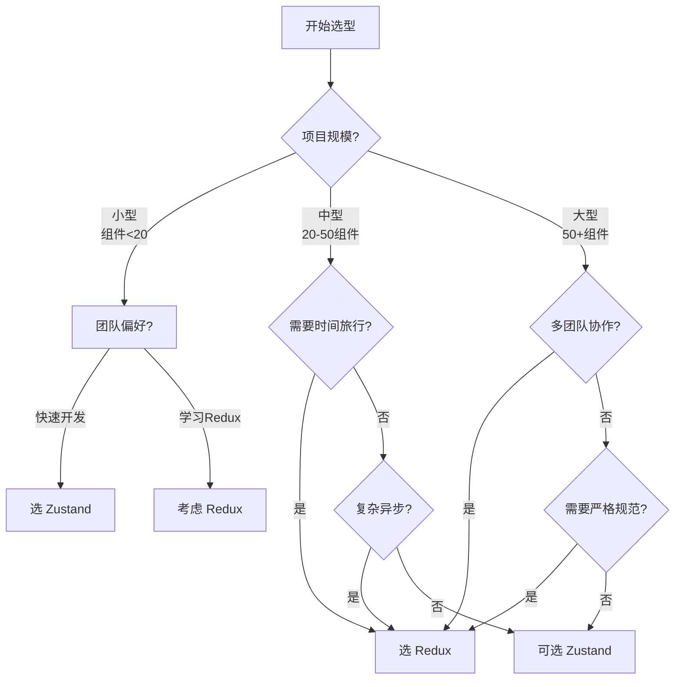

<!--
	对比笔记 (Comparison Note) 设计原则：

	1. 对比笔记用于记录两个或多个事物的系统性比较
	2. 核心是"差异点"——找出本质区别而非表面差异
	3. 必须有"场景选择"——帮助决策何时选哪个
	4. 包含"决策树"——可视化决策逻辑
	5. 与 Question 的区别：对比是静态分析，决策是动态选择

	写作节奏：
	- 先写一句话对比（核心区别）
	- 再写详细差异点（多维度）
	- 最后写场景选择和决策树（应用）
-->

## Zustand vs Redux

### 一句话对比

**Zustand** 以极简 API 直接修改状态，适合快速开发；**Redux** 以规范流程（dispatch→reduce）保证状态可追溯，适合大型团队协作。

---

### 核心对比

| 维度 | **[[Zustand]]** | **[[Redux]]** |
|:---|:---|:---|
| **定义** | 轻量级状态管理库 | 可预测状态容器 |
| **核心本质** | Hooks 风格，直接 set() 修改 | 单一数据源 + 纯函数 reducer |
| **适用场景** | 中小型应用、追求开发速度 | 大型应用、需要可调试性 |

### 差异点

- **样板代码**：
	- Zustand：极少，`create((set) => ({ count: 0, inc: () => set(s => ({ count: s.count + 1 })) }))`
	- Redux：较多，需定义 action type、action creator、reducer 函数
- **学习曲线**：
	- Zustand：平缓，15 分钟上手
	- Redux：陡峭，需理解 store、action、reducer、dispatch、中间件概念
- **性能优化**：
	- Zustand：组件精确订阅状态片段，自动避免无效渲染
	- Redux：需手动写 selector，或用 `useSelector` + `React.memo`
- **DevTools**：
	- Zustand：基础状态查看
	- Redux：时间旅行、action 回放、快照对比，强大得多
- **异步处理**：
	- Zustand：无内置方案，可用 `tanstack-query` 或手动包装
	- Redux：原生的 `createAsyncThunk`、redux-saga、redux-observable
- **中间件生态**：
	- Zustand：需要自己包装或用第三方
	- Redux：成熟的中间件生态（thunk、saga、logger、persistence）

---

### 场景选择

- **选 [[Zustand]] 当**：
	- 中小型 React 项目（< 50 组件）
	- 团队希望减少样板代码
	- 需要快速原型开发
	- 项目不需要复杂异步流程或时间旅行调试
- **选 [[Redux]] 当**：
	- 大型应用（100+ 组件）、多团队协作
	- 需要时间旅行调试（如复杂表单、购物车、undo/redo）
	- 复杂异步流程（轮询、WebSocket、乐观更新）
	- 需要严格代码规范和可预测性

---

### 决策树

---

### 知识图谱

- **父级概念**：[[前端状态管理]] — 两者都属于状态管理领域
- **相关对比**：
	- [[MobX vs Redux]] — 另一种状态管理范式对比
	- [[Jotai vs Zustand]] — 轻量状态管理方案对比
- **延伸阅读**
	- [Zustand GitHub](https://github.com/pmndrs/zustand)
	- [Redux 官方文档](https://redux.js.org/)
	- [Redux Toolkit](https://redux-toolkit.js.org/)
