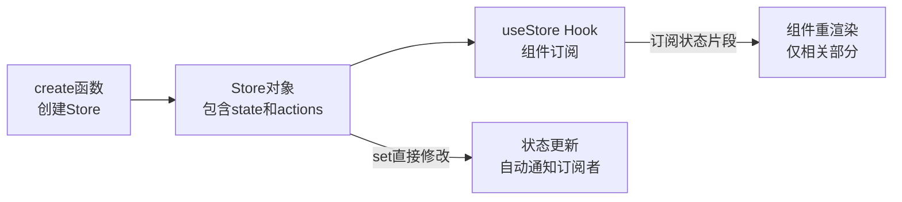

## 概念：Zustand

> Zustand 是 React 轻量级状态管理库，以极简 API 和 Hooks 为中心

**解决的核心痛点**：Redux 模板代码过多，Context API 性能差，开发者需要更简单的全局状态方案

---

### 核心命题

> 核心命题引用 atomic 笔记（陈述句观点），每个命题是一句话洞见

- [[A-极简即正义]]
	- **原理**：Zustand 用 set() 函数直接修改状态，无需 action/reducer/dispatch 的繁琐流程
- [[A-hooks是一等公民]]
	- **原理**：React 16.8 后的 Hooks 哲学渗透到状态管理，useStore 让组件按需订阅状态片段

---

### 运行机制

Zustand 的核心是**单一 store + selective subscription**，通过 Hook 暴露状态和方法。

**关键角色**：

| 角色 | 职责 |
|:---|:---|
| Store | 单一状态容器，包含 state 和 actions |
| create() | 创建 store 的工厂函数 |
| useStore | Hook，组件用来读取/订阅状态 |
| set() | 直接修改状态的函数，触发订阅者更新 |

---

### 关键区别

| 维度 | Zustand | Redux Toolkit |
|:--- |:--- |:--- |
| **样板代码** | 极简，create + set | 需定义 slice、reducer、action |
| **Provider** | 不需要 | 需要 `<Provider>` 包裹 |
| **中间件** | 手动包装 | 内置 immer、thunk、RTK Query |
| **DevTools** | 需额外插件 | 内置 |

| 维度 | Zustand | Context API |
|:--- |:--- |:--- |
| **更新机制** | 精确订阅，定向更新 | 广播式，任何 context 变化导致所有订阅组件重渲染 |
| **性能** | 优 | 差（需手动优化 memo） |
| **适用场景** | 全局状态、跨组件共享 | 主题、语言等低频变化 |

---

### 应用场景

- ✅ **适用场景**
	- **中小型 React 应用**：无需 Redux 的复杂性，又能管理跨组件状态
	- **需要高性能**：大列表 + 频繁局部更新的场景（如看板、数据表格）
	- **快速迭代项目**：减少模板代码，加快开发速度
- ⛔ **误用**
	- **复杂异步流程**：需要 saga/observable 时，Redux Toolkit 更适合
	- **超大型应用**：多团队、长期维护、需严格规范时，Redux 的可预测性更有优势

---

### SOP

> 与本概念相关的标准操作流程，通过实践辅助理解

- [[SOP-Zustand-基础配置]] — 创建 store、定义 state 和 actions
- [[SOP-Zustand-中间件]] — 添加持久化、日志、重试等中间件
- [[SOP-Zustand-性能优化]] — 使用 selector 避免不必要的重渲染

---

### FAQ

> 与本概念相关的开放性问题，待进一步探索

- [[Q-Zustand与Redux何时选]]
- [[Q-Zustand如何处理异步]]
- [[Q-Zustand持久化最佳实践]]

---

### 知识图谱

> 知识图谱链接 term（术语定义）和相关 concept，建立概念关系网络

- **父级概念**：[[前端状态管理]] — Zustand 所属的领域
- **子级概念**：
	- [[T-Store]] — 状态容器的抽象概念
	- [[T-Hook]] — Zustand 暴露状态的方式
- **并列概念**：
	- [[Redux]] — 更规范但更复杂的状态管理方案
	- [[Jotai]] — 原子化状态管理
	- [[Valtio]] — 响应式状态管理
- **相关概念**：
	- [[React Hooks]] — Zustand 暴露状态的基础
	- [[状态管理模式]] — 不同状态管理范式
- **参考文章**
	- [Zustand 官方文档](https://zustand-demo.pmnd.rs/)
	- [Redux vs Zustand vs Jotai](https://blog.openReplay.com/comparing-react-state-management-solutions-in-2024/)
