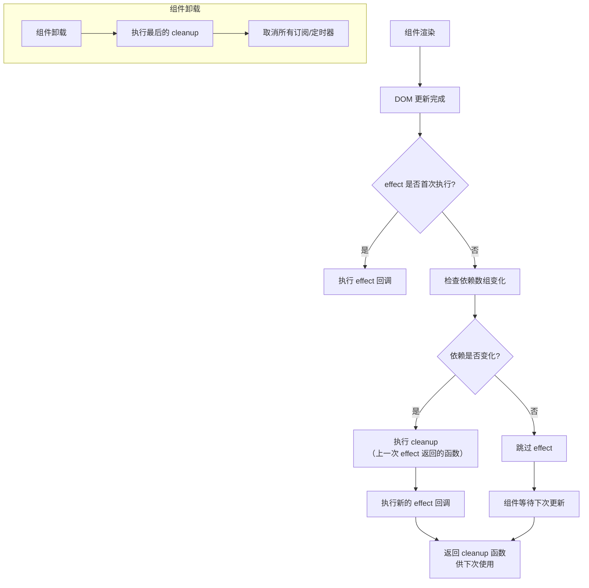
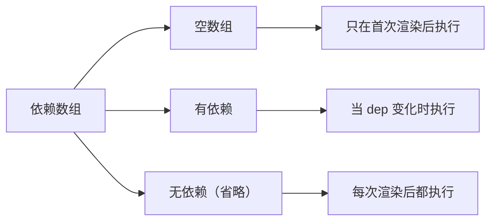

## 概念：useEffect

> React Hooks 中用于处理副作用的核心 API，在渲染后执行清理和订阅逻辑。

**解决的核心痛点**：在 Hooks 之前，副作用逻辑（如事件订阅、DOM 操作、数据获取）散落在 Class 组件的多个生命周期方法中（componentDidMount、componentDidUpdate、componentWillUnmount）；useEffect 将这些逻辑统一管理，支持在渲染后执行，并在下次执行前清理。

---

### 核心命题

- [[React渲染后执行副作用]]
	- **原理**：useEffect 在组件渲染后执行，包括首次渲染和每次更新后
- [[cleanup函数防止内存泄漏]]
	- **原理**：返回的 cleanup 函数在下次 effect 执行前调用，用于取消上次的订阅或定时器
- [[依赖数组控制执行时机]]
	- **原理**：依赖数组决定 effect 何时重新执行，空数组表示仅执行一次
- [[useEffect的return语句在组件卸载和依赖变化时都会被调用]]

---

### 运行机制

#### 依赖数组的执行规则

---

### 关键区别

| 维度 | 无依赖（省略数组） | 空数组 `[]` | 指定依赖 `[dep]` |
|:---|:---|:---|:---|
| **执行时机** | 每次渲染后 | 仅首次渲染后 | 依赖变化时 |
| **类似生命周期** | componentDidMount + componentDidUpdate | componentDidMount | componentDidUpdate（条件） |
| **常见用途** | 不推荐，容易导致无限循环 | 一次性初始化 | 按需更新 |

---

### 应用场景

- ✅ **适用场景**
	- **事件监听**：监听 window/document 事件（scroll、resize、keydown）
	- **数据订阅**：WebSocket、EventSource、第三方 SDK 订阅
	- **定时器**：setInterval、setTimeout
	- **DOM 操作**：手动修改 DOM、聚焦输入框、滚动位置
	- **数据获取**：API 请求（配合依赖或清理函数取消请求）
- ⛔ **误用**
	- **用 useEffect 处理同步逻辑**：应使用 useLayoutEffect 或直接放在渲染中
	- **在 effect 中处理应属于渲染的逻辑**：如计算派生状态，用 useMemo 替代
	- **忘记 cleanup 导致内存泄漏**：定时器/订阅未清除

---

### FAQ

> useEffect 相关的常见问题，通过独立笔记进行深入探索。

- [[useEffect依赖数组为什么不能使用对象]] — 对象引用比较的问题
- [[为什么useEffect需要return-cleanup函数]] — cleanup 函数的必要性
- [[useState的参数为什么不能直接用对象写法]] — 对象状态更新的不可变性原则

---

### 知识图谱

- **父级概念**：[[Hooks(React)]] — useEffect 是 React Hooks 之一
- **相关概念**：
	- [[useState]] — useEffect 常配合 useState 使用
	- [[useCallback]] — 缓存回调函数，防止 effect 重新执行
	- [[useMemo]] — 缓存计算结果，避免在 effect 中重复计算
	- [[useRef]] — 保存不需要触发更新的可变值
	- [[useLayoutEffect]] — 同步执行的副作用
- **应用场景**：
	- [[SOP-正确使用useEffect]] — useEffect 标准操作流程
	- [[React面试题]] — React 相关面试题汇总

---

### 参考延伸

- [React 官方文档 - Using the Effect Hook](https://react.dev/reference/react/useEffect)
- [A Complete Guide to useEffect](https://overreacted.io/a-complete-guide-to-useeffect/) — Dan Abramov 经典文章
