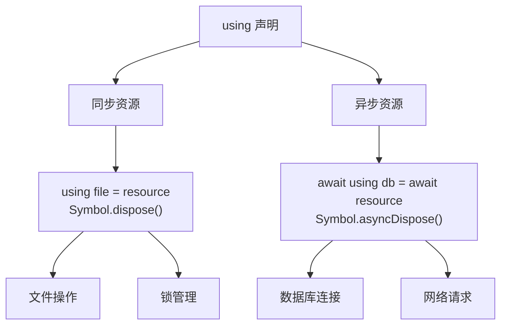

## 概念：using 声明

> ES2026 引入的声明式资源管理语法，在作用域结束时自动调用资源的 `Symbol.dispose()` 方法释放资源

**解决的核心痛点**：JavaScript 长期没有原生的资源管理机制，资源释放（文件关闭、连接断开）需要手动 `try-finally`，容易遗漏或出错

---

### 核心命题

- `using` 声明将改变 JavaScript 资源管理模式 — 从手动 `try-finally` 走向声明式自动管理
	- **原理**：通过 `Symbol.dispose()` 实现作用域结束时自动调用，类似 C# `using`、Python `with`
- `using` 声明只适用于需要明确释放的资源 — 临时计算不需要
	- **原理**：如果一个对象只需要 GC 回收就不需要 `using`，只有需要 `close()`/`dispose()`/`release()` 等明确清理的才需要
- `await using` 是异步资源管理的标准方式 — 替代手动 await + finally
	- **原理**：对于数据库连接、网络请求等异步资源，`Symbol.asyncDispose()` 允许在异步上下文自动释放

---

### 运行机制

**同步 vs 异步资源管理**：



**自动释放的执行时机**：


**LIFO 释放顺序**：

```javascript
{
  using file1 = openFile('a.txt');  // 1. 先获取
  using file2 = openFile('b.txt');  // 2. 后获取

  // 业务逻辑...

} // 3. 后获取的先释放：file2 → file1（LIFO）
```

**核心示例：文件操作**：

```javascript
class File {
  #handle = null;
  constructor(path) { this.path = path; }

  async open() {
    this.#handle = await fs.open(this.path, 'r');
    return this;
  }

  async read() { return this.#handle.readText(); }

  [Symbol.dispose]() { this.#handle?.close(); }
}

// 使用 using 自动管理文件资源
async function readConfig() {
  using file = new File('config.json');
  await file.open();
  return JSON.parse(await file.read());
  // 作用域结束时自动调用 file[Symbol.dispose]()
}
```

---

### 关键区别

| 维度 | `using` 声明 | `try-finally` |
|:---|:---|:---|
| **代码量** | 简洁（2 行 vs 8 行） | 冗长 |
| **资源泄漏风险** | 低（自动化） | 高（易忘 finally） |
| **异常安全性** | ✓ 自动清理 | ✓ 手动清理 |
| **异步支持** | `await using` | 需手动处理 |
| **可读性** | 高（意图明确） | 低（清理逻辑混杂） |

| 维度 | `using` | 垃圾回收 (GC) |
|:---|:---|:---|
| **释放时机** | 作用域结束（确定） | 不确定（GC 决定） |
| **适用场景** | 文件句柄、连接、锁 | 普通对象内存 |
| **资源类型** | 需要明确释放的资源 | 内存 |

---

### 应用场景

- ✅ **适用场景**
	- **文件操作**：关闭文件句柄
	- **数据库连接**：归还连接池
	- **网络请求**：关闭连接、取消订阅
	- **互斥锁**：释放锁
	- **计时器**：清除定时器
- ⛔ **误用**
	- **用于普通对象**：`using x = {}` 没有意义，对象只需要 GC
	- **忘记实现 Symbol.dispose**：`using` 但对象没有实现 `Symbol.dispose()` 会报错
	- **混淆同步/异步**：`using` 用于同步资源，`await using` 用于异步资源

---

### FAQ

> 关于 using 声明的常见问题

- [[Q-using声明和Symbol.dispose的关系]]
- [[Q-await using和using的区别]]
- [[Q-哪些资源应该用using管理]]

---

### 知识图谱

- **父级概念**：
	- [[ES2026]] — using 声明是 ES2026 的核心特性
	- [[Javascript版本演进]] — ES2026 是最新版本
- **相关概念**：
	- [[Promise]] — 异步资源管理依赖 Promise
	- [[Symbol.dispose]] — 资源释放的核心协议
	- [[async/await]] — 异步资源管理语法
- **参考文章**
	- [MDN - using](https://developer.mozilla.org/en-US/docs/Web/JavaScript/Reference/Statements/using)
