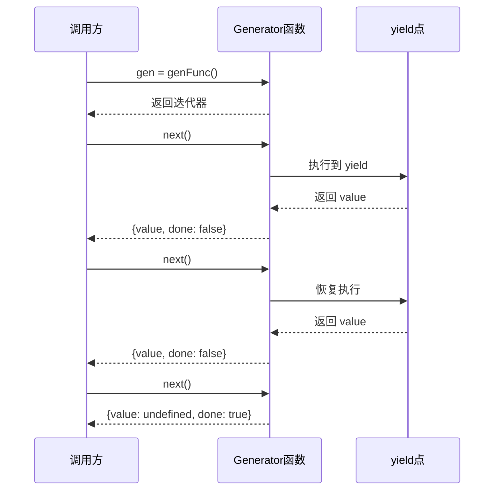

> yield 是 JavaScript 中用于暂停 Generator 函数执行并产出值的关键字，配合 `next()` 方法实现函数的惰性迭代。

**解决的核心痛点**：普通函数一旦调用必须执行完成才能返回结果，无法暂停和恢复；yield 打破了这一限制，让函数可以分步执行、按需产生值。

---

## 核心命题

- [[yield 暂停 Generator 函数执行并产出值]]
	- **原理**：yield 表达式暂停函数执行，返回一个包含 `value` 和 `done` 的对象，调用 `next()` 恢复执行
- [[yield 是惰性求值的基础]]
	- **原理**：yield 只在调用 `next()` 时才计算下一个值，实现按需生成，无需一次性加载所有数据

---

## 运行机制

1. 调用 Generator 函数返回迭代器
2. 每次调用 `next()` 执行到下一个 yield
3. yield 产出值并暂停函数
4. 迭代完成时 `done: true`

---

## 关键区别

| 维度 | yield | [[return]] | [[async/await]] |
|:--- |:--- |:--- |:--- |
| **作用** | 暂停并产出值 | 返回结果并结束 | 等待 Promise |
| **后续执行** | 可通过 next() 恢复 | 函数结束，不可恢复 | 自动继续 |
| **返回值** | `{value, done}` | 函数返回值 | Promise resolve 值 |
| **多次产出** | 支持 | 不支持 | 不支持 |

---

## 应用场景

- ✅ **适用场景**
	- **惰性数据流**：大列表分页加载，按需获取
	- **状态机**： Generator 配合 yield 实现状态转换
	- **异步流程控制**：手动控制异步步骤，类似协程
- ⛔ **误用**
	- **同步遍历**：能用 for…of 时不必用 Generator
	- **忘记调用 next()**：yield 后不调用 next() 会卡住

---

## 知识图谱

- **父级概念**：[[Generator]] — yield 是 Generator 函数的控制关键字
- **子级概念**：[[yield*]] — 委托给另一个 Generator
- **并列概念**：[[async-await|async/await]] — 另一种异步流程控制方式
- **相关概念**：[[迭代器]] [[协程]] [[生成器模式]]

---

## 参考延伸

- [function* - JavaScript | MDN](https://developer.mozilla.org/zh-CN/docs/Web/JavaScript/Reference/Statements/function*)
- 《你不知道的 JavaScript》下卷：Generator
