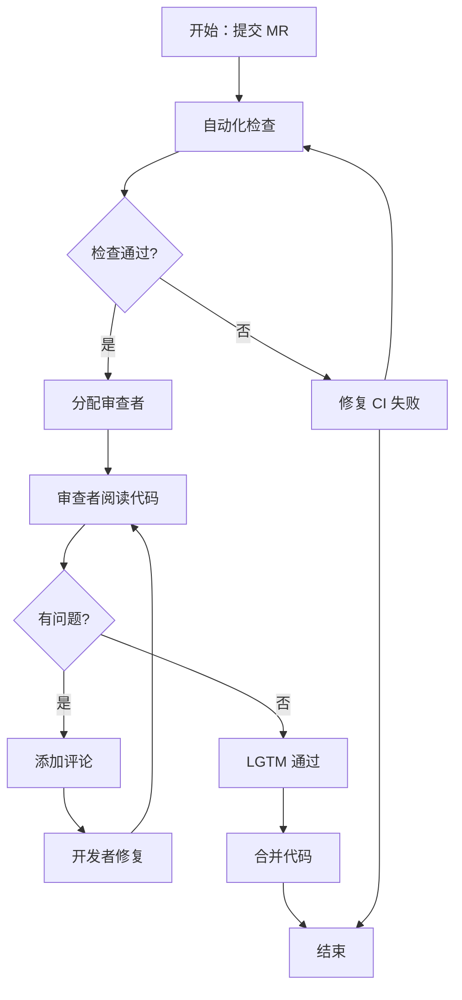

## SOP：团队代码审查流程

> 通过结构化审查提升代码质量，促进知识共享

目标：确保代码质量、发现潜在问题、促进团队知识共享
实现：每次 MR 审查时间 15-30 分钟，缺陷修复率 > 90%

---

### 适用场景

- 场景 1：开发者提 Merge Request（MR）/ Pull Request（PR）需要审查
- 场景 2：审查者进行代码审查并给出反馈
- 场景 3：审查通过后合并代码

---

### 流程图解



---

### 核心步骤

1. **提交 MR 前自检**：确认本地 CI 通过、代码格式统一、测试覆盖
- 注意：不要提交有明显问题的 MR 浪费审查者时间
1. **自动化检查**：CI 运行 lint、类型检查、单元测试、构建
- 注意：CI 失败时优先修复，再提审查
1. **分配审查者**：根据代码关联模块分配 1-2 名熟悉该领域的审查者
- 注意：关键模块或高风险改动需要至少 2 名审查者
1. **审查者审查**：
- 检查逻辑正确性（边界条件、异常处理）
- 检查可读性（命名、注释、函数长度）
- 检查可维护性（耦合度、测试覆盖）
- 注意：优先关注业务逻辑和架构设计，而非风格细节
1. **添加评论**：对每个问题用建议语气标注，说明原因和参考
- 注意：区分 "must fix" 和 "nitpick"（小建议），避免过度要求
1. **开发者修复**：根据反馈修改代码，回复每个评论说明处理方式
2. **LGTM 通过**：审查者确认所有 must fix 已处理，留言 LGTM
3. **合并代码**： Squash merge 保持 commit 历史清晰，删除分支

---

### 实践/示例

#### MR 描述模板

```markdown
## 变更内容
- 修复登录页面在 Safari 下样式错乱

## 变更原因
- 用户的 Safari 15.4 版本 Flexbox 布局表现不一致

## 测试方式
- [ ] 本地 Safari 15.4 验证
- [ ] 添加了 3 个 unit test

## 相关截图
（如有 UI 变更）
```

#### 审查评论示例

```bash
[must] 这个函数缺少对空数组的判断，建议加 early return：
if (!items.length) return [];
```

```bash
[nitpick] 变量名 `data` 太泛化，考虑用 `userList` 更明确。
```

---

### 常见坑点

- ⛔ **反模式**：审查者只关注风格问题（分号、缩进）→ 忽略业务逻辑和架构问题
- ⛔ **反模式**：MR 太大（超过 500 行）→ 审查质量下降，建议拆分成小 MR
- ⛔ **反模式**：开发者不回复评论直接提交 → 审查反馈被忽视
- 🔧 **排查**：审查总是被阻塞 → 设定 SLI（如 4 小时内响应），定期清理待审查队列
- 🔧 **排查**：审查意见经常被反驳 → 可能是规范不清晰，需要补充编码规范文档

---

### 知识图谱

**相关概念**：
- [[建立前端工程规范]]
- [[Git 工作流]]
- [[前端自动化测试]]
