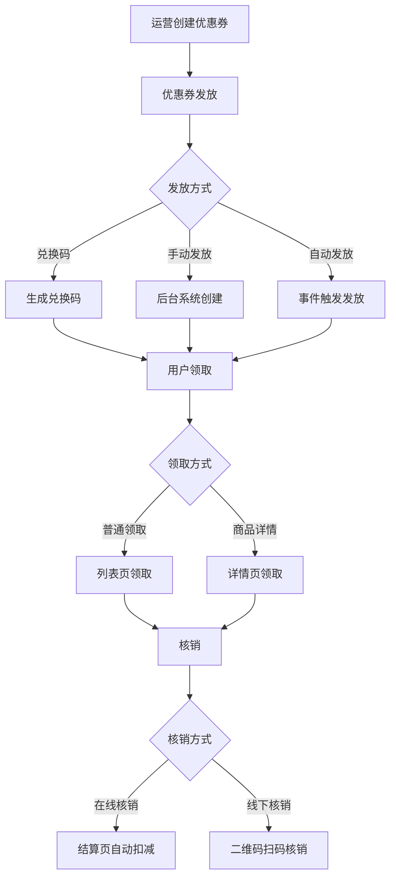

## SOP：优惠券发放、领取、核销

> 实现优惠券系统的前端业务流程，包含发放→领取→核销三个核心环节

目标：实现完整的优惠券业务流程，前端处理用户与优惠券的交互
实现：Vue/React + 状态管理 + HTTP 请求库

---

### 适用场景

- 场景 1：电商平台优惠券系统，用户领取商家发放的优惠券并在下单时使用
- 场景 2：活动发放优惠券（注册送券、满减活动、限时抢券）
- 场景 3：线下核销场景，商家扫码验证优惠券有效性

---

### 流程图解



---

### 核心步骤

1. **优惠券发放**：运营在后台创建优惠券，设置类型、金额、条件、有效期、数量
	 - 注意：手动发放需调用后端 API 创建，自动发放根据事件（如注册、登录）触发
2. **优惠券领取**：用户在列表页或商品详情页点击领取，系统检查登录状态后调用 API
	 - 注意：抢券场景需前端防抖减少并发请求，后端需 Redis 分布式锁
3. **优惠券核销**：结算时系统自动匹配可用优惠券，或通过二维码扫码线下核销
	 - 注意：二维码生成可使用 `qrcode` 库，核销后需同步状态

---

### 实践/示例

**Vue 3 领取优惠券组件（含 JWT + WebSocket）**

```vue
<template>
  <div class="coupon-item" :class="{ disabled: isUsed, expired: isExpired }">
    <div class="coupon-info">
      <span class="amount">¥{{ coupon.value }}</span>
      <span class="condition">满{{ coupon.threshold }}可用</span>
    </div>
    <button
      @click="handleClaim"
      :disabled="isUsed || isExpired || claiming"
    >
      {{ claimButtonText }}
    </button>
  </div>
</template>

<script setup>
import { ref, computed, onMounted, onUnmounted } from 'vue'

const props = defineProps({
  coupon: { type: Object, required: true }
})

const claiming = ref(false)
// WebSocket 连接
let ws = null

const isUsed = computed(() => props.coupon.status === 'used')
const isExpired = computed(() => new Date(props.coupon.expireTime) < new Date())

const claimButtonText = computed(() => {
  if (isUsed.value) return '已使用'
  if (isExpired.value) return '已过期'
  if (props.coupon.claimed) return '已领取'
  return '立即领取'
})

// 建立 WebSocket 连接（用于实时推送）
const initWebSocket = () => {
  const token = localStorage.getItem('token')
  ws = new WebSocket(`wss://api.example.com/ws?token=${token}`)

  ws.onmessage = (event) => {
    const data = JSON.parse(event.data)
    if (data.type === 'coupon_notification') {
      message.info(`您有新优惠券：${data.couponName}`)
    }
  }

  ws.onclose = () => {
    // 断线重连
    setTimeout(initWebSocket, 3000)
  }
}

// JWT Token 获取
const getAuthHeader = () => {
  const token = localStorage.getItem('token')
  return token ? { 'Authorization': `Bearer ${token}` } : {}
}

const handleClaim = async () => {
  // 检查登录
  const token = localStorage.getItem('token')
  if (!token) {
    router.push('/login?redirect=/coupon')
    return
  }

  // 防抖处理抢券场景
  if (claiming.value) return
  claiming.value = true

  try {
    // 领取请求（带 JWT）
    const res = await fetch('/api/coupon/claim', {
      method: 'POST',
      headers: {
        'Content-Type': 'application/json',
        ...getAuthHeader()
      },
      body: JSON.stringify({ couponId: props.coupon.id })
    })

    if (!res.ok) throw new Error('领取失败')
    props.coupon.claimed = true
    message.success('领取成功')

    // 通知 WebSocket（可选，用于同步状态）
    if (ws && ws.readyState === WebSocket.OPEN) {
      ws.send(JSON.stringify({
        type: 'coupon_claimed',
        couponId: props.coupon.id
      }))
    }
  } catch (error) {
    message.error(error.message || '领取失败')
  } finally {
    claiming.value = false
  }
}

onMounted(() => {
  initWebSocket()
})

onUnmounted(() => {
  ws?.close()
})
</script>
```

**核销组件（JWT 验证 + 二维码）**

```vue
<template>
  <div class="coupon-verify">
    
    <button @click="handleVerify">核销</button>
  </div>
</template>

<script setup>
import { ref } from 'vue'
import QRCode from 'qrcode'

const props = defineProps({
  coupon: { type: Object, required: true }
})

const qrCodeUrl = ref('')

// 生成核销二维码
const generateQR = async () => {
  const token = localStorage.getItem('token')
  qrCodeUrl.value = await QRCode.toDataURL(JSON.stringify({
    code: props.coupon.code,
    timestamp: Date.now(),
    token // 可选：嵌入 token 用于快速验证
  }))
}

// 核销（带 JWT）
const handleVerify = async () => {
  const token = localStorage.getItem('token')
  if (!token) {
    message.error('请先登录')
    return
  }

  const res = await fetch('/api/coupon/verify', {
    method: 'POST',
    headers: {
      'Content-Type': 'application/json',
      'Authorization': `Bearer ${token}`
    },
    body: JSON.stringify({ couponId: props.coupon.id })
  })

  const data = await res.json()
  if (data.success) {
    message.success('核销成功')
    props.coupon.status = 'used'
  } else {
    message.error(data.message || '核销失败')
  }
}

generateQR()
</script>
```

---

### 常见坑点

- ⛔ **抢券并发问题**：大量用户同时抢券，后端需分布式锁，前端可加防抖
- ⛔ **优惠券状态同步**：领取后需立即更新 UI，核销后需通知后端更新库存
- 🔧 **登录拦截**：未登录用户点击领取应跳转登录页，而非直接提示错误
- 🔧 **过期检查**：前端时间校验不可靠，后端需二次验证有效期
- 🔧 **多端登录**：同一用户多处登录需确保优惠券状态一致

---

### 知识图谱

- **相关概念**：
	- [[WebSocket]]：建立客户端服务端间的双向通讯
	- [[JWT]]：每次核销进行验证
	- [[SSE]]：服务端通知客户端优惠券发放
	- [[高并发场景下的前端优化]]
